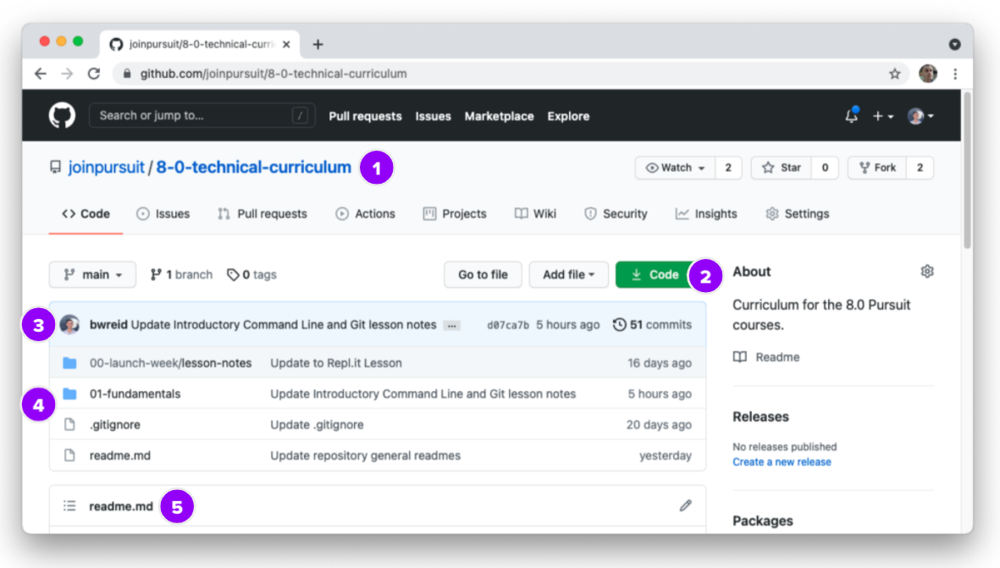
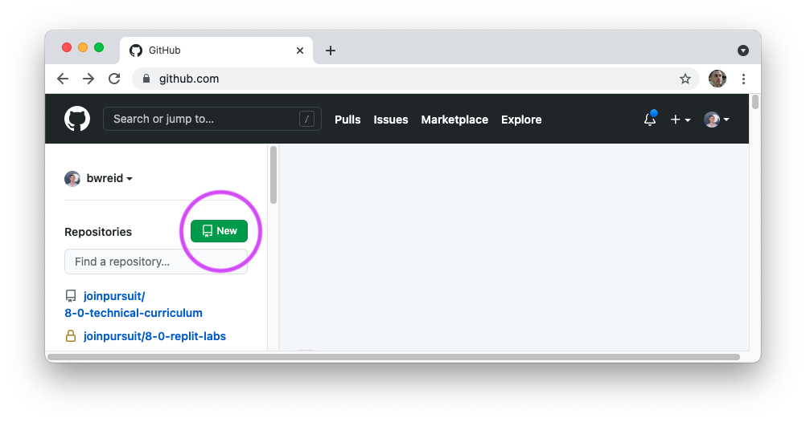
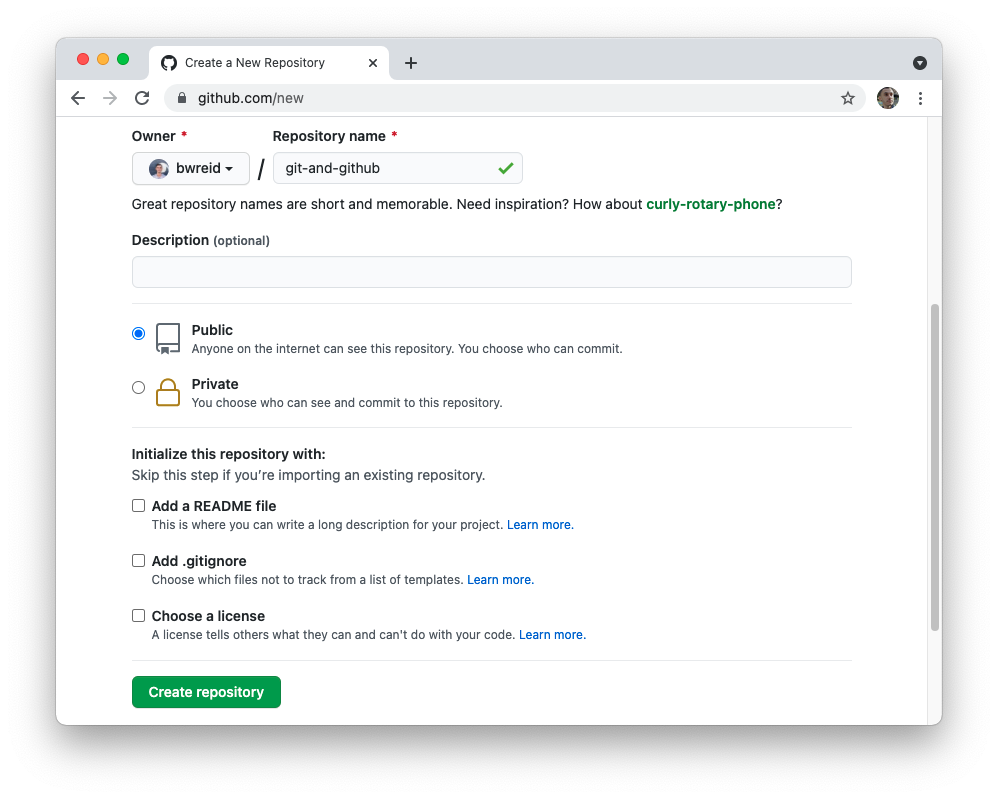
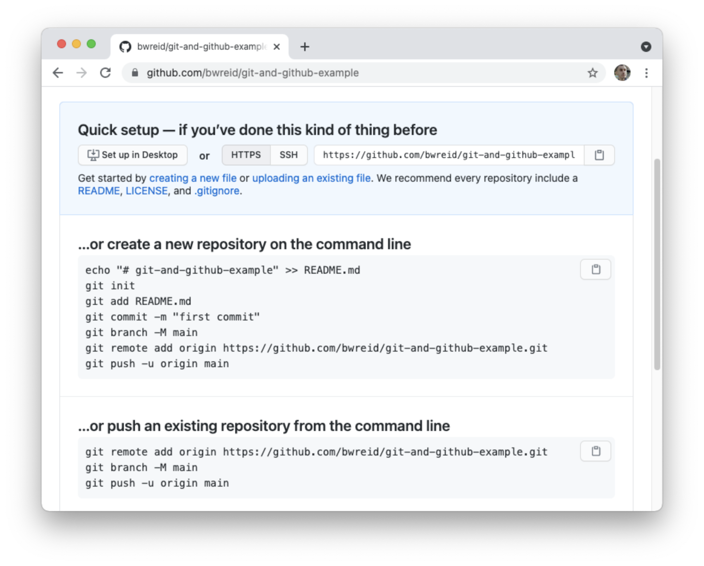
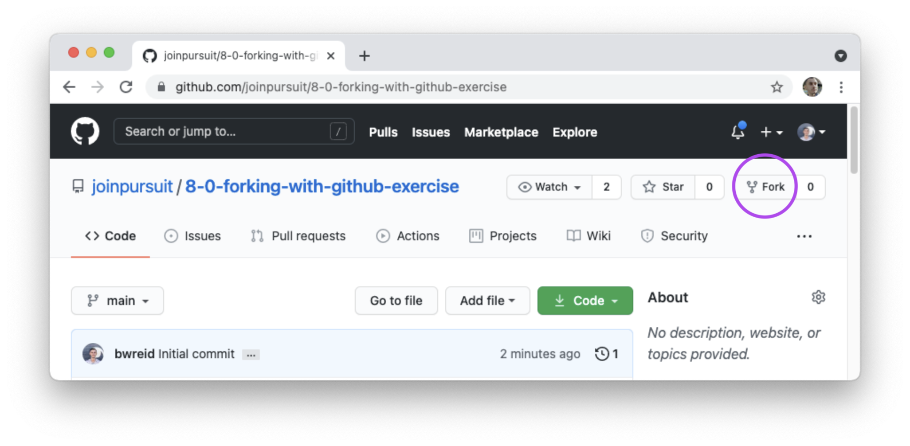
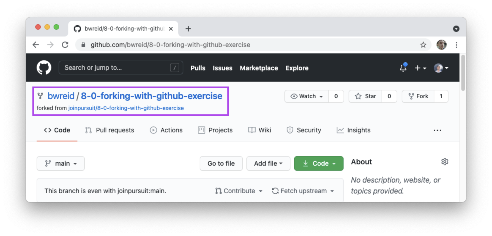
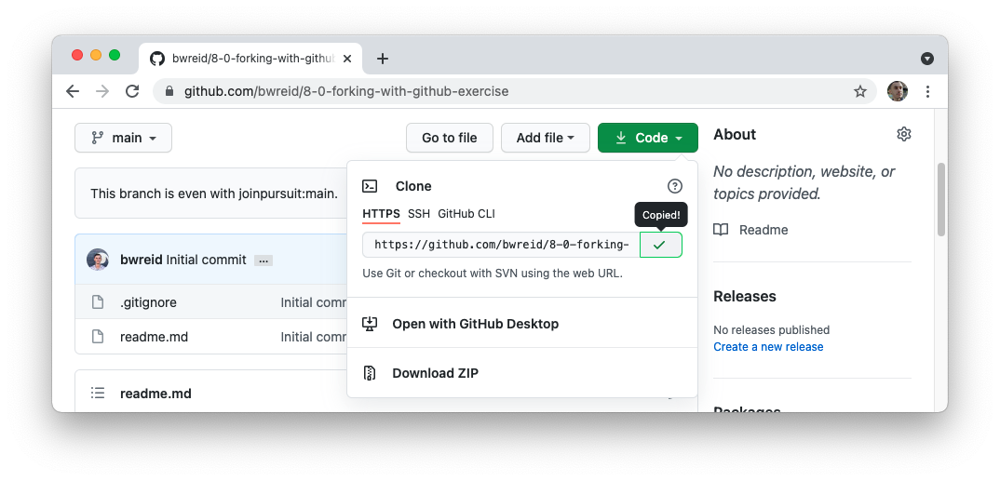
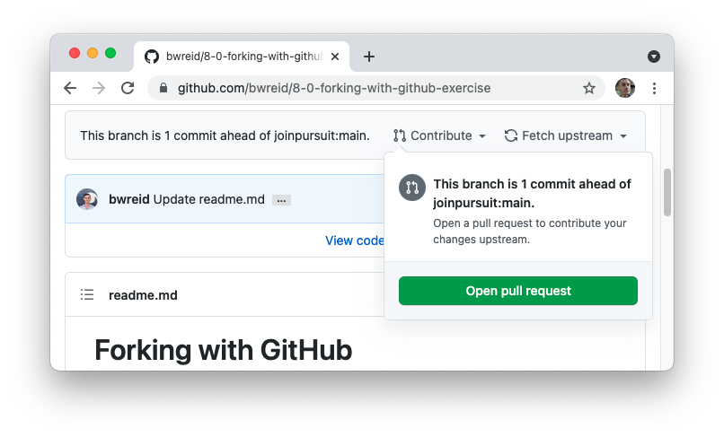
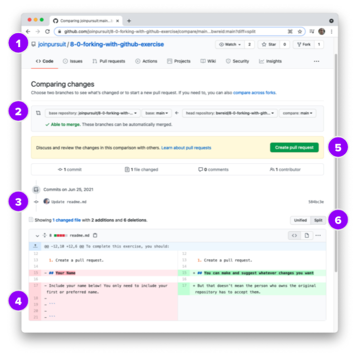
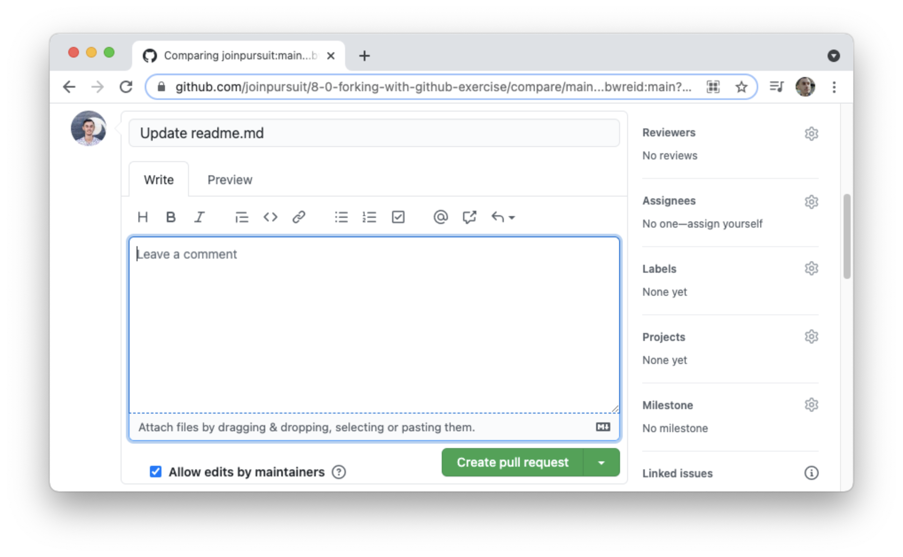

# GitHub

GitHub is a powerful tool for collaboration. Developers across the world use GitHub to back up their code, work with other developers asynchronously, and share their code with the world.

In this lesson, you'll learn about the GitHub platform. You'll connect the repositories you've created on your computer to other repositories hosted by GitHub, allowing you to backup and share your code. Finally, you'll learn the process for creating a pull request, one of the main ways developers collaborate on GitHub.

## Learning Objectives

By the end of this lesson you should be able to:

- Differentiate between git and GitHub.
- Identify important visual aspects of the GitHub repository page.
- Connect your local git repository with a remote GitHub repository.
- Push from your local git repository to your remote repository.
- Fork and clone a repository.
- Create a pull request using a forked repository.

---

## Git and GitHub

The `git` program is different than GitHub, the online service. One of the easiest ways to differentiate the two is to think of _where_ each one "lives."

- The `git` program "lives" on your computer. You can use the `git` program without having to be connected to the internet.

- GitHub is an online service. The majority of GitHub-specific features can only be done on the website.

> **Note:** There _are_ some ways to perform `git` actions on the web and access GitHub features from your computer. However, in general, this distinction holds.

On its own, git is a powerful tool for managing versions of your own programs. GitHub allows that version control to go global. By sharing your code on GitHub, you can work with other developers around the world. GitHub also has a few specific features that can help for managing projects, even if you're working on your own.

## GitHub repositories

Repositories on GitHub are essentially well-designed file systems with extra features. Just like the repositories you've created with the `git` program, they include files, folders, and commits.



The above image highlights a number of important parts of any repository's page.

1. At the top of the page is the name of the account that owns the repository (e.g. `joinpursuit`) and the name of the repository (e.g. `8-0-technical-curriculum`).

2. The green "Code" button is where you can get information about how to connect this repository to you local machine.

3. The light blue bar at the top shows the latest commit. It should show you who made the commit, the commit message, as well as other details about the commit.

   To the right, you can see how many commits are a part of the repository's history. You can also click the link (i.e. "51 commits") to see the entire commit history.

4. A list of the files and folders associated with the repository is listed here. You can view these files similar to how you would with a program like VSCode.

5. If there is a `readme.md` file in the current folder, it will be shown below. `readme.md` is a special file that GitHub looks for to display.

## Connecting local to remote

While it's possible to work on GitHub alone, it is more typical that a GitHub repository is connected to a repository on someone's local machine.

In this way, GitHub can serve as a "backup" for your code. By connecting your local repository to a repository on GitHub, your code will live in two places. However, as is the case whenever you have duplicate files, you want the different version of these files to stay in sync.

### Local vs remote

You'll hear the terms "local" and "remote" often when learning about GitHub.

The word "local" typically refers to your own machine. For example, your "local repository" is a repository that you've initialized with `git init`.

The word "remote" typically refers to the version of your repository that is hosted on GitHub. This is the public version of your repository. Remote repositories are useful for a number of reasons, but one of the most important is that it makes your code easier to share.

Can you imagine trying to work with a team of ten developers and having to send `.zip` files back and forth to each other? This would be inefficient and error prone.

### Getting ready on your local machine

Before creating a remote repository on GitHub, you'll need a local repository with at least a single commit. That means you'll need to:

- Create a new directory with at least one file.

- Initialize that directory as a git repository with `git init`.

- Stage and commit files, with `git add` and `git commit`.

You can always check if your directory is a git repository and has a single commit by running `git log`.

### Creating a new repository

You can create a new repository from the [GitHub.com](https://github.com) homepage. Click the green New button to get the process started.



Alternatively, you can click the "+" button in the top-right corner of any GitHub page. You will then be brought to a page where you can name your repository.



You should give your repository a name that is meaningful as opposed to the nonsense names GitHub typically suggests, like "curly-rotary-phone." It's also typical to give your repository the same name as the folder that contains your repository on your local machine.

At the bottom of the screen, it gives you the option to initialize your repository with some files. You will have already initialized your repository on your local machine, so you _do not need to check these boxes._

After clicking the "Create repository" button, you will be brought to a new page that includes a number of code blocks.



Because you should have already created a repository, you'll be following the instructions under the heading "...or push an existing repository from the command line."

### Push your code

There are three commands that are run to connect your local repository to your remote repository. Typically, you can copy and paste these commands directly into your terminal. However, it's important to generally understand what each command is doing.

**`git remote add origin <url>`**

When you run this command inside of your local git repository, this command connects your local repository with your remote repository.

As you can see by reading the command, a new "remote" is added at the given URL. The name "origin" is just that -- a name for the remote. This name _could_ be whatever you want, but you can just leave it as origin.

**`git branch -M main`**

This command sets the name of the main "branch" to be called `main`. You will learn more about branches later on. For now, know that the `main` branch is where your commit history will live. Your local repository also has a `main` branch -- these two branches will be connected.

**`git push -u origin main`**

The `git push` command moves all of the commits from your local repository to your remote repository. This is the command that gets the two synchronized.

The `-u` flag sets the "upstream" default for this branch to always be the remote with a name of "origin" and the branch with the name of "main."

Because of the `-u` flag, moving forward you can just write `git push` from your local `main` branch and git will know that you want to push to the `main` branch of the remote repository by the name of "origin".

## Asynchronous collaboration

GitHub is designed to work particularly well for sharing code and collaborating with other developers. In order to facilitate this, GitHub has a few useful features that you will both use throughout the class and when working on group projects.

### Forking

Forking a repository means to make a duplicate of it to your own GitHub _account._ The "forked" repository maintains a connection to the original repository.

Anyone can fork a public repository, which makes it a great way for developers to work together on open-source projects without having to manage permissions for a repository.



To Fork a repository, you can click the Fork button at the top of any repository you have access to. After a brief moment, you'll be brought to a new page which is your version of the forked repository.



You should see your account name as the owner of the repository, which will have the same name. You should also see that your repository is forked from the original repository.

Now you have a forked version of the code which means you can update and change it as you like.

### Cloning

Cloning is the process of taking a remote repository from GitHub and creating a synchronized version of it on your computer.

Before cloning, you should do the following on your local machine:

1. Navigate to a directory that _is not_ a git repository.

1. Navigate to a directory that is the _parent_ directory of where you want this repository to live.

1. Make sure that there is not already a folder inside the directory that has the same name as the repository.

Once you've confirmed the above, you will click on the green "Code" button and then copy the URL that is there.



On the command line, you will then run the following command, replacing `<url>` with the URL you just copied.

```bash
git clone <url>
```

This will start a process of downloading all of the files associated with your forked repository. All of those files will go into a new folder with the same name as the repository.

You now have a local version of your remote repository. Your local repository:

- Already has its remote set to be your forked repository.

- Has the same history as the remote repository.

- Is yours, which means you can add your own commits!

### Making changes

You can now work on your forked repository in the same way you would work on any local repository. Make changes, stage those changes, and make new commits. You can also push your changes from your local repository to the forked repository in the same way.

### Creating a pull request

Once you've added at least one new commit, you can create a pull request. Pull requests are a way to suggest changes to a repository without forcefully changing that repository. In a real development workflow, someone would be tasked with reviewing that pull request and determining whether or not your code should be accepted.

To create a pull request, click on the "Contribute" dropdown and then click the green "Open pull request" button.



### Anatomy of a pull request

The page you will be brought to has a number of important parts.



The image above shows the following:

1. After clicking the "Open pull request" button on _your_ forked repository, you'll find you are now on the original repository. This is because you are making a pull request that will be compared to the original repository.

2. This allows you to choose what you're going to compare. You can typically leave this alone for now.

3. All of the commits you are sharing will be listed here.

4. Whatever changes you've made are listed here. In red are the lines that you deleted while in green are the lines you've added.

5. You'll click this green button to actually create the pull request.

6. You can switch between a "Unified" or "Split" view when comparing changes.

### Completing your pull request

After you click the "Create pull request" button, you'll see an area what you can add more details about your pull request.



As a developer, this is where you might describe what changes you're suggesting. If you're using a pull request to submit an assignment for Pursuit, you can just press the "Create pull request" button.
