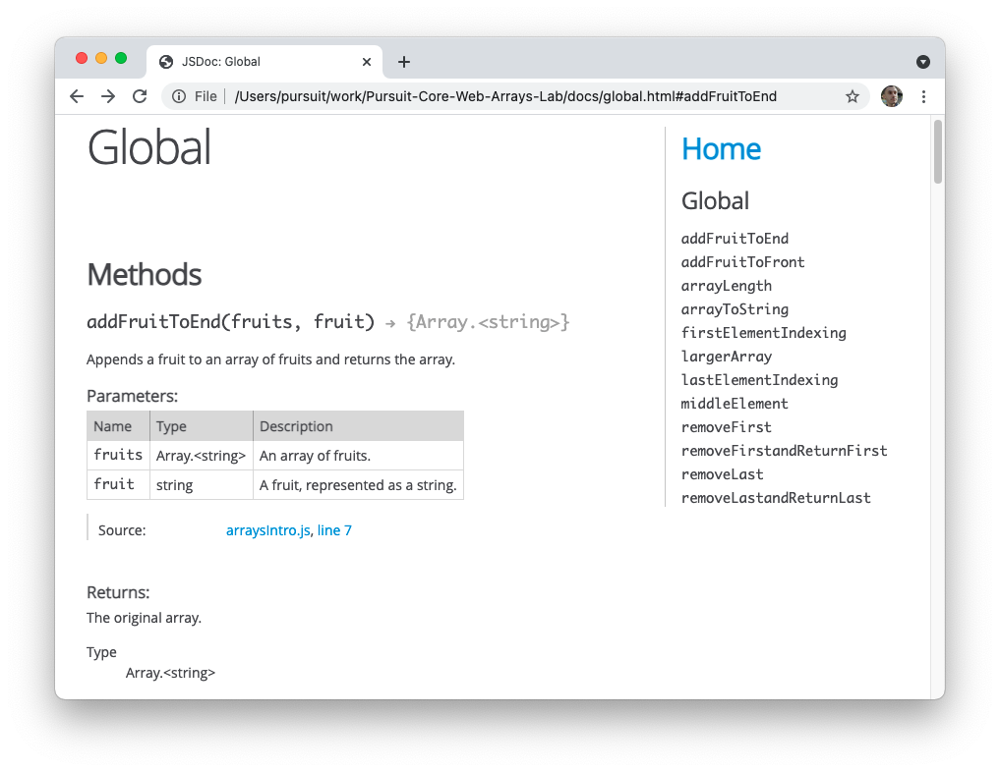

# JSDocs

Commenting your code can feel like an afterthought at times, especially if you're not sure what exactly needs to be commented. Thankfully, some very smart folks have come up with a style guide that can help you to write detailed comments.

In this lesson, you'll learn about JSDoc, a program and style guide. By the end of this lesson, you'll be able to interpret these comments as well as describe the role of comments in software development.

## Learning Objectives

By the end of this lesson, you should be able to:

- Describe the role of comments in software development.
- Interpret JSDoc function comments.

---

## Commented code

When should you comment your code? This question doesn't always have a clear answer.

As an example, take a look at the following function:

```js
function calculateDiscount(val, per) {
  return val * per;
}
```

Is it clear what is happening in the code above? With a bit of thinking, you can probably assume that `val` relates to the total value, or amount, while `per` probably refers to the discount percentage. While the function name is pretty clear, the variable names are not. This could be a good case for adding a comment.

### Basic descriptions

To improve this code, you may want to add a comment that describes what is happening.

```js
/*
  This function takes in a value and a percentage (as a decimal) and returns a number, representing the amount of the discount.
*/
function calculateDiscount(val, per) {
  return val * per;
}
```

This is certainly a nice improvement. Now you have a better idea of what the parameters and output represent. However, instead of writing a comment, what if you just wrote clearer code?

```js
function calculateDiscount(amount, discountPercentage) {
  const discountedAmount = amount * discountPercentage;
  return discountedAmount;
}
```

The code above is much easier to read due to the nicely named variables. A descriptive comment may not be as necessary here. Notice though that some critical information has been lost: that this function expects `discountPercentage` to be a decimal.

Ideally, your code speaks for itself. However, comments can be a useful way to give clarity to your code, when that's not completely possible.

```js
/*
  Returns a number, representing the discount.
  - `amount` is a number.
  - `discountPercentage` is a decimal. Should be less than 1.
*/
function calculateDiscount(amount, discountPercentage) {
  const discountedAmount = amount * discountPercentage;
  return discountedAmount;
}
```

The above comment is simple but adds some clarity to understanding how the function is intended to be used. Additionally, the function is written in such a way that its intention is clear, even without reading the comment.

## JSDocs

While there is no "right" way to write comments, there is a benefit to picking a standardized way of writing comments. Particularly when working with a large team, agreeing on a comment strategy can be beneficial to the entire organization.

One common tool used in the industry is [JSDoc](https://jsdoc.app/). JSDoc is both a program and a style guide. If you follow the style guide for writing comments, JSDoc will allow you to generate a documentation website from your code.



In the example above, you can see the following:

- On the right, a list of all functions that are commented with JSDoc style comments.
- On the left, a description of a specific function, `addFruitToEnd()`.
- A description of the function.
- A description of each parameter, as well as their data type.
- A link to the actual code, where the function is written.
- Details about what is returned from the function.

This visual page was generated using JSDoc from the following comment:

```js
/**
 * Appends a fruit to an array of fruits and returns the array.
 * @param {string[]} fruits - An array of fruits.
 * @param {string} fruit - A fruit, represented as a string.
 * @returns {string[]} The original array.
 */
function addFruitToEnd() {}
```

While you will not learn how to use the JSDoc program in this lesson, you will learn about how to write documentation according to the JSDoc style guide. This will help you understand code challenges you'll complete in the program as well as give you a sensible and detailed format for writing your own comments.

### Writing documentation with JSDocs

JSDoc uses a system of tags to generate documentation. This formatting style is useful, even if you're just looking at the comment directly.

#### Comment block

To start JSDoc comments, you must use the multi-line comment syntax. JSDoc in particular requires you to use an additional `*` after the required ones, as well as include an `*` on every line afterwards. These commented lines should be included directly above the function you are documenting.

```js
/**
 * Your comment goes here.
 */
function calculateDiscount(amount, discountPercentage) {
  // Code goes here...
}
```

#### Description

The first line of your comment block will be a description of the function. This can be brief, assuming the code is written well.

```js
/**
 * Calculates the discount applied to the checkout total.
 */
function calculateDiscount(amount, discountPercentage) {
  // Code goes here...
}
```

Your description is a good place to add context for the function. In the above code, you can see that this function is specifically related to a checkout process.

#### Parameters

Next, you'll define the parameters. Each parameter description must start with `@param`. JSDoc refers to these special keywords that begin with the `@` symbol as a tag.

You should then follow that `@param` tag with a description of the data type between curly braces, followed by the name of the parameter. Finally, you'll separate the parameter name and it's description with a dash.

```js
/**
 * Calculates the discount applied to the checkout total.
 * @param {number} amount - The total amount at checkout.
 * @param {number} discountPercentage - The amount to be discounted.
 */
function calculateDiscount(amount, discountPercentage) {
  // Code goes here...
}
```

In the example above, you may notice that there's no mention of the fact that `discountPercentage` should be a decimal. While "decimal" is not actually a JavaScript data type, you can type whatever you want between the curly braces.

```js
/**
 * Calculates the discount applied to the checkout total.
 * @param {number} amount - The total amount at checkout.
 * @param {decimal} discountPercentage - The amount to be discounted.
 */
function calculateDiscount(amount, discountPercentage) {
  // Code goes here...
}
```

#### Return values

Finally, you can add details about what is returned from the function by using the `@returns` tag.

```js
/**
 * Calculates the discount applied to the checkout total.
 * @param {number} amount - The total amount at checkout.
 * @param {number} discountPercentage - The amount to be discounted.
 * @returns {number} The final discounted amount.
 */
function calculateDiscount(amount, discountPercentage) {
  // Code goes here...
}
```

Just like with `@param`, you can specify the data type that should be returned. While there's no return value name, you can also include a description as seen above.
