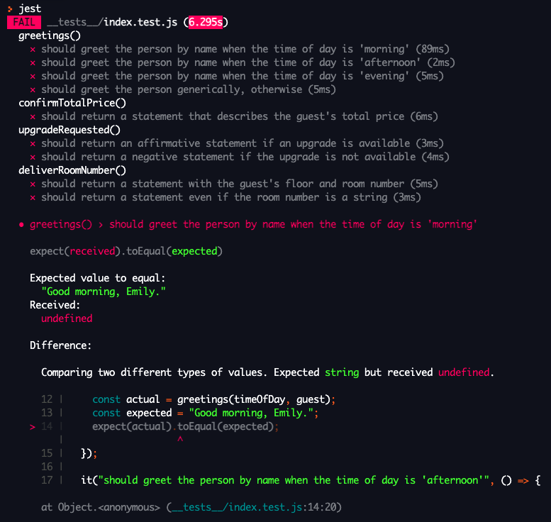

# Understanding tests

When working on larger applications, it quickly becomes impossible to manually check that all of your code is always working. To solve this problem, software developers write tests for their code. To write tests means to write code that verifies whether or not other code you've written is working.

Although it can be a bit confusing to understand at first, testing is an incredibly powerful tool for ensuring your code works the way you want it to. And, for your duration at Pursuit, tests will be a big part of getting immediate feedback on the code you've written.

The goal of this lesson is just to get you familiar with reading tests. You will not be asked to write tests, at least not yet!

## Learning Objectives

By the end of this lesson, you should be able to:

- Describe the role of tests in software development.
- Interpret test output in order to take actionable steps in code.

---

## What are tests?

Take a look at the following function that returns a descriptor depending on the temperature.

```js
function temperatureDescription(degreesInCelsius) {
  let result = "cold";

  if (degreesInCelsius > 25) {
    result = "hot";
  } else if (degreesInCelsius > 18) {
    result = "pleasant";
  } else if (degreesInCelsius > 10) {
    result = "cool";
  } else if (degreesInCelsius > 0) {
    result = "chilly";
  }

  return result;
}
```

How would you test that this function works in every situation? Ideally, you would need to call the function multiple times, each time testing a different situation. For example, take a look at the code below that expects for the function to return the word `"cool"`.

```js
const actual = temperatureDescription(11);
const expected = "cool";
if (actual === expected) {
  console.log("The temperatureDescription() function works as expected.");
} else {
  console.log("The temperatureDescription() function failed.");
}
```

The code above compares the actual result of calling `temperatureDescription()` with the number `11` with its expected return value, `"cool"`. If the actual result and the expected result are equal, an affirmative message is logged. Otherwise, a negative message is logged.

At its most basic form, this is testing. The code above is written to test out whether or not the `temperatureDescription()` function works in the way it is intended to work. While this testing code is not useful for someone who actually wants to use the `temperatureDescription()` function to actual get a description, it is very useful to you as a software developer.

If good tests are written, you can feel confident that your code will continue to work.

### Test libraries

Developers have created a number of powerful tools to help with testing. While using `console.log()` can work at the basic level, there is more and better reporting that can be done by using a powerful testing library.

A library is code someone else has written that you can use. You'll learn more about libraries at a later date. For now, keep in mind that some of the code you'll be seeing in this lesson is not natively included into JavaScript.

One of the most popular libraries to use nowadays is called [Jest](https://jestjs.io/). Jest is used by large tech companies such as Twitter, AirBnB, and Spotify.

## Reading tests

In this lesson, you'll focus on just being able to read tests. Thankfully, Jest tests use a syntax that is quite easy to read compared to other code you might have seen.

There are two main components to tests.

### Test output

When you run Jest tests, you will receive output in your console that will tell you what functions are working and which are not. If something about your function is failing, you'll get additional details about what is wrong.



The image above is an example of Jest output. It is only a partial view of what you get back from Jest.

In the image above, you can see the following:

- You can see that one file was tested, `__tests__/index.test.js`. This is where the Jest tests live.
- You can see that four functions were tested: `greetings()`, `confirmTotalPrice()`, `upgradeRequested()`, and `deliverRoomNumber()`. These functions each have a number of different test cases. For example, `greetings()` has four test cases, all of which failed.
- In the bottom half of the image, you can see more details about one of the tests for the `greetings()` function. You can see that what Jest expected was the result `"Good morning, Emily."`, but instead it got the result `undefined`.
- Underneath where it says "Difference", the test code is shown where this error occurs. This will be covered in the next section.

The function that is being tested currently looks like this:

```js
/**
 * Displays an appropriate greeting to the guest.
 * @param {string} timeOfDay - Should be either "morning", "afternoon", or "evening".
 * @param {string} name - The guest's name.
 * @returns {string} An appropriate greeting based on the time of day.
 */
function greetings(timeOfDay, name) {}
```

With that in mind, it should make sense that the actual result that was returned from the function was `undefined`, as there's no explicit return value. Reading the comments above the function, it should also become clear that this function should be returning a string that makes use of the `timeOfDay` and `name` parameters.

To find out more about how this function should work, you can look at the actual Jest tests.

### Test code

The tests for the `greetings()` function will look very complicated at first. Don't panic! Your only goal right now is to interpret enough of what is going on so that you can understand the function's intention.

```js
describe("greetings()", () => {
  it("should greet the person by name when the time of day is 'morning'", () => {
    const timeOfDay = "morning";
    const guest = "Emily";
    const actual = greetings(timeOfDay, guest);
    const expected = "Good morning, Emily.";
    expect(actual).toEqual(expected);
  });

  // More tests...
});
```

Some of the code above will look very different, but some may actually look familiar. You can read the code above in the following way:

- This test is "describing" the `greetings()` function.
- "It" "should greet the person by name when the time of day is 'morning'".
- When the `greetings()` function is called with the values `"morning"` and `"Emily"`, the `expected` output is `"Good morning, Emily."`.

Although the syntax may not be completely clear, the Jest tests can read nicely when you know what to look for. With all the information you've gathered, you likely have a better idea of how the `greetings()` function should work.

There are additional test cases underneath this first one. Each test case begins with the `it()` function. Each function that is tested will start with a `describe()` function.
