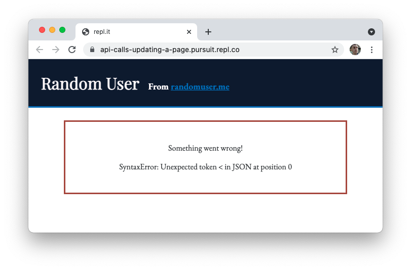
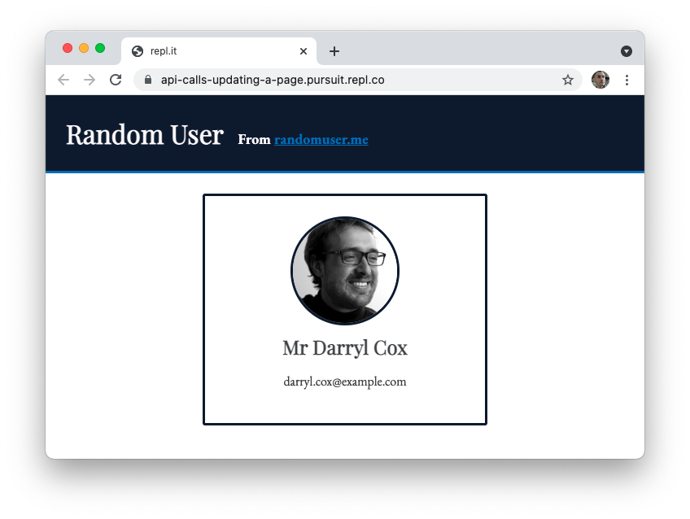

# API Calls with Fetch

To make use of JSON APIs on the front end, you'll need a way to connect to an external server and retrieve data from it. One powerful way to do so is with the built-in `fetch()` function. This function allows you to make requests to external websites and does so using promises.

In this lesson, you'll learn how to use the `fetch()` function. Then, you'll see how you could integrate data into an HTML, CSS, and JavaScript web application using the data you've retrieved from the `fetch()` function.

## Learning objectives

By the end of this lesson you should be able to:

- Use the `fetch()` API to make GET requests to a public JSON API.
- Use the data from an API call to build a web application, including event listeners.
- Gracefully handle errors by showing a response to the user.

---

## Fetch

The `fetch()` function is a powerful utility available in most common browsers. It allows for all the functionality you might need to make any kind of external request. Because `fetch()` is designed to handle any kind of request, not just requests to JSON APIs, an additional step is needed to appropriately parse the response received from the function.

### Using the fetch() function

The `fetch()` function returns a promise and can be used in the following way.

```js
fetch(YOUR_URL)
  .then((response) => response.json())
  .then((json) => {
    // You can do what you like with the result here.
    console.log(json);
  })
  .catch((error) => {
    // You can do what you like with the error here.
    console.log(error);
  });
```

Replacing `YOUR_URL` with the URL of the JSON API you are trying to access, the code above will do the following:

1. Make a `GET` request to `YOUR_URL`.
1. If the server responds, it will attempt to parse that response from JSON into JavaScript.
1. You are "then" able to use the JavaScript returned from the API in whatever way you like.
1. If anything fails along the way, you will receive an error.

The second line, where the received response has the `.json()` method invoked, is unique to using the `fetch()` function. It is not inherently connected to promises.

Once you have access to the `json` variable (which, as a reminder, can be named whatever you like), you have access to the response from the API. Similar, if a failure occurs, the response from that failure will be available in the `.catch()`.

## Integrating an API

Now that you know how to make a request to an external JSON API and receive its results, you can integrate JSON APIs into your interactive web applications. While the `fetch()` function may feel foreign, it is code just like anything else.

For an example, see the following repl. This repl makes use of the [Random User Generator API](https://randomuser.me/).

- [API Calls: Updating a Page](https://replit.com/@Pursuit/API-Calls-Updating-a-Page)

### Handling errors

When you load the repl above you should see an error appear after a brief moment. That error is being dynamically added to the page after a `fetch()` request fails. The error message is shown on the page as well.



You can see the issue with this code once you look at the `script.js` file.

```js
const BASE_URL = "https://randomuser.me/api";

fetch("")
  .then((response) => response.json())
  .then(displayCard)
  .catch(displayError);
```

As you can see, there is no valid URL that has been placed inside of the `fetch()` function. However, the page still shows something to the user due to the `.catch()` method. If there is an error, the `displayError()` function is called.

### Dynamically updating the page

You can solve this error by replacing `""` with `BASE_URL` as the argument for the `fetch()` function.

When the request succeeds, a random person is added to the page due to the `displayCard()` function being called as part of the `.then()` method.


