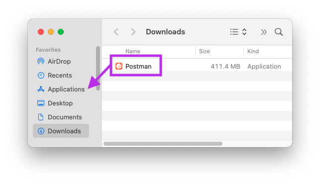
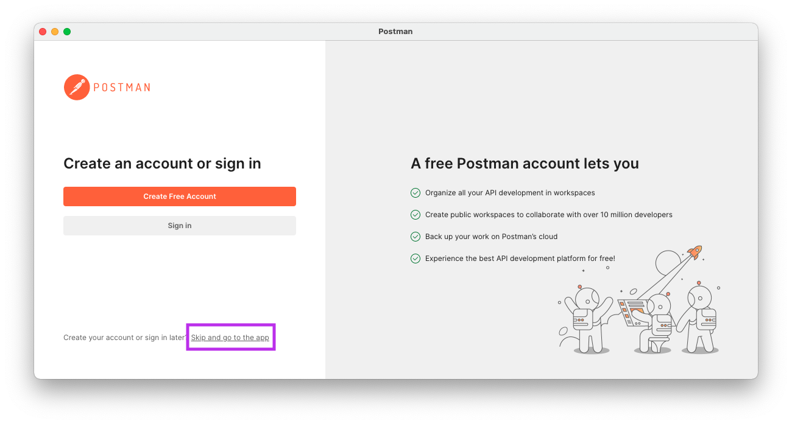
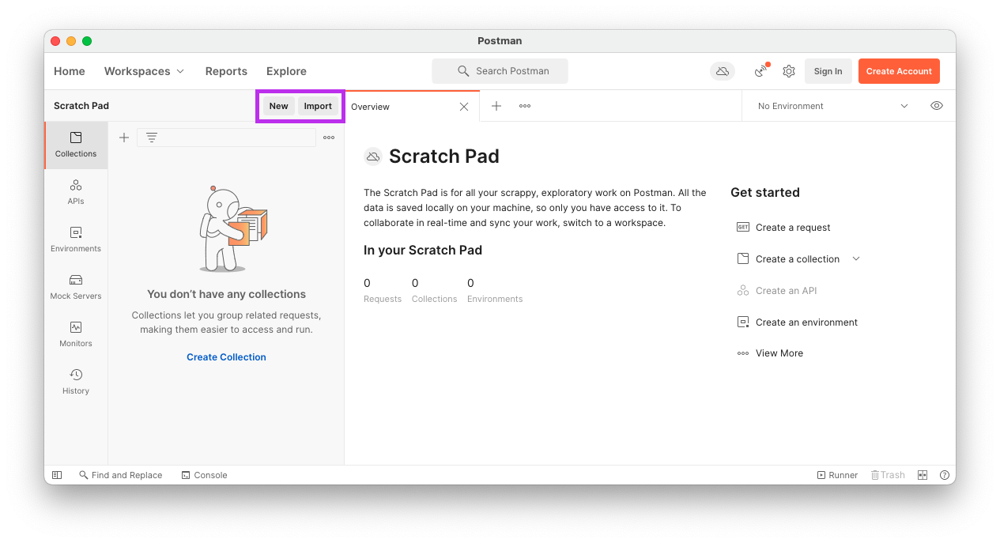
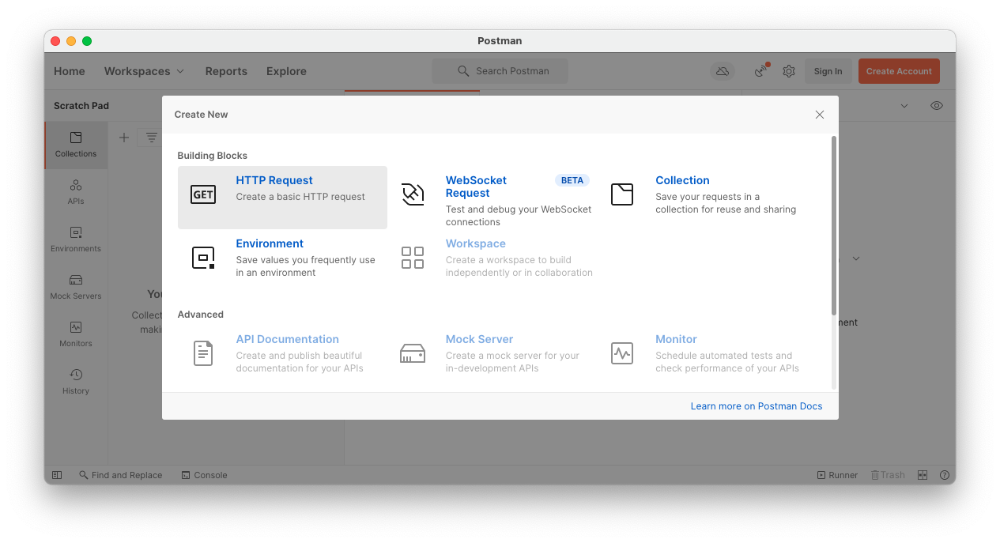
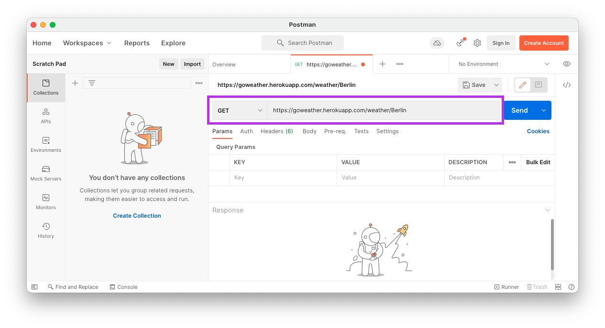
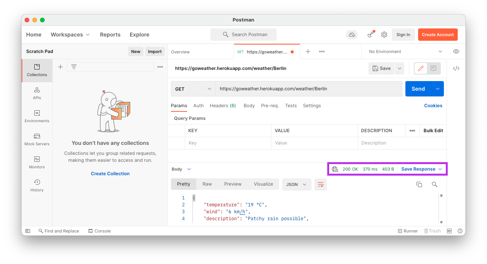
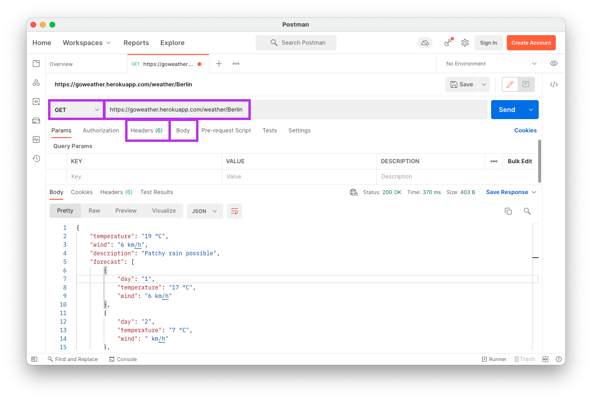
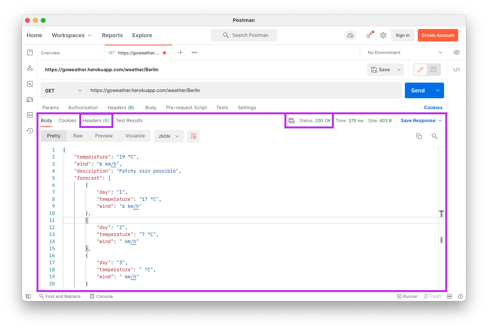

# API Calls with Postman

As you know, browsers make requests to servers which respond with data. This data can be in the form of HTML, text, or a variety of other forms. Additionally, it's not just browsers that can make these requests -- other types of software can make similar requests.

In this lesson, you'll learn how to use a popular tool called Postman that makes it possible to make requests to servers. You'll learn about one specific type of request as well as the different parts that make up general requests and responses.

## Learning objectives

By the end of this lesson you should be able to:

- Use Postman to make GET requests to a public API.
- Identify the four main parts of an HTTP request.
- Identify the three main parts of an HTTP response.
- Identify different types of data that can be used in a response.

---

## What is an API?

In this lesson, you'll be making a request to a public API. API stands for application programming interface. This term alone is a bit confusing, made even more confusing that when someone talks about an "API" they could be referring to a few different types of programs. In general, an API is a kind of connection between computers or a computer program. However, there are two main ways it typically used:

1. The term API might refer to the way in which you interact with a particular program or object. For example, JavaScript's "Array API" would refer to the ways in which you can interact with arrays in JavaScript, such as through `.push()` and `.pop()`. This is the less favored meaning for APIs but you will still hear it, particularly in relation to particular functions or packages. For example, the React API or the `fetch` API.

1. The term API can also refer to a web server that responds with some kind of data. Typically these APIs have a particular way to interact with them in order to receive the desired response. This is the more popular meaning of API these days.

### JSON APIs

One common type of web API is a JSON API. JSON stands for JavaScript Object Notation. For an example of JSON, look below.

```json
{
  "temperature": "19 °C",
  "wind": "22 km/h",
  "description": "Partly cloudy",
  "forecast": [
    { "day": "1", "temperature": "25 °C", "wind": "14 km/h" },
    { "day": "2", "temperature": "21 °C", "wind": "8 km/h" },
    { "day": "3", "temperature": "21 °C", "wind": "11 km/h" }
  ]
}
```

While the above looks like JavaScript, it is in fact JSON. JSON is just a textual representation of JavaScript. JSON APIs respond with this type of data, which is great for when you want to work in JavaScript.

In a later lesson you will learn how to translate JSON to JavaScript.

## Postman

Postman is an application that allows you to make customized requests to a particular URL and inspect the response you receive. As a web developer, it is more useful than using the browser because it readily gives you access to more information and more customization.

### Installing Postman

You can download the Postman application by clicking on the link below.

- [Postman](https://www.postman.com/downloads)

Once you've downloaded the application, it will be in your `Downloads/` directory. You will need to drag it from your `Downloads/` directory to your `Applications/` directory to completely install it.



When you open the program, you will be prompted to make an account. While you can do so, you can also skip ahead by clicking the link at the bottom of the screen.



### Making requests

When you make a request in Postman, it's as if you were to go to that page in the browser. However, with Postman, you can customize the request and the response more deeply.

To make a request with Postman, first click on the "New" button in the upper-left portion of the screen. There are a few other ways to create a new request as well.



Then, click the option that allows you to make an HTTP Request.



A new tab will open that will allow you to enter a URL. You'll enter in your URL in the gray box.



For example, in the above image the following URL was entered:

```
https://goweather.herokuapp.com/weather/Berlin
```

Finally, to make the request you will press the "Send" button.

Once you do so, you should see the bottom half of the page change. In particular, you look for the text "200 OK".



## Parts of a request

There are four key components to any request. While in the browser much of this is set for you, as a web developer you will often need to specify one or more of the following components.



### URL

The URL is one of the most important parts of the request. This determines what server you will be asking for information as well as the path. The server will determine what information to send back partially by looking at the path.

In the image above, the URL starts with `https://goweather.herokuapp.com/`.

### Method

The method describes what kind of request is being. Methods are also sometimes called "HTTP Verbs" as they are action-oriented words that describe what is happening.

For example, in the image above the method is "GET". This is because the request being sent wants to "GET" information back.

You will learn other types of methods at a later time.

### Headers

Headers generally include metadata that is part of the request. You can think of it as kind of like the `head` element in an HTML page.

In general, you will only need to modify the headers in a few specific scenarios. For now, you can leave the headers as is.

### Body

The body refers to information being sent as part of the request. Often this will include information about the user, such as what the user has submitted in a form.

You will learn more about what can be sent in the body at a later time.

## Parts of a response

The response you receive contains three key components. Different servers will share information differently, but all will necessarily send back the following information.



### Status code

The status code is a numerical representation of what happened as part of the request-response cycle. Each numerical code has a short word or phrase associated with it.

For example, in the image above a status code of "200 OK" was sent back. This means that the request successfully reached the server, was formatted as expected, and that the server was able to respond.

There are many different types of status codes. Some of the most common are below.

| Status Code | Message               | Description                         |
| ----------- | --------------------- | ----------------------------------- |
| 200         | OK                    | Everything went great!              |
| 201         | Created               | A new resource was created.         |
| 404         | Not Found             | Nothing could be found at this URL. |
| 500         | Internal Server Error | Something in the server went wrong. |

### Body

The response has a body as well. This is where all the information requested is stored.

A response doesn't need to have a body. It could actually be empty. But, it is common for some data to be in the body.

In the example above, the response was sent back as JSON. Other popular formats are HTML and XML.

### Headers

The response has headers as well. Just like with the request, these headers are meta information that you will likely not need to touch for now. These headers differ from the request headers in that they typically tell information about the server or the response.
