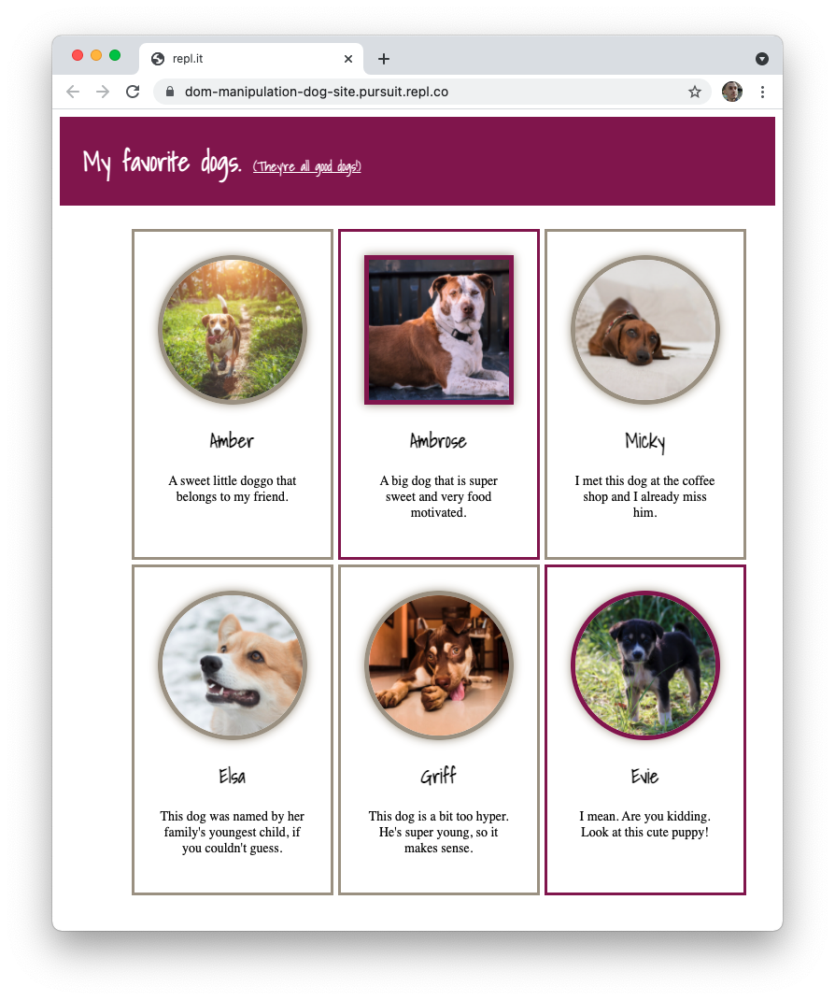

# Creating and Updating DOM Elements

## Learning Objectives

By the end of this lesson you should be able to:

- Create DOM elements in memory, through `Document.createElement()`.
- Attach DOM elements to the page.
- Modify DOM elements through element methods and properties.

---

## Setup

Begin by forking the following Repl.it.

- [Repl.it: Dog Site](https://replit.com/@Pursuit/DOM-Manipulation-Dog-Site)

## Guiding questions

- The `document.createElement()` method will create a new element. What argument does the `.createElement()` take?

- There are at least four different methods that allow you to attach elements you've created to the DOM. What are those methods and how do they differ from one another?

- In the repl, write code in the `script.js` file that adds a `span` element to the `h1` element currently on the page. The `span` element should come _after_ the text.

- In the repl, update your code so that the following text appears inside of the `span` element. What attribute can you use to set this text?

  ```
  (They're all good dogs!)
  ```

- Add the `underline` class to the `span` element you just created with JavaScript. Did you use `.setAttribute()` or `.classList`? Why?

- Create the following HTML structure with JavaScript before adding it to the `main` element.

  ```html
  <article>
    
    <h2>Amber</h2>
    <p>A sweet little doggo that belongs to my friend.</p>
  </article>
  ```

- Create another `article` element with the same structure as above. However, make the following changes:

  - Change the `src` attribute to be equal to `https://placedog.net/500/441`.
  - Change the name of the dog. Update the `alt` attribute and the `h2` element with the new name.
  - Change the description for the dog.
  - Add a class of "featured" to the `article` element.

- At this point, you likely have a lot of code that is duplicated. What are some of the issues with having so much duplicated code?

- Can you create any helper functions that would help DRY up this code? Create at least one helper function now.

- Take a look at the following array which contains a single object. As you can see, much of the data that is variable has been removed and placed in this object.

  ```js
  const dogs = [
    {
      name: "Amber",
      description: "A sweet little doggo that belongs to my friend.",
      imageNum: 450,
      featured: false,
    },
  ];
  ```

  First, begin by adding a new object to the array above that includes the name, description, and image number (i.e. `441`). Finally, set the `featured` key to be equal to `true`.

  Next, loop over the array. Inside of the loop, use the code you've written to create both of the articles. You can do so by substituting your hardcoded values (e.g. "Amber") with the values accessed via the object.

- Reflect back on what you've just accomplished. What was difficult about it? What benefit did you get?

- Add at least one more dog to the array and watch as your list of favorite dogs grows.

  
