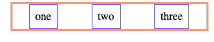

# CSS Box Model

## Learning Objectives

By the end of this lesson you should be able to:

- Describe the properties of the CSS box model
- Define padding, margin, and borders for customizing an HTML element
- Compare and contrast default display properties
- Determine appropriate positioning strategy for your layout

---

## HTML Elements are a Box

### Every HTML element has default box properties made up of:

- content
- padding
- border
- margin
- display
- position

In your browser `dev` tools (open with: <kbd>command</kbd> <kbd>shift</kbd> <kbd>i</kbd>) you can see the box model of any element by hovering over it.

The below element has:

- `content` with a `width` of of 500px and `height` of 250px
- `padding` with `top` / `bottom` of 50px, and `left` / `right` of 10px
- `border` with 2px on each side
- `margin` `top` and `bottom` of 25px
- `position` `-` which is set to the default (static)


The content is always in the middle, then padding, then border, and margin is the most outer portion.

### Content

Content generally means text or other html elements and follows this default behavior:

- Content will adjust to the maximum width allowed by its container (parent html element) or viewport (browser size)
- Once it has reached maximum width, content will expand in terms of height

Let's look at an example:

**index.html**

Let's start with an empty `div`. A `div` has a default `display` of `block` - which means it will take up the entire width of the viewport (browser) or parent container (if it is placed inside another HTML element).

It has a height of 0, because it currently has no content (neither text nor another HTML element) inside of it.

**index.html**

```html
<div></div>
```

**appearance**


By default a div has:

- no content (height of 0)
- width matches the viewport (browser) or parent container size
- no padding
- no border
- no margins

Let's add some content:

```html
<div>
  <p>content</p>
  <p>more content</p>
  <p>even more content</p>
  <p>
    a wall of content that just goes on... and on... and on and on and on...
  </p>
</div>
```

Let's limit the width and add a border to the `div` to help see the area of the `div`.

**main.css**

```css
div {
  width: 100px;
  border: 2px solid teal;
}
```

In order to show where the `p` tags begin and end, let's add a `background-color`

**Note:** `p` tags also have a default `display` of `block`

```css
div p {
  background-color: antiquewhite;
}
```


As we can see, the content (p tags with text), stay within the boundary of the container's width (`div`). Then, if needed, automatically expand downward, increasing the height of themselves, and the height of the `div`.

**div** (with p tags and 2px border)


If we look at the box model for a `p` tag, we'll notice that it has a default `margin-top` and `margin-bottom` of 16px.

**p** (single line of text)


With practice and usage, you will get used to what to expect for default settings of different elements. You may notice, when you develop CSS for different browsers, that the defaults might be slightly different.

When determining what element to use, you should choose the [semantic](https://www.w3schools.com/html/html5_semantic_elements.asp) one and then style it correctly. For example, if you need to make a top level `heading`, but you prefer the size and margins of an `h2`, you should use an `h1` and use CSS to make it the size and top/bottom margins what you want.

### Padding

Padding puts space between the content and the border of the element.

**main.css**

```CSS
div p {
    background-color: antiquewhite;
    text-align: center;
    padding: 16px;
}
```

Notice that `padding: 16px` adds padding to all four sides, making the `antiquewhite` area around the text bigger.


We can also add padding to the `div`. This will add space between the content (entire `p` tags and their content), and the teal border:

```css
div {
  width: 100px;
  border: 2px solid teal;
  padding: 16px;
}
```


**Note:** Now the total `width` of the `div` has increased from 100px to 136px.


This is because the base width is set by content. Then, padding of 16px, on both sides = 32px and 2px of border on each side = 4px are added on to the total width.

The total width is now 100 + 32 + 4 = 136

If you need to constrain the width to be exactly 100px, regardless of padding and borders, you can use:

```css
box-sizing: border-box;
```

We can also make each side of padding different. The arguments go like a clock they start top (12), then right to (3), then bottom (6) and then left (9)

**Note:** for ease of viewing this demo, the width of the div has been adjusted to `300px`

```css
div {
  width: 300px;
  border: 2px solid teal;
  padding: 12px 3px 6px 9px;
  box-sizing: border-box;
  margin: 4px auto;
}
```

### Border

`border` has 3 arguments always in the same order: The width of the border, the type of border, and the color.

A mnemonic to help remember the order is `1 solid gold` bar, which you would write out like so:

```css
border: 1px solid gold;
```

You can change the properties, as needed.

## Margins

Margins add space outside of the border. Other elements will not begin until the set margin amounts are cleared. 

One common thing to do with an HTML element is to center it horizontally.

This type of centering only works on elements with a display of `block`. If you have an element that has a different type of display (e.g. - an image has a display of `inline-block`), you would have to set the display to `block`, in order to be able to center with this method.

First, set the width to be less than 100% of the viewport (browser) or container. Then, set the left and right margin properties to `auto`.

When you use two arguments for `padding` or `margin`, the first represents top/bottom and the second represents left/right

```css
div {
  width: 300px;
  border: 2px solid teal;
  padding: 16px;
  box-sizing: border-box;
  margin: 4px auto;
}
```

You can also set each margin individually:

```css
div > p {
  background-color: antiquewhite;
  text-align: center;
  padding: 16px;
  margin-top: 12px;
  margin-right: 3px;
  margin-bottom: 6px;
  margin-left: 9px;
}
```

## Display

There are a few different display properties:

- block
- inline
- inline-block
- none
- flex
- grid

### Block

This is the default for many elements such as headings (h1 - h6), paragraph, div, article, unordered lists etc.

By default, these elements are the full width of the viewport or container element. You cannot put another element horizontally next to this element. You would need to change the display property in order to do that.

### Inline

This is the default for html elements that go inside a text element (e.g.heading, paragraph). Examples of inline elements are anchor (`a`) or span. It is important to note that height and width properties have no effect on this display type. It keeps the element in line with the parent element.

For example, wrapping the word `more` inside a span tag will not affect where it is in the p tag (it will keep it in line). Typically, one would use the `span` tag to add additional style.

**index.html**

```html
<p>even <span>more</span> content</p>
```

**main.css**

```CSS
p > span {
    color: orange;
    font-style: italic;
}
```

### Inline-block

This has the same behavior as an `inline` display, however you can set width and height properties. An example of an element with this as a default display property is a `button`

Let's try an example by adding the following code below our div:

**index.html**

```HTML
   <ul>
       <li>one</li>
       <li>two</li>
       <li>three</li>
   </ul>
```

**main.css**

```CSS
ul {
    border: 3px solid lightsalmon;
    width: 50%;
    margin: auto;
}

li {
    border: 1px solid mediumslateblue;
}

```


Let's change some default styling from the unordered list and list items.

```CSS
ul {
    border: 3px solid lightsalmon;
    width: 50%;
    margin: auto;
    padding-left: 0;
}

li {
    border: 1px solid mediumslateblue;
    text-align: center;
    padding: 8px;
    list-style: none;
}

```


Now, let's change the `display` from it's default, `block` to `inline-block`

```CSS
li {
    border: 1px solid mediumslateblue;
    text-align: center;
    padding: 8px;
    list-style: none;
    display: inline-block;
}
```


**Try it!**: change `inline-block` to `inline` - notice how the height property is no longer being utilized.

### None

This property allows you to hide the element. This property is most useful when combined with JavaScript to show or hide an element (e.g. open and close an info box).

```CSS
 li {
     display: none;
 }
```

<hr />

### BONUS: Flex

Flex is a newer display, introduced in 2009. [Flex](https://css-tricks.com/snippets/css/a-guide-to-flexbox/) sets the `flexbox` property on the container which will impact all the children components. Flexbox is great for:

- Centering elements (an alternative to `margin: auto`)
- [Setting elements equidistantly from each other](https://css-tricks.com/equidistant-objects-with-css/)
- [Vertical centering](https://philipwalton.github.io/solved-by-flexbox/demos/vertical-centering/)
- Creating a [sticky footer](https://philipwalton.github.io/solved-by-flexbox/)

Example of equidistant spacing:

```CSS
ul {
   border: 3px solid lightsalmon;
   width: 50%;
   margin: auto;
   padding-left: 0;
   display: flex;
   justify-content: space-around;
}
```



**Try it** : change the property of `justify-content` to `space-between` or `center` for other types of equidistant spacing.

### BONUS: Grid

[Grid](https://css-tricks.com/snippets/css/complete-guide-grid/) is the newest display type, it became widely accepted by most browsers in ~ 2017. It allows elements to be laid out in a responsive grid and thus allows creating complex, responsive layouts to be achieved with relative ease, especially in contrast to older techniques.

## Position

By default, HTML elements have a property of `static`. Elements are loaded from top to bottom, as each element takes up space, it moves the next element to the right and down.

Sometimes we want to take things out of the flow. And before the arrival of flexbox and grid, using these properties to create layouts was much more common. Now there are better ways to do layout, but there are use cases where these position properties can still be useful.

We might want an element to be `fixed` in position - no matter where other elements are in the page, nor the size of the viewport, nor if a scroll has been activated, this will keep the element in the exact position in relation to the viewport.

An example of this is a modal (pop-up) that is always center in the page.

We may want an element that is `absolute` in position, relative to another, non-static element.

An example of this would be a logo inside a fixed nav bar.

Another one is `relative` - where the element is moving from where it _would_ be to the specified offset. This is useful when you are working with other elements that are no longer set to static.

A great way to learn more how these properties behave is to play around with them

[W3 Schools Demo](https://www.w3schools.com/cssref/playit.asp?filename=playcss_position&preval=absolute)

Usually, there is a certain behavior that you want to create with CSS, (like an overlay), then you would google how to do it and adapt a given example. 

### Z-Index

Sometimes you want to be sure that one HTML element is on top of another one (this is only something you can set when the `position` `static` has been changed to something else, like `absolute`, `fixed`, `relative` etc.)

You can choose how the elements stack by giving them a `z-index` number. Remember the `x-axis` goes across, the `y-axis` up/down and the `z-axis` goes towards/away from you (in a 3D plane)

**index.html`**

```HTML
    <h1>This is an awesome pop up message</h1>
```

**main.css**
```CSS
h1 {
    position: fixed;
    top: 100px;
    left: 100px;
    width: 50%;
    padding: 64px;
    background-color: lightsteelblue;
    color: cornsilk;
    opacity: .9;
}
```


**Try it**: If we would want, we could move this pop up to be behind the other elements

```CSS
h1 {
   position: fixed;
   top: 100px;
   left: 100px;
   width: 50%;
   padding: 64px;
   background-color: lightsteelblue;
   color: cornsilk;
   opacity: .9;
   z-index: -1
}
```

**BONUS** : [Use this guide to center the modal](https://css-tricks.com/considerations-styling-modal/)

---

Full code:

**index.html**

```HTML
<!DOCTYPE html>
<html lang="en">
  <head>
    <title>Box Model</title>
    <link rel="stylesheet" href="main.css" />
  </head>
  <body>
    <div>
      <p>content</p>
      <p>more content</p>
      <p>even <span>more</span> content</p>
      <p>
        a wall of content that just goes on... and on... and on and on and on...
      </p>
    </div>
    <ul>
      <li>one</li>
      <li>two</li>
      <li>three</li>
    </ul>
    <h1>This is an awesome pop up message</h1>
  </body>
</html>
```

**main.css**

```CSS
div {
  width: 300px;
  border: 2px solid teal;
  padding: 12px 3px 6px 9px;
  box-sizing: border-box;
  margin: 4px auto;
}

div > p {
  background-color: antiquewhite;
  text-align: center;
  padding: 16px;
  margin-top: 12px;
  margin-right: 3px;
  margin-bottom: 6px;
  margin-left: 9px;
}

ul {
  border: 3px solid lightsalmon;
  width: 50%;
  margin: auto;
  padding-left: 0;
  display: flex;
  justify-content: space-around;
}

li {
  border: 1px solid mediumslateblue;
  text-align: center;
  list-style: none;
  padding: 8px;
  display: inline-block;
}

h1 {
  position: fixed;
  top: 100px;
  left: 100px;
  width: 50%;
  padding: 64px;
  background-color: lightsteelblue;
  color: cornsilk;
  opacity: 0.9;
  z-index: -1;
}

p > span {
  color: orange;
  font-style: italic;
}

```
