# CSS Box Model

## Learning Objectives

By the end of this lesson you should be able to:

- Describe the CSS Box Model.
- Differentiate between values of the display property, and how it may affect the box model.
- Use the position property to break the normal flow of the page.

---

## HTML elements are a box

Every HTML element has default box properties made up of:

- content (inner width and height)
- padding
- border
- margin
- display
- position

Together, these make up the box model. The box model is essentially a box that wraps around each HTML element. In your browser developer tools you can see the box model of any element by hovering over it.

The below element has:

- _content_, with a `width` of of 500px and `height` of 250px
- _padding_, with `top` and `bottom` of 50px, and `left` `right` of 10px
- _border_, with 2px on each side
- _margin_, both `top` and `bottom` of 25px
- _position_, which is set to the default, `-` (static)

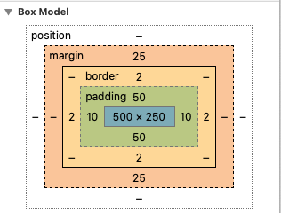

As you can see, the content is in the center, surrounded by padding, then the border, then the margin. The position, although shown in the image above, does not wrap around an HTML element in the same way the others do but instead determines its place in the "flow" of the page. The `position` property is discussed in more detail below.

The order of these components always stays the same.

### Content

Content generally refers to text and other HTML elements. Typically, content will adjust to the maximum width allowed by its container (parent HTML element) or viewport. Once it has reached maximum width, content will expand in terms of height.

For example, take a look at the following empty `div`. A `div` has a default `display` of `block`, which means it can be the only element going across and it takes up the entire width of the parent element. It has a height of `0`, because it currently has no content.

```html
<!-- index.html -->
<div></div>
```

In your browser `dev` tools (open with: <kbd>command</kbd> <kbd>shift</kbd> <kbd>i</kbd>) you can see the box model of any element by hovering over it.

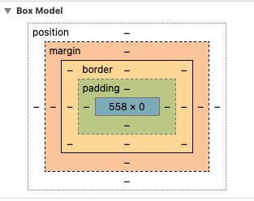

By default a `div` has:

- no content (height of 0)
- width matching the viewport (browser) size
- no padding
- no border
- no margins

Let's add some content to the `div` element as well as some CSS rules to update its appearance and change the box model.

```html
<!-- index.html -->
<div>
  <p>content</p>
  <p>more content</p>
  <p>even more content</p>
  <p>
    a wall of content that just goes on... and on... and on and on and on...
  </p>
</div>
```

```css
/* main.css */
div {
  width: 100px;
  border: 2px solid teal;
}

div p {
  background-color: antiquewhite;
}
```

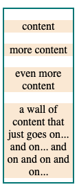

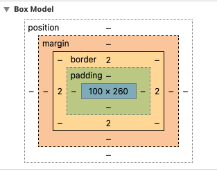

As we can see, the content (text), stays within the boundary of the container's width. Then it automatically expands downward, increasing the height of itself `p` elements, and the height of the `div` element.

If we look at the box model for a `p` element, we'll notice that it has a `margin-top` and `margin-bottom` of `16px`. This was not added by our CSS above, but instead is included as part of the default styling for `p` elements.


With practice and usage, you will get used to what to expect for default settings of different elements. You may notice, if you use different browsers, that the defaults might be slightly different.

When determining what element to use, you should choose the [semantic](https://www.w3schools.com/html/html5_semantic_elements.asp) one and then style it correctly. For example, if you need to make a top level `heading`, but you prefer the size and margins of an `h2`, you should use an `h1`, but then style it, with CSS, to make it the size you want.

### Padding

Padding puts space between the content and the border of the element.

```css
/* main.css */
div p {
  background-color: antiquewhite;
  text-align: center;
  padding: 16px;
}
```

Notice that `padding: 16px` adds padding to all four sides of the paragraph, making the area around the text bigger.

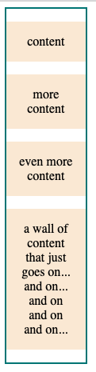

Padding can also be added to the `div` element, which will place space around its content, which is all of the paragraph elements.

```css
div {
  width: 100px;
  border: 2px solid teal;
  padding: 16px;
}
```

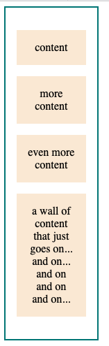

Both elements now contain padding, creating more space around their content.

#### Changing size

The total `width` of the `div` has increased from `100px` to `136px`.

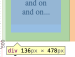

The base width is set by the content, which in this case is constrained due to the width of the `div`. Then, on each side of the `div` element, there is padding of `16px`. The `2px` border on either side also contributes to the overall width of the page.

The width is now `100px` + `16px` + `16px` + `2px` + `2px` = `136px`

If you need to constrain the width to be exactly `100px`, regardless of padding and borders, you can use the `box-sizing` property.

```css
box-sizing: border-box;
```

This changes how the element's width is calculated, if one is set. Instead of using `100px` for the content width, the overall width of the element will be constrained to the given value for the `width` property.

We can also make each side of padding different. The arguments go like a clock: they start top (`12px`), then right to (`3px`), then bottom (`6px`) and then left (`9px`)

```css
div {
  width: 100px;
  border: 2px solid teal;
  padding: 12px 3px 6px 9px;
  box-sizing: border-box;
  margin: 4px auto;
}
```

### Border

The `border` property can have up to 3 arguments, always in the same order:

1. The width of the border.
1. The type of border.
1. The color of the border.

A mnemonic to help remember the order is `1 solid gold` bar

```css
div {
  border: 1px solid gold;
}
```

Then, you can change the properties, as needed.

## Margins

Margins add space outside of the border. Other elements will not begin until the set margin amounts are cleared.

One common thing to do with an HTML element is to center it horizontally.

To do so, we must set the width to be less than 100% of the viewport (browser) or container. Then we must set the left and right margin properties to `auto`. This will "automatically" center the object, horizontally.

When you use two arguments for `padding` or `margin`, the first represents top/bottom and the second represents left/right

```css
div {
  width: 300px;
  border: 2px solid teal;
  /* Top and bottom padding is 16px. Left and right padding is 20px. */
  padding: 16px 20px;
  box-sizing: border-box;
  /* Top and bottom margin is 4px. Left and right padding is auto. */
  margin: 4px auto;
}
```

You can also set each margin (or padding) individually:

```css
div p {
  background-color: antiquewhite;
  text-align: center;
  padding: 16px;
  margin-top: 12px;
  margin-right: 3px;
  margin-bottom: 6px;
  margin-left: 9px;
}
```

## Display

There are a few different display properties:

- block
- inline
- inline-block
- none
- flex
- grid

### Block

This is the default for many elements such as headings, paragraphs, `div` elements, `article` elements, and unordered lists.

By default, these elements are the full width of the viewport or container element. You cannot put another element horizontally next to this element. You would need to change the `display` property to do that.

### Inline

This is the default for HTML elements that go inside a text tag such as a `span` element. Height and width properties have no effect on this display type. It keeps the element in line with the parent element.

For example, wrapping the word `more` inside `span` tags will not affect where it is in the `p` element. Typically, one would use the `span` tag to add additional style to a specific word, such as changing the color.

```html
<!-- index.html -->
<p>even <span>more</span> content</p>
```

```CSS
/* main.css */
p > span {
    color: orange;
    font-style: italic;
}
```

Another common element with a default display of `inline` is an `img` tag. If you would like to center an image, you would need to set the display to `block` and then set the left and right `margin` values to be equal to `auto`.

### Inline-block

The `inline-block` value has the same behavior as an `inline` display, however you can set width and height properties. An example of an element with this as a default display property is a `button`.

Let's try an example. We can add this code below our `div` element.

```html
<!-- index.html -->
<ul>
  <li>one</li>
  <li>two</li>
  <li>three</li>
</ul>
```

And then add the following to our CSS. The CSS below also removes some of the default styling from lists, such as the default padding that is typically applied to `ul` elements and the bullet point `list-style`.

```CSS
ul {
    border: 3px solid lightsalmon;
    width: 50%;
    margin: auto;
}

li {
    border: 1px solid mediumslateblue;
}

```

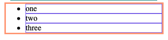

Let's change some default styling from the unordered list and list items.

```CSS
ul {
    border: 3px solid lightsalmon;
    width: 50%;
    margin: auto;
    padding-left: 0;
}

li {
    border: 1px solid mediumslateblue;
    text-align: center;
    padding: 8px;
    list-style: none;
}

```

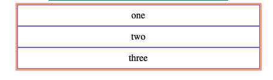

The image above shows that each `li` element has a default `display` value of `block`. Each `li` element takes up the entire width of its parent element, the `ul`, and no `li` elements share space next to one another.

Changing the `display` property to a value of `inline-block` will allow for each element to appear next to one another. However, it will still retain rules applied to the box model, such as the `padding` property.

```css
li {
  border: 1px solid mediumslateblue;
  text-align: center;
  list-style: none;
  padding: 8px;
  display: inline-block;
}
```

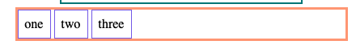

If the `display` property is set to `inline`, you'll see that the padding around each element is no longer respected by the parent element. Interestingly, you'll notice that the styling still applies.

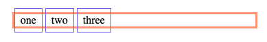

### None

This property allows you to hide the element. This property is most useful when combined with JavaScript to show or hide an element.

```css
li {
  display: none;
}
```

### BONUS: Flex

Flex is a newer display, introduced in 2009. [Flex](https://css-tricks.com/snippets/css/a-guide-to-flexbox/) sets the `flexbox` property on the container which will impact all the children components. Flexbox is great for:

- Centering elements (an alternative to `margin: auto`)
- [Setting elements equidistantly from each other](https://css-tricks.com/equidistant-objects-with-css/)
- [Vertical centering](https://philipwalton.github.io/solved-by-flexbox/demos/vertical-centering/)
- Creating a [sticky footer](https://philipwalton.github.io/solved-by-flexbox/)

Example of equidistant spacing:

```css
ul {
  border: 3px solid lightsalmon;
  width: 50%;
  margin: auto;
  padding-left: 0;
  display: flex;
  justify-content: space-around;
}
```

In this course, you will not cover flexbox but are encouraged to explore it on your own.

### Grid

[Grid](https://css-tricks.com/snippets/css/complete-guide-grid/) is the newest display type. It allows elements to be laid out in a responsive grid and thus allows creating complex, responsive layouts to be achieved with relative ease, especially in contrast to older techniques.

You will cover CSS Grid at a later time.

## Position

By default, HTML elements have a property of `static`. Elements are loaded from top to bottom and as each element takes up space, it moves the next element to the right and down.

However, sometimes we want to take things out of that normal flow.

We might want them to be `fixed` in position. That is, no matter where other elements are in the page, nor the size of the viewport, the element should be fixed in the exact position in relation to the viewport.

For example, many websites contain a navigation bar that "sticks" to the top of the page as you scroll down the page.

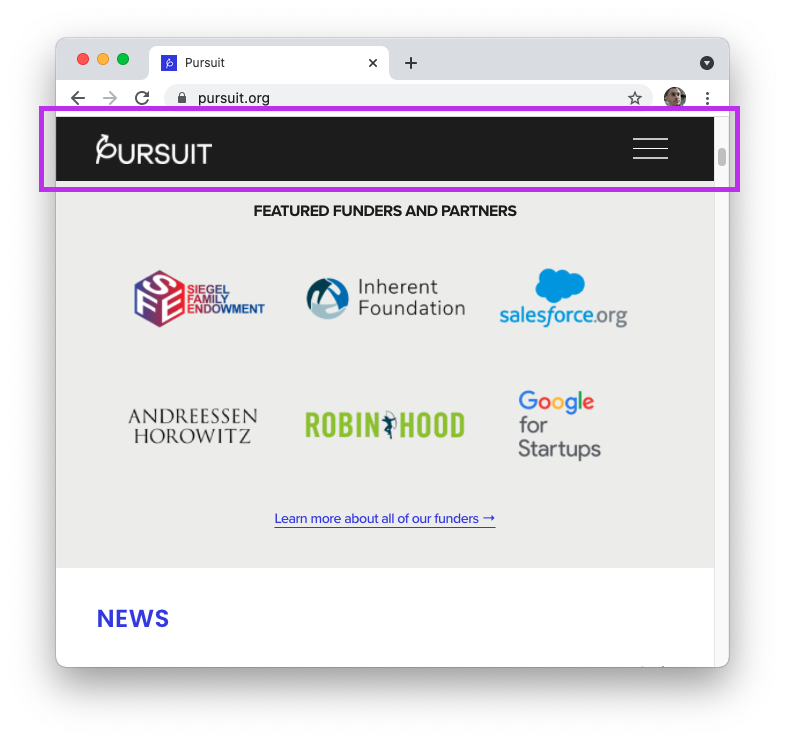

We may want an element that is `absolute` in position, relative to another, non-static element.

For example, pop-ups, also called modals, are often positioned in the middle of the page using the `absolute` value.

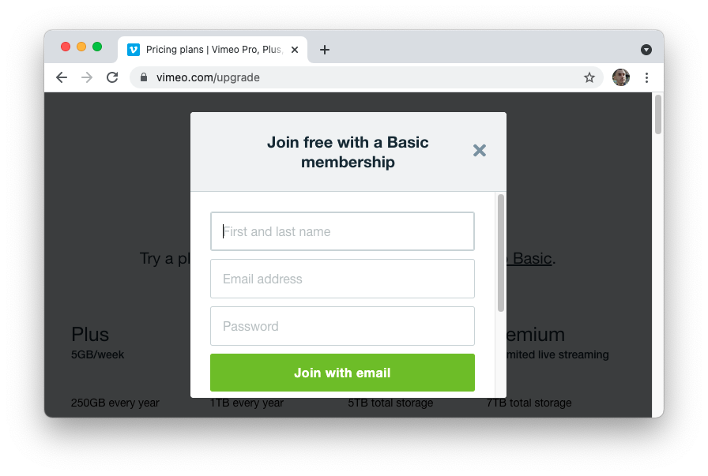

Another one is `relative` - where the element is moving from where it _would_ be to the specified offset. This is useful when you are working with other elements that are no longer set to `static`.

A great way to learn more how these properties behave is to play around with the values. The following website will let you do just that.

- [W3 Schools Demo](https://www.w3schools.com/cssref/playit.asp?filename=playcss_position&preval=absolute)

### Z-Index

Sometimes you want to be sure that one HTML element is on top of another one. This is only something you can set when the `position` property has been changed to a value other than `static`, such as `absolute`, `fixed`, `relative` etc.

You can choose how the elements stack by giving them a `z-index` number. Remember the `x-axis` goes across, the `y-axis` up/down and the `z-axis` goes towards/away from you (in a 3D plane).

```html
<!-- index.html -->
<h1>This is an awesome pop up message</h1>
```

```css
h1 {
  position: fixed;
  top: 100px;
  left: 100px;
  width: 50%;
  padding: 64px;
  background-color: lightsteelblue;
  color: cornsilk;
  opacity: 0.9;
}
```

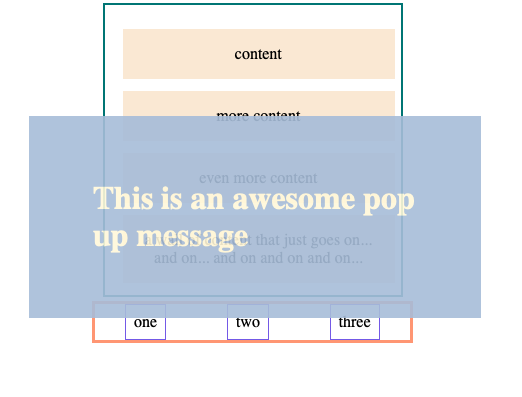

If you wanted, you could move this pop up to be behind the other elements by changing the `z-index` to a negative number, such as `-1`.

```css
h1 {
  position: fixed;
  top: 100px;
  left: 100px;
  width: 50%;
  padding: 64px;
  background-color: lightsteelblue;
  color: cornsilk;
  opacity: 0.9;
  z-index: -1;
}
```

> **Note:** The following guide could help you in centering the modal.
>
> - [CSS Tricks: Styling Modals](https://css-tricks.com/considerations-styling-modal/)

---

Full code:

```html
<head>
  <title>Box Model</title>
  <link rel="stylesheet" href="main.css" />
</head>
<body>
  <div>
    <p>content</p>
    <p>more content</p>
    <p>even <span>more</span> content</p>
    <p>
      a wall of <span>content </span>that just goes on... and on... and on and
      on and on...
    </p>
  </div>
  <ul>
    <li>one</li>
    <li>two</li>
    <li>three</li>
  </ul>
  <h1>This is an awesome pop up message</h1>
</body>
```

```css
div {
  width: 300px;
  border: 2px solid teal;
  padding: 12px 3px 6px 9px;
  box-sizing: border-box;
  margin: 4px auto;
}

div p {
  background-color: antiquewhite;
  text-align: center;
  padding: 16px;
  margin-top: 12px;
  margin-right: 3px;
  margin-bottom: 6px;
  margin-left: 9px;
}

ul {
  border: 3px solid lightsalmon;
  width: 50%;
  margin: auto;
  padding-left: 0;
  display: flex;
  justify-content: space-around;
}

li {
  border: 1px solid mediumslateblue;
  text-align: center;
  list-style: none;
  padding: 8px;
  display: inline-block;
}

h1 {
  position: fixed;
  top: 100px;
  left: 100px;
  width: 50%;
  padding: 64px;
  background-color: lightsteelblue;
  color: cornsilk;
  opacity: 0.9;
  z-index: -1;
}

p > span {
  color: orange;
  font-style: italic;
}
```
