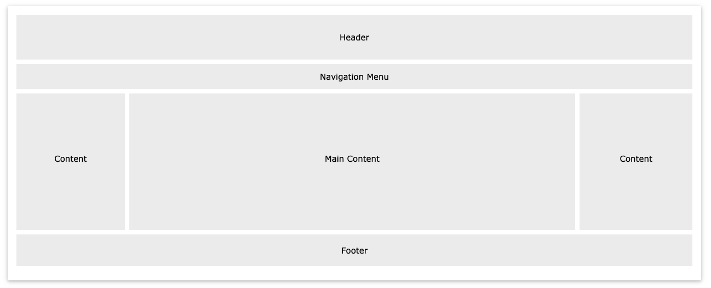
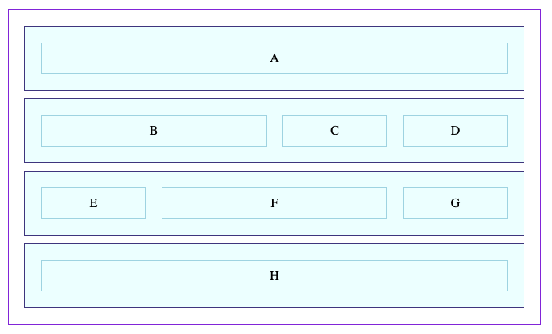

# CSS Grid

## Learning Objectives

By the end of this lesson you should be able to:

- Describe the purpose of `grid` display value and what advantages it brings with it.
- Style a simple web page that includes a header, footer, sidebar, and main section using CSS grid.
- Style content inside of grid areas.

---

## Guiding questions

- What problem does `grid` attempt to solve?

- What property-value pair must you add to a parent element to have all of its children elements act as if they are in a grid?

- How do the CSS properties `grid-template-columns` and `grid-template-rows` affect the grid? Are they placed on the parent element or children element?

- Describe the following CSS and how it will affect each child element inside of the `container` element.

  ```css
  .container {
    display: grid;
    grid-template-columns: 200px 100px 400px;
    grid-template-rows: 50px 300px 200px;
  }
  ```

- Imagine you want to create the following layout. How can you use CSS Grid to help in the implementation of this mockup?

  

- Take a look at [this website](https://getbootstrap.com/docs/5.1/examples/album/), focusing on the overall structure of the page as opposed to the specific styles.

  How might CSS Grid be used to help in the implementation of this page?

- Take a look at [this repl](https://replit.com/@Pursuit/CSS-Grid-Nested-Grid-Example) which makes use of a grid inside of another grid. Describe what is happening and how it works.

- Try adding the following CSS to the repl above.

  ```css
  .container.child {
    grid-template-columns: repeat(3, 1fr);
  }
  ```

  How does this visually change the page? Why?

- How do you add gaps to your grid?

- How can you apply a minimum size to your grid elements?

- Take a look at [this repl](https://replit.com/@Pursuit/CSS-Grid-Grid-Elements) which makes use of a pattern of "rows" that encapsulate a series of `div` elements.

  Update the CSS so that it matches the image below. You will need to add styles for both the `full` and `wide` classes.

  
