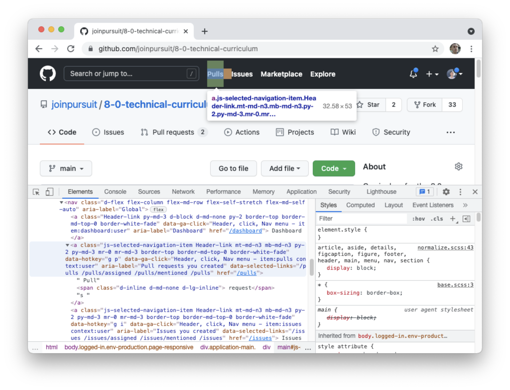

# Document Object Model

Up until this point, HTML and CSS have stayed completely separate from JavaScript; however, JavaScript is a key component to building interactive web applications.

In this lesson, you'll learn how to connect JavaScript to your HTML pages. Then, you'll learn about the Document Object Model, or DOM, and how JavaScript interacts with it.

## Learning Objectives

By the end of this lesson you should be able to:

- Connect JavaScript, HTML, and CSS to the same page by embedding JavaScript into the HTML with the `script` element.
- Connect an external JavaScript file to an HTML page through use of the `script` element.
- Differentiate the DOM from HTML.

---

## The Script Tag

We've been using HTML and CSS to layout and style the content of our web pages, but there's a key ingredient of web applications we've been missing: handling user interaction.

Users can type into text inputs and select checkboxes, but using pure HTML, we can't do anything with that information. In order for us to do something with the user's input, we'll need to combine HTML and JavaScript.

We can do this using the `<script>` tag:

```html
<!DOCTYPE html>
<html>
  <head>
    <title>Javascript + HTML</title>
    <script>
      console.log("Now we're using JavaScript!");
    </script>
  </head>
  <body>
    To see the secret JavaScript message, right click on this page, and click
    "Inspect". Then click on "Console".
  </body>
</html>
```

When the browser loads our website, it stops when it gets to the `<script>` tag, then executes any of the code that it sees there. After it's done, it reads the rest of the HTML and displays it on the screen. Putting the `script` tag in the `head` section means it will run before any of the body is loaded.

Now we can run JavaScript in our websites! But we probably want to do something more than logging messages to the console...

## The Window Object

`window` is the top level object in browser-side JavaScript that represents a browser window. It is an `object` in the full JavaScript sense: it has properties and values such as `.innerWidth`, `.innerHeight`, and `.localStorage`. Today we'll use two window methods:
`window.alert()` and `window.prompt()`.

## Alerts

`window.alert("I'm an alert message")` will display a message in a popup window. In general, it should only be used as a quick and dirty debugging tool, or before you've learned alternative ways to create output. You've probably only seen these as really annoying pop ups on sketchy websites. Let's write our first alert together.

Create a new file named `index.html` that holds the following content:

```html
<!DOCTYPE html>
<html lang="en" dir="ltr">
  <head>
    <meta charset="utf-8" />
    <title>Javascript + HTML</title>
    <script>
      window.alert("Welcome to my website!");
    </script>
  </head>
  <body>
    This is my website.
  </body>
</html>
```

Now instead of logging a message to the console, we can display it to the user.

### Prompts

`window.prompt` allows us to display a popup message that also has a text input field inside it. `window.prompt()` will return the value in the input field (as a string) after the "OK" button is pressed. Try updating the contents of your script tag with the following:

```js
const userSubmittedName = window.prompt("Enter your name");
window.alert(`Hello ${userSubmittedName}!  Thank you for your response.`);
```

## Practice

### Exercise 1

Use `window.prompt()` to ask the user to "type a string". Then, use `window.alert()` to display a fully capitalized version of the string.

<details>
<summary>Hint</summary>
What is prompt's return value?     
</details>

<details>
<summary>Compare Your solution.</summary>

```js
const string = window.prompt("Please enter a string");
window.alert(string.toUpperCase());
```

</details>

### Exercise 2

Use `window.prompt()` to ask the user to "enter a number". Then, use
`window.alert()` to display that number times two.

If the input cannot be converted to a real number, use
`window.alert()` to display `"Please enter a number next time."`

<details>
<summary>Hint</summary>
`isNaN()` can be used to tell if something is not a number
</details>

<details>
<summary>Compare Your solution.</summary>

```js
const response = window.prompt("Enter a number to be doubled!");
const number = Number(response);
let displayText = "";
if (isNaN(number)) {
  displayText = "Please enter a number next time";
} else {
  displayText = `Your doubled number is ${number * 2}`;
}
window.alert(displayText);
```

</details>

## Connecting an external JavaScript file

Just like with CSS, it's possible and preferable to write JavaScript in an external file. To do so, you can continue to use the `script` element although you will need to change how it's being used.

```html
<head>
  <script src="./main.js"></script>
</head>
```

Although both a closing and opening tags are used, you should not put anything inside of them. Instead, include the `src` attribute on the opening tag and set the value equal to a path to your JavaScript file.

## The DOM

The Document Object Model (DOM) is a programming interface for HTML and XML documents. The DOM models each element in an HTML page as a JavaScript object.
Together, these objects form a [tree-like](<https://en.wikipedia.org/wiki/Tree_(data_structure)>) data structure:


Each box in the diagram above represents a [node in the DOM](https://developer.mozilla.org/en-US/docs/Web/API/Node).
Some of these nodes, called [elements](https://developer.mozilla.org/en-US/docs/Web/API/HTMLElement), correspond to tags in our HTML file.
Other nodes store information about attributes of our HTML tags, or store the text inside HTML tags that the browser will display.

DOM elements are _live_, which means that if we make changes to the data inside them, those changes will be reflected in the browser!
This means we can display information to the user on our webpage directly, instead of having to use an alert.

Put simply, the DOM is a representation of the HTML that lives in the browser. It's possible to update and edit the DOM without editing the actual HTML file.

### Inspecting the DOM

Whenever you use your browser's developer tools to inspect or edit content on the page, you are interacting with the DOM.

In the image below, you can see how Chrome Dev Tools represents the DOM. When hovering over a node in the inspector, the visual representation of that node is highlighted in the browser.



If you click on one of the nodes and delete it, that doesn't mean it's deleted from the HTML file. It's just deleted for the current representation of the page. If you refresh the page, you'll see that the element renders once again.
