# Introduction to Forms

It may seem strange to think about, but many types of user interaction are funneled through forms. For example, any time you perform a search on YouTube, purchase a product from your favorite online store, or submit a post to your favorite social media site, you're working with forms.

In this lesson, you'll learn how the basics behind building forms with HTML. You will not yet learn how to harness this data -- that will be for a later lesson!

## Learning Objectives

By the end of this lesson you should be able to:

- Build forms with the form tag, using generic inputs and a submit button.
- Write valid HTML by including necessary input attributes.
- Associate labels with inputs via the `for` tag or through nesting.
- Modify inputs by changing the `type` attribute.
- Create dropdowns, radio buttons, text areas, and check boxes in forms.
- Require fields to be completed on submit with the `required` keyword.

---

## What are forms?

You've already encountered a number of forms if you've spent any time on the web at all. Below are just some examples of where forms are used.

- Signing up for a service with your email and password.

- Paying for a product on an online store.

- Submitting an assignment to a learning management system.

In general, HTML forms will look something like the image below.

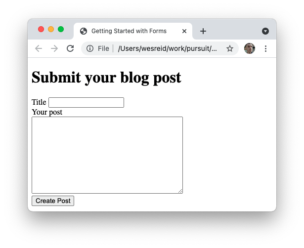

Forms generally consist of multiple _fields_, such as "Title", that allow for user interaction. Forms also generally have a _submit button_, such as the "Create Post" button above, which perform some action with the data inserted into the field.

### The form element

To create a form, you must use the `form` element.

```html
<form></form>
```

All form fields and the submit button will go within the `form` element. It's possible to put other types of elements inside of the `form` element as well, although elements such as paragraphs or headings will not affect the form submission.

### Text inputs

The most common field to put into a form is a text input. The `input` element can be used for a variety of purposes, but text is the most common.

```html
<form>
  <input type="text" />
</form>
```

This will create an input box with nothing inside or around it.

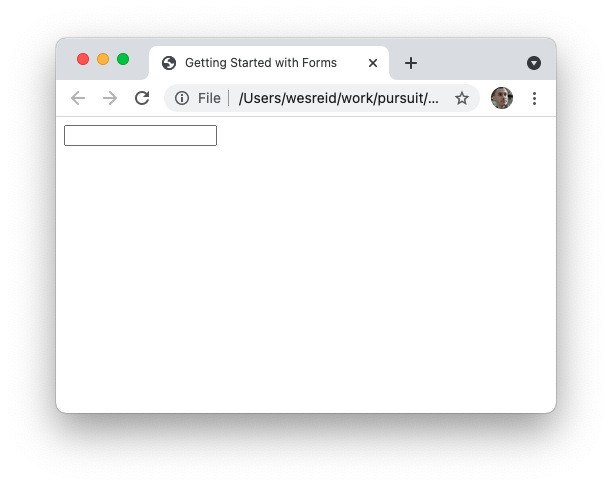

In general, the `placeholder` attribute can be added to inputs to suggest to the user what should go inside the input.

```html
<form>
  <input type="text" placeholder="Enter a title..." />
</form>
```

This creates grey text that will be removed as soon as the user starts typing.

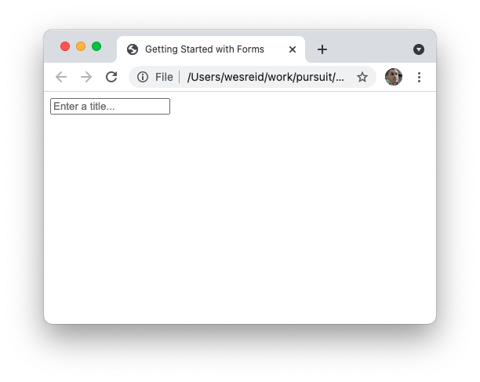

### Submit buttons

To have a complete form, you need some kind of submit button. The submit button can be used on many websites to trigger an action with the data you've entered.

There are two ways to create submit buttons. Both options below are valid.

```html
<!-- Using the `button` element. -->
<button type="submit">Create Post</button>

<!-- Using the `input` element. -->
<input type="submit" value="Create Post" />
```

Adding a submit button will look like the following.

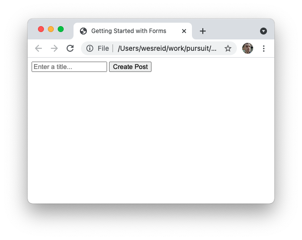

> **Note:** Notice that the submit button shows up next to the input field. If you'd like it to appear on a new line, you'll need to style the form with CSS. Alternatively, you can add a `br` element between the input and the submit button.

When you press the submit button your page, you'll see the page refresh. This is the default behavior for forms. For now, do not worry too much about this behavior -- it will be covered later on.

## Valid fields

While HTML is very permissive with what is allowed, it is best to follow appropriate conventions when writing your form fields.

Each `input` element should include:

- A `type` attribute, which defines what kind of input it is.
- A `name` attribute, which describes what the value means in the context of the form.
- An `id` attribute, which is unique across the entire page.

There are many other attributes that can be added to `input` elements, but these three are essential.

```html
<form>
  <input id="post-title" name="title" type="text" />
</form>
```

One of the few exceptions to this is `input` elements with a `type` of `submit`.

## Labels

Labels are also appropriate to include in your forms. There are a few reasons to include labels:

- Labels help describe the form field with which the label is associated.

- Labels can improve the accessibility of your website.

- Labels, when connected properly, can make it easier to click on your form fields.

To create a label, you use the `label` element. Any text can go within the `label` element.

```html
<form>
  <label>Blog post title</label>
  <input id="post-title" name="title" type="text" />
</form>
```

This will cause the added text to show up near the input.

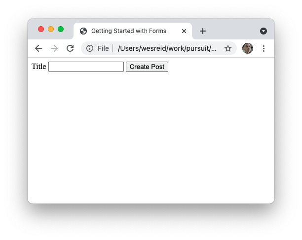

However, this `label` is technically not associated with the `input` element. At the moment, it is just a floating label. One effect of this is that clicking the text of the label (i.e. "Blog post title") does nothing. If appropriately associated with the input field, clicking the label will move the cursor to inside the field.

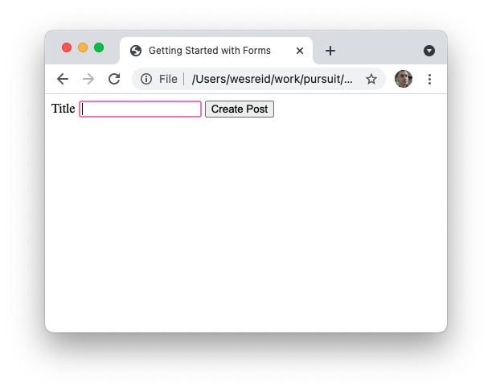

To link your label with a specific field, there are two options:

1. Add the `for` attribute to the `label` element, with it's value being whatever the value is for the `id` of the associated element.

   ```html
   <label for="post-title">Title</label>
   <input id="post-title" name="title" type="text" />
   ```

1. Nest the input within the `label` element. The text can go anywhere within the `label` element.

   ```html
   <label for="post-title">
     Title
     <input id="post-title" name="title" type="text" />
   </label>
   ```

Both of these options will make it so that when you click on the label text, the relevant form field will be selected.

## Alternative inputs

There are a variety of different types of input types that can be used to improve your form. Some of the most common completely change how the input field functions.

### Radio buttons

Radio buttons allow for you to ask the user to choose one of many options.

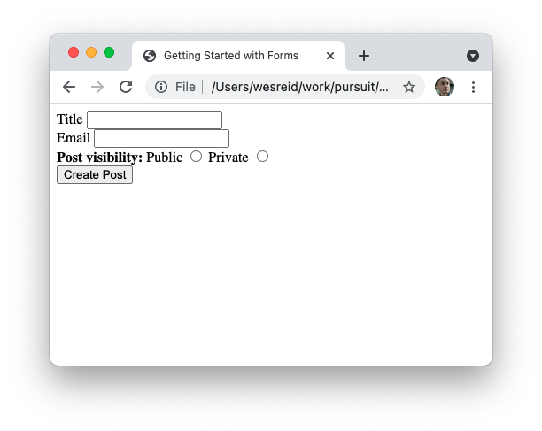

To create a radio button, you can change the `input` element's `type` to `radio`.

```html
<label>
  Public
  <input id="public" name="visibility" type="radio" value="public" />
</label>

<label>
  Private
  <input id="private" name="visibility" type="radio" value="private" />
</label>
```

It is very important that your input buttons have the same value for the `name` attribute. This is what links the radio buttons together, meaning that selecting one option will de-select the other options. If you do not use the same `name` value, the radio buttons can both be selected.

If you want one of the options to be selected by default, you can add the `checked` property.

```html
<label>
  Public
  <input id="public" name="visibility" type="radio" value="public" checked />
</label>
```

### Checkboxes

Checkboxes allow your user to select any number of options.

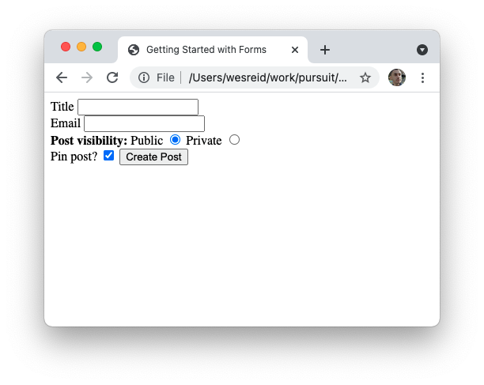

To create a checkbox, you can change the `input` element's `type` to `checkbox`. Just like with radio buttons, checkboxes can be checked by default. If you use multiple checkboxes, you will also need to ensure all of them have the same name.

```html
<label>
  Pin post?
  <input id="pin-post" name="pin" type="checkbox" value="pin" checked />
</label>
```

## Dropdowns

Dropdowns are another common element of forms that allow you to pick from multiple options.

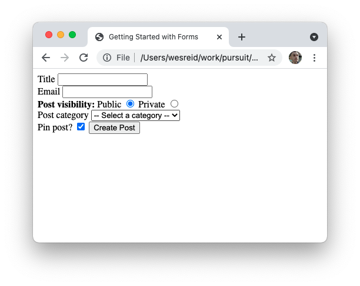

But, they do not use an `input` element. Instead, they use two elements: `select` and `option`.

```html
<label>
  Post category
  <select id="post-category" name="category">
    <option>-- Select a category --</option>
    <option value="personal">Personal</option>
    <option value="professional">Professional</option>
    <option value="promotion">Promotion</option>
  </select>
</label>
```

The `select` element is the wrapping element that defines the dropdown. It requires at least an `id` attribute and a `name` attribute.

Each `option` inside is one of the possibilities that can be selected from the dropdown. The options will appear in the order on the page. Options should include a `value` attribute, but it is common to have one `option` that lacks a `value` that has text like "Choose from the list below," or something similar.

## Input validation

Inputs can be validated so that they can only allow certain types of text, or so that they stop the
submission of a form. There is much that can be said about form validation as
it's a pretty complex topic. This lesson will only cover some of the simplest
validation. ### Email An email field can be used to ensure that a valid email
address is typed into your form. You can make an `input` element an email field
by setting the `type` to `email`.

```html
<label>
  Email
  <input id="email" name="email" type="email" />
</label>
```

If an invalid email is provided, an error message will show on the page when the form is submitted.

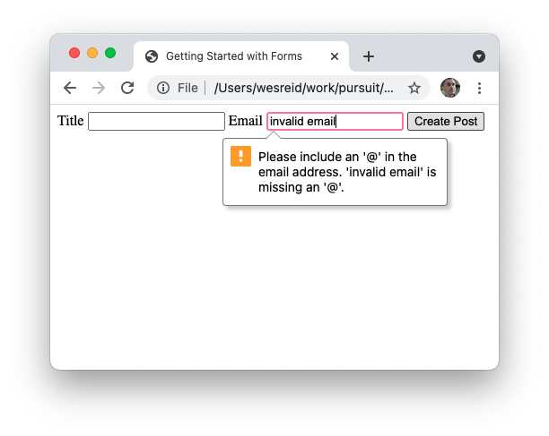

### Required

The `required` keyword can be added to the end of a form field to ensure that the field has some value before submit.

```html
<label>
  Title
  <input id="post-title" name="title" type="text" required />
</label>
```

If no input is provided, an error message will show on the page when the form is submitted.

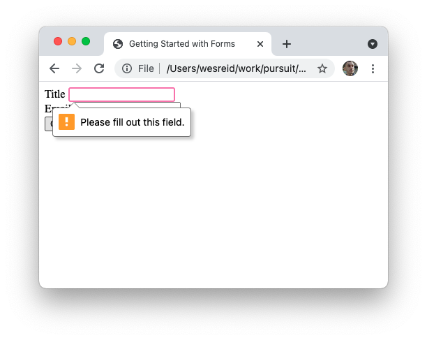
