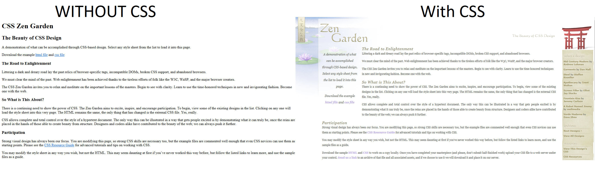
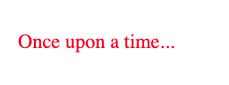

# Introductory CSS

Most webpages rely heavily on CSS to make them look great. CSS allows for developers to write powerful, declarative rules that can affect how a webpage looks on a variety of devices. Newer features of CSS allows for even more complex visuals such as animations, gradients, and more.

CSS can also be quite challenging in that it can be somewhat brittle. When writing CSS, it's surprisingly easy to break one part of your page while improving another. In this lesson, you'll learn the key concepts of CSS and begin to style pages. You'll end the lesson by taking control of your CSS by separating it into a different file.

## Learning Objectives

By the end of this lesson you should be able to:

- Describe what CSS is and what it means that it cascades.
- Differentiate between CSS rules, selectors, declarations, properties, and values.
- Add inline styles to specific elements on an HTML page.
- Add styles to an HTML page’s elements using the `style` element.
- Add styles to an HTML page’s elements by connecting an external style sheet.

---

## What is CSS?

CSS stands for _Cascading Style Sheets._ CSS is used to style pages and give them visual structure. CSS controls everything from how big text is on a page to what color the background is. Without CSS, most webpages will look the same.



CSS works by applying rules to particular elements on the page. For example, you could create a rule that every `h2` on your page should be the color `blue`. By combining a variety of styles and selections together, you can end up with a beautiful page.

### Cascading styles

The "cascading" part of CSS refers to the fact that multiple rules can be applied to the same selections. For example, if you created a rule that every `h2` on your page should be the color `blue`, but later made _another_ rule that every `h2` should be `yellow`, whatever rule should up later in the file would be applied.

This means the CSS can overwrite or add to other CSS, even in the same file. Below, you will see examples of how exactly this works.

Additionally, styles can be "inherited" from their parent elements. For example, if you were to add a style to a `body` element that changes the background to green, all elements nested inside of the `body` element would also have a green background. That is, unless they had a background style set of their own!

## CSS Rules

CSS is written by writing a series of rules. Also called rulesets, CSS rules look like the following:

```css
h2 {
  color: blue;
}
```

The above CSS is comprised of two distinct components: a selector and a declaration. Declarations are then made up of properties and values, similar to key-value pairs.

More importantly, the above CSS has an effect when applied to an HTML page. It will make all of the `h2` elements turn the color blue!

### Selectors

Selectors refer to everything that comes before the opening curly brace in a CSS rule.

```css
body {
  background-color: yellow;
}
```

In the above CSS, the selector is `body`. This means that the declaration that follows will apply to the `body` element that is on the page. There should only ever be one `body` on an HTML page, but CSS selectors do not just apply to the first element.

```css
p {
  color: white;
  font-size: 16px;
}
```

In the above CSS, the selector is `p`. This means that the declaration that follows will apply to _every paragraph on the page._

CSS selectors can be any valid HTML element. However, they can also be IDs or classes. You'll learn more about CSS selectors in a later lesson.

### Declaration blocks and declarations

A declaration block is everything that is found between the curly braces in a CSS rule.

```css
p {
  color: white;
  font-size: 16px;
}
```

In the above CSS, the declaration is everything between the curly braces. That includes the `color` line and the `font-size` line. Each of those lines is an individual declaration. Everything within the declaration block will be applied to the selector, in this case all `p` elements.

Declarations are made up of property-value pairs. Each of these pairs must have the following format, where a colon (i.e. `:`) separates the property from the value and must be followed by a semi-colon (i.e. `;`) which marks the end of the value. Unlike JavaScript, semi-colons are not optional.

```
property: value;
```

#### Properties

Depending on the selector, there are dozens of possible properties that can be used to change the look of HTML elements on the page. You can find some of the most common properties at the link below.

- [MDN: CSS Properties Reference](https://developer.mozilla.org/en-US/docs/Web/CSS/CSS_Properties_Reference)

#### Values

Each property will have an appropriate value associated with it. Sometimes the value will be some kind of measurement, as in the case of the `font-size` property.

```css
img {
  width: 150px;
}
```

The above CSS will change the width of all images on the page to be 150 pixels wide. Pixels are one precise measurement that can be used to set the size of a variety of properties.

Other times, the value will be a word.

```css
ul {
  list-style: square;
}
```

The value `square` will change the bullet points that are normally circular on an unordered list to be a square shape instead.

Some properties allow for multiple values to be added, one after another. These multiple values could be applied in a variety of ways.

```css
body {
  font-family: Georgia, serif;
  border: 1rem dotted pink;
}
```

In the above CSS, the `font-family` (i.e. the style of the font) will attempt to be set to the "Georgia" font. If that font is not available for some reason, the closest "serif-style" font will be chosen. In this case, the subsequent values act as a fallback.

However, in the case of the `border` property, the values work together. This declaration will create a pink border around the `body` element, made up of dots. Each dot will be `1rem`. `rem` is a special unit of measurement that can also be used in CSS.

To know the possible values of each property, you will have to look up the property itself. As you can see, there's a lot to learn when it comes to property-value pairs. However, know that all of this knowledge is readily accessible for you on the web -- no one is expecting you to memorize all of this immediately!

#### Cascading rules

As mentioned earlier, CSS rules cascade on top of one another. Take the following CSS as an example.

```css
p {
  color: blue;
  font-size: 14px;
}

p {
  color: green;
  font-family: Helvetica, serif;
}
```

Both of the declaration blocks above affect the same selector: the `p` element. So, what's the effect of the CSS?

CSS is read by the browser by starting at the top of the file. Each new declaration block will get applied to selectors, and will either _overwrite or combine_ with the previous declaration block. In the above CSS, each declaration block has one declaration that is unique. Both of these will be kept. Meanwhile, the `color` declaration is duplicated in both declaration blocks. In this case, the property-value pair that comes last will be kept.

This will result in the following, combined declaration.

```css
p {
  color: green;
  font-family: Helvetica, serif;
  font-size: 14px;
}
```


## Adding styles

There are three main ways to add style to an HTML page.

### Inline styles

You can add styles to individual elements by adding the `style` attribute. You then write declarations within a string as the value.

```html
<p style="color: red; font-size: 20px;">Once upon a time...</p>
```



In general, this method is not preferred. Because the style will only be applied to the specific element, it loses the powerful ability of CSS to cascade.

Instead, only use this style of embedding CSS when you want to quickly test out a particular style. The final version of your webpages should not include inline styles like this.

### Style element

You can add styles to a single HTML file by including a `style` element within the `head` element of the page.

```html
<html>
  <head>
    <!-- Other elements will go here... -->
    <style>
      p {
        color: green;
        font-family: Helvetica, serif;
        font-size: 14px;
      }
    </style>
  </head>
  <body>
    <p>Once upon a time...</p>
  </body>
</html>
```

Multiple CSS rules can be included within the `style` element and will apply to that HTML page. This is better than writing inline styles as it is easier to update and edit your CSS.

### External style sheet

While using the `style` element is better than inline styling, the best way to write CSS is to create an external style sheet. To do so, first create a `.css` file. If you only plan to use one file, the name of the file should be something like `main.css` or `styles.css`.

In that file, you can then write your CSS directly, without any HTML.

```css
/* Start of the styles.css file. */
p {
  color: green;
  font-family: Helvetica, serif;
  font-size: 14px;
}
```

In your HTML, you will then need to link this file. To do so, you will add a `link` element that has two attributes: `rel` and `src`. The `rel` attribute should be equal to "stylesheet" while the `src` attribute should be a path to your CSS file. The `link` element should be added to your HTML page's `head` element.

```html
<head>
  <!-- Other elements will go here... -->
  <link rel="stylesheet" href="./styles.css" />
</head>
```

This is the best method for connecting your CSS to your HTML. Using this method, you can easily locate your CSS and update it so that it affects your page. You can also link the same CSS to multiple pages, meaning you do not have to copy and paste the same CSS in multiple places.
