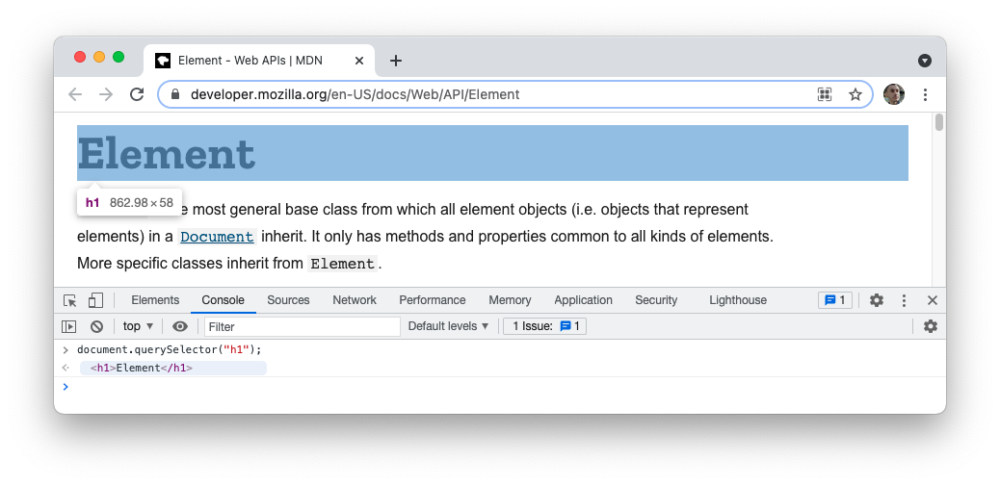

# Reading and Deleting DOM Elements

JavaScript can allow you to access data from the DOM and manipulate elements on the DOM through the `document` object, which contains a number of useful methods. These skills are crucial for building interactive web applications that can respond to user input.

In this lesson, you will begin the process of learning how to manipulate the DOM with JavaScript. You will start by reading data from the DOM and then removing elements from the DOM.

## Learning Objectives

By the end of this lesson you should be able to:

- Access DOM elements through `.querySelector()` and `.querySelectorAll()`.
- Describe the importance of the `defer` attribute and use it to cause JavaScript to run after the DOM is loaded.
- Access element information through the use of element properties, such as `.innerHTML` and `.textContent`.
- Remove DOM elements from the page with the `.remove()` method.

---

## Selecting elements

Selecting elements from the DOM is crucial to performing any other kind of operation on elements from the DOM. All DOM manipulation methods can be accessed from the `document` object, which represents the DOM.

Most developer tools will highlight elements on the page by hovering over the related DOM element. If you print out the `document` object and hover over it, you'll see the entire browser is highlighted.


### querySelector()

To select a single element on the page, you can use the `document.querySelector()` method.

`document.querySelector()` takes a string as its argument. This string should be a selector, just like what you'd use to select CSS and apply a rule to it.

For example, the following would select _the first `h1` element_ on the page.

```js
document.querySelector("h1");
```

`document.querySelector()` will always grab the _first element_ that matches the selector, even if there's more than one. It will then return an [Element](https://developer.mozilla.org/en-US/docs/Web/API/Element), which is the DOM representation of that element on the page.

Elements are objects but behave a bit differently than a regular object. Later on, you'll see a few ways you can interact with these elements.

Just like when hovering over `document`, hovering over the returned element will highlight the relevant element on the page.



It's important to also note that you can store these returned elements into variables.

```js
const heading = document.querySelector("h1");
console.log(heading);
```

### querySelectorAll()

To select multiple elements, you should use `document.querySelectorAll()` which will select _all elements_ that match the given selector. This will return a [NodeList](https://developer.mozilla.org/en-US/docs/Web/API/NodeList), which is an array-like structure.

```js
const paragraphs = document.querySelectorAll("p");
```

`NodeList` objects are a bit strange to work with. While it's possible to iterate over them, they are not arrays and therefore do not have methods like `.map()` or `.filter()`. However, they do have a `.forEach()` method.

```js
const paragraphs = document.querySelectorAll("p");
paragraphs.forEach((paragraph) => {
  console.log(paragraph);
});
```

When attempting to loop over a `NodeList` keep in mind that both `for` loops and `.forEach()` will work, but that other methods you might typically use on an array may not.

## The defer attribute

Recall that you can connect external JavaScript in an HTML file through the `script` element.

```html
<script src="./main.js"></script>
```

However, if you were to add code that accessed DOM elements on the page you might be surprised at what happens. For example, imagine you have the following code in a `main.js` file connected to your HTML.

```js
const heading = document.querySelector("h1");
console.log(heading);
```

When you load your HTML page, the following will be logged.

```js
null;
```

Why is that? Remember that the JavaScript is run as soon as the `script` tag is read by the browser. That means at the time the JavaScript is run, no `h1` element would have been rendered to the page.

There are a few strategies to fix this, but one of the simplest is to add the `defer` attribute to the `script` element.

```html
<script defer src="./main.js"></script>
```

This will cause the code to run once the DOM has been loaded.

## Accessing element information

Whenever you select an element with `document.querySelector()`, or access an element inside a loop you've created to iterate over a `NodeList`, you have access to a ton of information about that element.

### innerHTML

One property accessible on element nodes is the `.innerHTML` property.

Imagine you have the following HTML on your page.

```html
<article>
  
  <h3>Games to Play on the Road</h3>
  <p>
    Traveling with others is always better than traveling along, in my opinion.
    I don't mind the quiet, but sometimes it's nice to have a few activities to
    keep our minds entertained while driving.
  </p>
  <aside>
    <p>
      <span><strong>Read Time:</strong> 6 Minutes</span>
      <a href="#">Read more...</a>
    </p>
  </aside>
</article>
```

To select the `aside` element, you could write the following JavaScript. This will return the `aside` element.

```js
document.querySelector("aside");
//> <aside></aside>
```

However, if you wanted a text representation of the `aside` element, you could use the `.innerHTML` attribute.

```js
document.querySelector("aside").innerHTML;
//> "\n            <p>\n              <span><strong>Read Time:</strong> 4 Minutes</span><a href=\"#\">Read more...</a>\n            </p>\n          "
```

The `.innerHTML` attribute will become useful later on when you begin modifying the DOM. Note that it includes everything inside of the `aside` element, including HTML tags.

### textContent

The `.textContent` attribute works similarly to `.innerHTML`, but looks to only grab the text -- not tags.

```js
document.querySelector("aside").textContent;
//> "\n            \n              Read Time: 4 MinutesRead more...\n            \n          "
```

While this does include the spaces, it no longer includes any of the tags.

In general, accessing text on a parent element, like the `aside` element in this situation, will lead to some strange output. Instead, it's better to be more specific in your targeting.

```js
document.querySelector("aside span").textContent;
//> "Read Time: 4 Minutes"
```

## Removing elements

Removing an element is surprisingly easy. You must first select the element. Then, you call `.remove()` on it.

```js
const aside = document.querySelector("aside");
aside.remove();
```

This will remove the element and all of its child nodes from the page.

Note that this _will not_ work on a `NodeList` but only specific elements.

```js
const paragraphs = document.querySelectorAll("p");
paragraphs.remove();
//> Uncaught TypeError: paragraphs.remove is not a function
```
