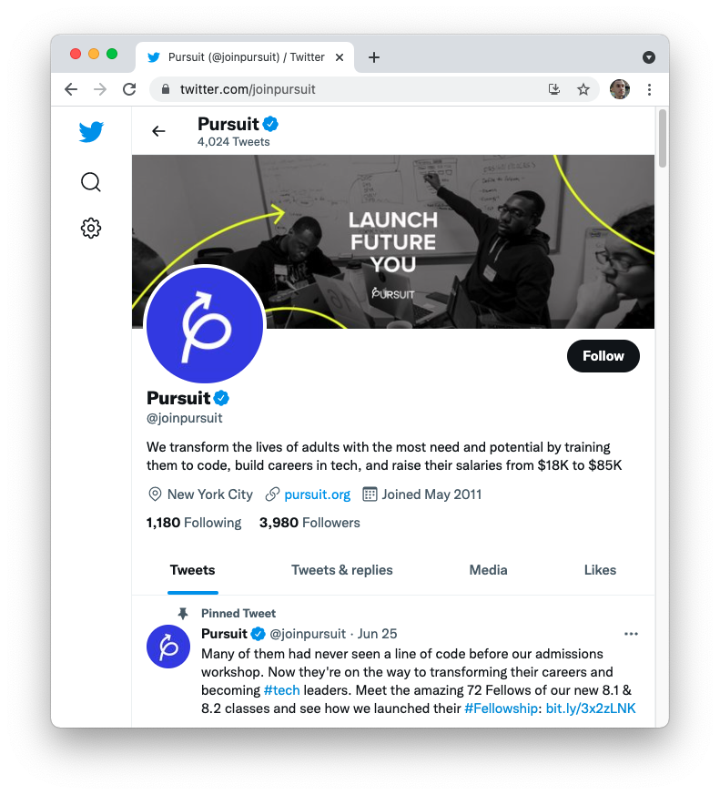
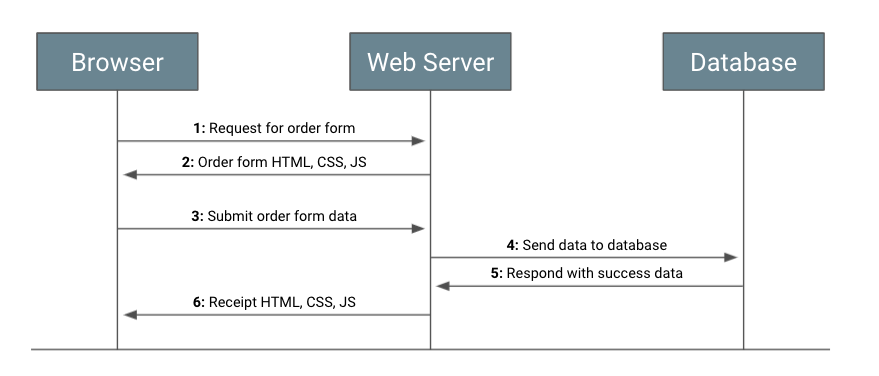

# Request-response Cycle

When you clicked on a link to bring you to this page, what happened? It is easy to take for granted how much just seems to work when interacting with the internet. However, each line of text and code has to somehow make it from some developer's computer to yours.

In this lesson, you'll learn the basics of how the internet works. In particular, you'll focus on the how the request-response cycle allows you to view content on the web. You'll also learn about different pieces that make up the architecture of the internet.

## Learning Objectives

By the end of this lesson you should be able to:

- Identify key components of the internet, including browser, servers, and databases.
- Describe the request-response cycle and how it relates to server architecture.

---

## How does the internet work?

Whenever you click on a link or go to a website, a request is made. For example, when you loaded this webpage, a request was made by your browser to GitHub. If your browser sends the right request, and GitHub is able to receive the request, a response will be sent from GitHub.

This, in a nutshell, is the request-response cycle. It is a pattern where one program asks another program for some data. If the second program responds, the cycle is complete. To better understand how the request-response cycle relates to how the internet works, it's helpful to first learn about some of the different pieces of architecture that make up the internet. Each of these pieces is a particular program that has a role to play in the request-response cycle.

### Client

A client is any program that makes a request and receives a response.

The browser your currently using, for example, is a client. Your browser is a special type of program that makes request to other websites on your behalf. What your browser receives can vary, but often one of the first pieces of data it receives is the contents of an HTML file.

```html
<!DOCTYPE html>
<html lang="en">
  <head>
    <meta charset="UTF-8" />
    <meta http-equiv="X-UA-Compatible" content="IE=edge" />
    <meta name="viewport" content="width=device-width, initial-scale=1.0" />
    <title>My Page</title>
    <link rel="stylesheet" href="https://mydomain.com/home/styles.css" />
  </head>
  <body>
    <!-- ... -->
  </body>
</html>
```

One of your browser's main jobs is to receive this kind of information and render it to the page. When your browser receives HTML, it goes down every line of the file and makes changes based on the file. For example, then your browser reaches the `title` element, it changes the title for the tab in your browser where you are loading the website.

Depending on what's in the HTML, the browser may make more requests. For example, when the browser reads the `link` element, another request is made to receive the CSS file. Your browser, which knows what to do with CSS, then begins to apply the CSS file to the HTML.

The HTML, CSS, and JavaScript your browser receives combines to make up a functioning webpage.


### Server

A server is any program that can receive a request and send a response.

Each website has one or more servers that respond to each request made from a client. While the term "server" makes this program sound particularly complicated, it doesn't have to be. For example, the code below will start a server.

> **Note:** You are not expected to understand the code below. It's just to give you an idea of how much code is needed to start a server.

```js
const express = require("express");
const app = express();
const port = 3000;

const listener = () => console.log(`Application listening on port ${port}!`);
app.listen(port, listener);
```

While there is more behind the scenes to make the code above work, there isn't much. What makes servers unique than other code you may have written is that they are constantly running. While most programs execute the code and then end, servers continually run and wait for requests to come in.

When servers receive a request, they will respond in some way. Servers often respond with HTML or data that looks very similar to JavaScript. If the request is valid, the server may respond with the information needed to display a webpage. If invalid, it may respond with an error of some sort.

#### URLs

While a server is made to respond to requests, how does it know what kind of data to send? Consider that when you go to the [Pursuit homepage](https://pursuit.org), you receive a different view than if you were to go to the [Pursuit Contact Page](https://www.pursuit.org/contact). Why is this?

While there are a few ways for the response to change depending on the requests, the most typical way relates to the URL. URL stands for Uniform Resource Locator. This name is not immediately clarifying on its own, but you can think of a URL like a website's address.

For example, the three URLs below point to very different websites. It's as if you have three addresses for different stores in your area.

```
https://pursuit.org
https://developer.mozilla.org
https://css-tricks.com
```

When a request is made to those addresses, their respective servers respond with data for their homepage. However, you can also go to an address that is more specific by including more in the URL.

```
https://pursuit.org/contact
https://developer.mozilla.org/en-US/docs/MDN/Contribute/Getting_started
https://css-tricks.com/snippets/css/complete-guide-grid/
```

These more complex URLs store more information than just the basic address. All of the URLs above include a _path_ which helps the server distinguish what kind of information should be sent.

Below is a diagram showing different possible parts of a URL.

```
    http://www.example.org:3000/hello/world/index.html?name=foo&limit=20#footer
    \___/  \_____________/ \__/ \___________________/ \_______________/ \____/
  protocol  host/domain    port           path            query-string hash/fragment
```

All of the above parts of a URL can help a server determine how to respond to a given request.

### Databases

Many websites have information that changes and persists over time. In particular, many websites store information _provided by users._ In order to store this information, websites make use of a database.

Databases are also servers. They receive requests and respond to those requests. However, the type of requests they expect to receive and the information they send is different than a web server.

Consider anytime you make a post on a social media account or follow another account.



When making a post, there's not a developer waiting to build some HTML so that when you refresh the page, you see the post. Instead, the data you send is sent to the server which then sends it to the database, for storing. When someone else visits your page, or you revisit it, your browser makes a request to the social media site which then requests your posts from the database. It then packages up that data, dynamically, and then sends it along to your browser.

Later on in this course, you will learn much more about databases. For now, know that keeping persistent data is only possible because of them.

## The request-response cycle

You now have enough context to understand the request-response cycle. As you have already seen, each of these pieces of architecture either makes requests and receives responses (e.g. the browser), receives requests and sends responses (e.g. the database), or does both (e.g. the web server).

To better understand the request-response cycle, take a look at what generally happens when you go to purchase a product from a website.



1. You input a URL into your _browser_ that will bring you to an order form. Your _browser_ makes a request to the web server.

1. The _web server_ responds with the HTML, CSS, and JavaScript needed to make the page with the form work.

1. You fill out your information into the _browser_ and then hit submit. This sends another request to the _web server_, with the information you've submitted.

1. Assuming all of the information is filled out correctly, the _server_ then sends your order request to the _database_ so that it can be stored.

1. The _database_, storing the information, then responds back to the _server_ with relevant information it's created, such as an order number.

1. The _server_ packages up that information and sends back to the _browser_ HTML, CSS, and JavaScript relevant to the user, such as a receipt.

While there is a lot more happening at each step of the process, in general this describes how the request-response cycle works. Different programs interact with one another, sending requests and expecting a response back.

The request-response cycle is a big part of what makes the internet possible.
