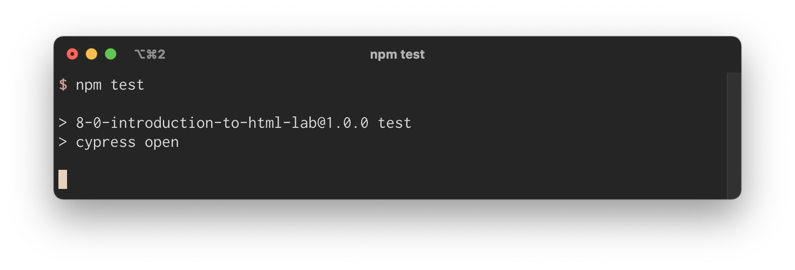
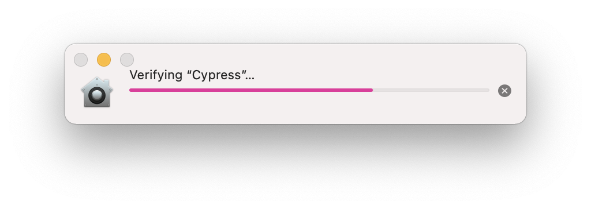
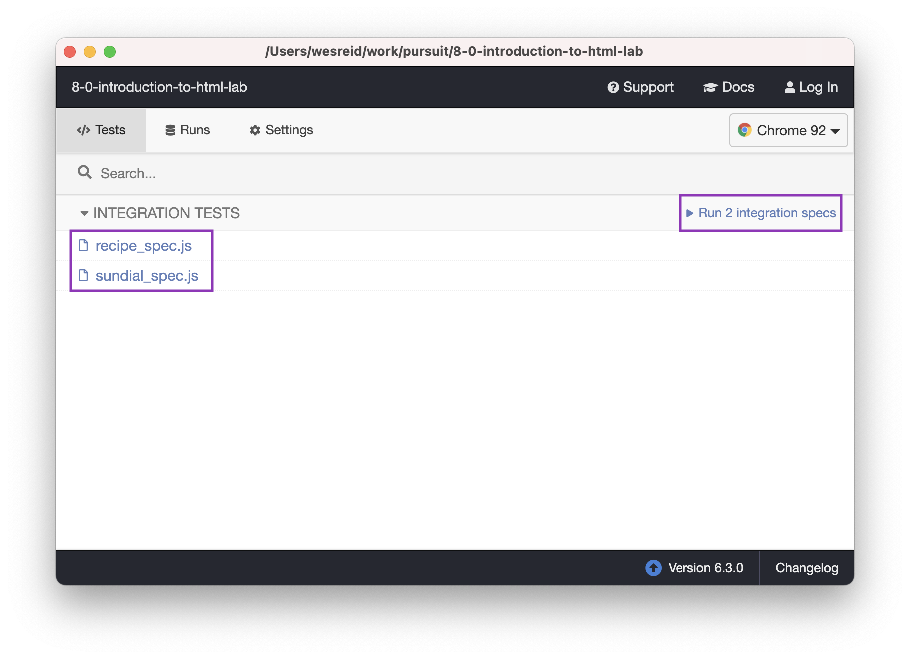
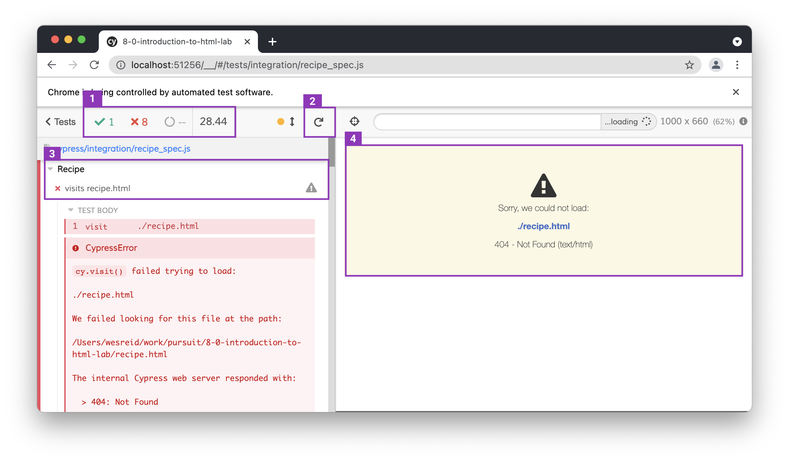
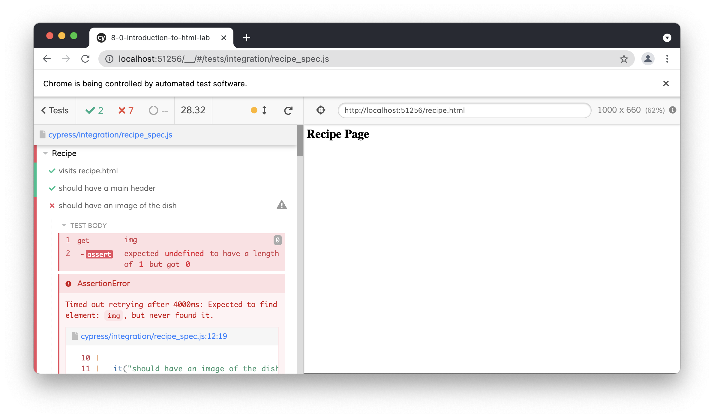
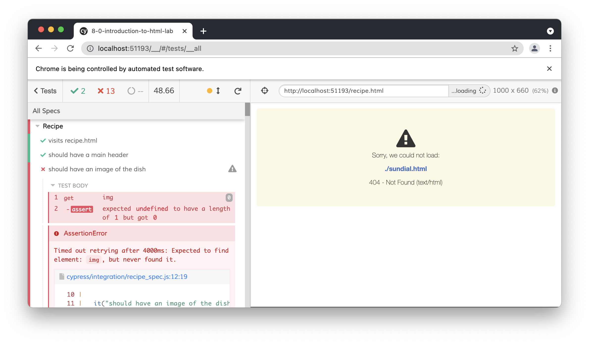

# Understanding Front End Tests

In general, testing is a great way to make sure the applications you build work as intended. Front end testing, in particular, can be quite difficult to do as accounting for user input is challenging. Users can interact with the websites you build in all kinds of unexpected ways.

In this lesson, you will primarily learn about the purpose of front end tests and how to read them. You will not be expected to write your own at this time.

## Learning Objectives

By the end of this lesson you should be able to:

- Describe the role of tests on the front end.
- Interpret test output for front end tests in order to take actionable steps in code.

---

## Testing on the front end

At this point, you've seen what is called _unit tests._ Unit tests ensure that specific functions are working as intended by providing a variety of inputs and testing the output. Unit tests are great for making sure the core functionality of your application works as intended.

However, testing the front end of websites is a bit different than testing a single function. Front ends include structure through HTML, style with CSS, and allow for user interactivity with HTML, CSS, and JavaScript. This means front end testing is inherently more complex.

There are many different types of front end testing you can do. A few that you will encounter in this course are detailed below.

### Visual testing

Visual testing refers to checking that a page looks the way it should. Visual testing can be used to ensure that a label is inside of a form or even that a heading has a specific font.

This kind of testing can be useful when thinking about _regressions._ When changing code on a website, it is possible that some new changes break something that used to look a certain way. For example, you might add CSS rules that accidentally style a different part of the page. Visual testing can help solve these kinds of problems.

Visual testing can be tricky to do well. Oftentimes, if the tests are written very specifically, it can be difficult to iterate on a website without having to make a lot of changes to both the code and the tests.

### Integration testing

Integration testing refers to tests that ensure multiple pieces of your website work together. The term integration testing can be used broadly. In the context of the front end, integration testing often refers to tests that ensure user interaction works in a particular way.

For example, an integration test might check to see whether or not a specific error shows up when a user clicks submit on a form that is incomplete. This interaction touches HTML, CSS, and JavaScript, therefore writing a unit test would not be sufficient.

Integration tests are common and can be very useful to ensure your website works as intended.

### Cypress

To run front end tests, a testing framework is often used. While there are more than a few options out there, [Cypress](https://www.cypress.io/) is one of the most robust. Cypress provides a sleek user interface through which to see that your tests are running correctly. It also allows you to write tests in JavaScript, which is great for JavaScript developers!

This course relies on Cypress for testing the front end.

## Cypress testing

While you will not need to be an expert in Cypress or front end testing yet, you will need to be able to read Cypress tests and understand what is being asked of you to do. You will also need to be able to run the tests so that you can check if you've done everything you need to complete an assignment.

### Reading tests

Cypress tests look remarkably like the other testing framework you've used, Jest.

```js
describe("Recipe", () => {
  it("visits recipe.html", () => {
    cy.visit("./recipe.html");
  });

  it("should have a main header", () => {
    cy.get("h1").should("have.length", 1);
    cy.get("h1").should("be.visible");
  });

  // ...
});
```

As you can see, there is a `describe()` block, under which are two separate `it()` blocks. The `it()` block is essentially the same as the `test()` block from Jest.

In the above code, there are two tests for the "Recipe" category.

1. The first test checks that the `recipe.html` page can be visited at all.

1. The second test checks that there is only one `h1` element on the page and that it is visible to the user.

The majority of the tests will be written in the style of the second test. You should be able to read the test from left to right and get a general sense of what is being asked. For example, take a look at the following test. What do you think is being tested?

```js
it("should have an image of the dish", () => {
  cy.get("img").should("have.length", 1).and("be.visible");
  cy.get("img").should("have.attr", "alt");
  cy.get("img").should("have.attr", "src");
});
```

This test has three different conditions:

1. After "getting" all of the `img` elements on the page, there should only be `1` that is visible.

1. That `img` should have an `alt` attribute.

1. That `img` should also have a `src` attribute.

The tests above are only evaluating whether or not something is on the page. Other Cypress tests will perform some kind of action on your page.

```js
cy.get("form input[type='text']")
  .type("Seattle")
  .get("form input[type='submit']")
  .click();
```

The code above instructs Cypress to do the following, in order:

1. Find the text `input` element that is inside of a `form` element.

1. Type in the text `"Seattle"`.

1. Find the submit `input` element that is inside of a `form` element.

1. Click the submit button.

Based on what happens next, more Cypress tests can be written to ensure that the page changes in the expected way.

### Running tests

Running your tests will begin in a similar way to what you've done before. You'll start by cloning a repository and then running the following commands:

```
npm install
npm test
```

However, this time instead of sending a lot of output to the terminal, you'll see the terminal print out a few lines and then stop.



You may also see the following show up on your computer.



This is all normal; Cypress is getting verified and ready to run.

Next, you'll see the Cypress program open up and display something like the following window.



This program view will show you what tests exist for the repository as well as let you run them. As you can see, this repository has "2 integration specs": `recipe_spec.js` and `sundial_spec.js`. "Specs", in this case, is just another word for test.

### Running an individual file

To run an individual file, you can click on the name of the file. This will open up your default browser and run tests in the browser.



In the opened browser window, you will see the test output. The screenshot above highlights the following.

1. One test passed while eight failed. You can also see that running the tests took about 28 seconds.

2. You are provided a button to click that will re-run your tests.

3. The "visits recipe.html" test failed. Details about the failure are included below.

4. Any output from running the tests, such as a page, would be shown here. Because the file does not exist, a "404 - Not Found" message is shown.

As you update the code, you can press the re-run button to check your solution. For example, the image below shows a few more tests passing. Note how the output to the right has changed.



### Running all test files

To run all test files, you can press the link that says "Run X integration specs", where "X" is the number of integration specs there are. This will run all of the tests at once.



### Quitting Cypress

To quit Cypress, you just need to close the Cypress program. You can do so by selecting the Cypress icon on your dock and press `Cmd` + `Q`, or quitting Cypress from the menu bar.

This will free up your terminal so that you can continue to run commands in it once again.
