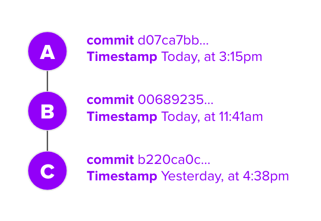
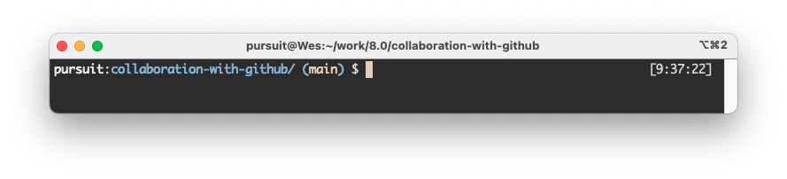
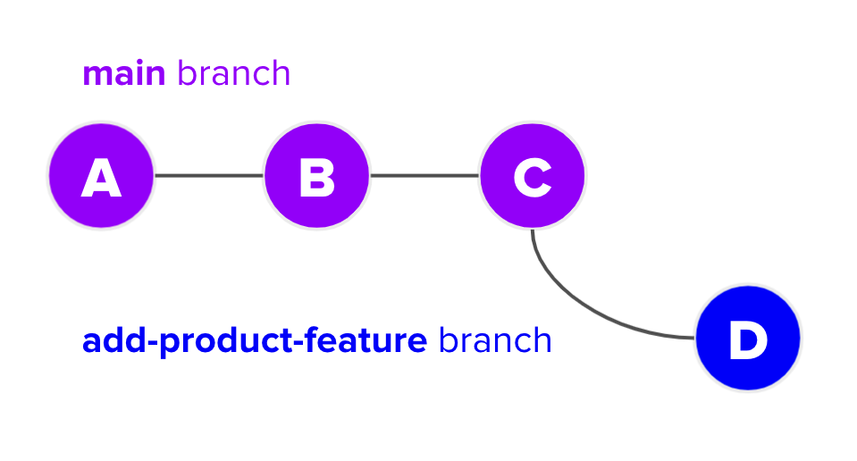
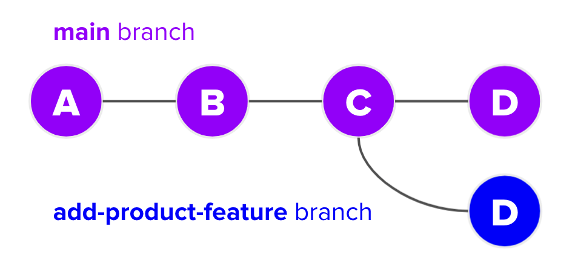
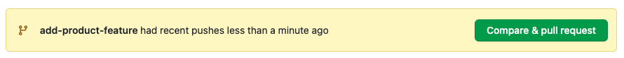
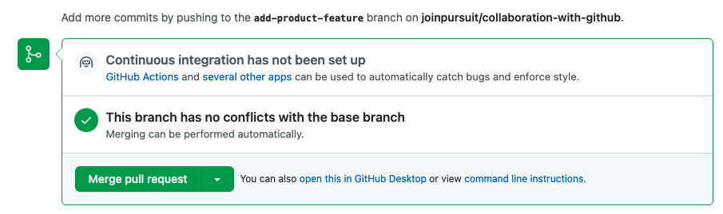
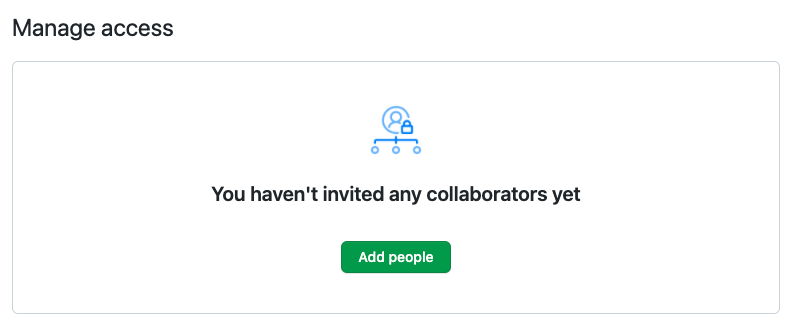

# Collaboration with GitHub

Up until this point, you've likely used Git and GitHub solely as a way to track and backup your code. While this is certainly helpful, both of these tools can do much more than just that. The purpose of the `git` program and GitHub is broader, allowing you to finely track the history of multiple versions. Git and GitHub can also both be used to allow for collaboration by multiple developers.

In this lesson, you'll learn about a specific ability of `git` and GitHub called branching. You'll also learn more about syncing your local and remote repositories, through the lens of branching.

## Learning objectives

By the end of this lesson you should be able to:

- Create branches locally on their own machine.
- Merge branches locally and push those changes to GitHub.
- Push branches to GitHub and merge those branches via pull request.
- Pull changes from GitHub to their local machine.
- Share access to a GitHub repository to other developers.

---

## Review

Before diving into these new topics, it is helpful to review what you've already learned about Git and GitHub.

### Version control

Remember that one of purposes of the `git` program is to track your changes over time, creating a history. Each time you commit changes, you are creating a new node that is part of a commit history. Each commit is a snapshot of your overall project, in time. For example, take a look at the image below which represents a project with three commits.



Which commit came first? Looking at the timestamps, you can see that the first commit of the project was commit "C" at the very bottom. Each commit afterwards tracked some changes. Perhaps commit "B" added new files, and commit "A" modified those files.

This means that, should you want to, you can actually go "back in time" in your Git projects. If, for example, commit "A" introduced a bunch of problems, you could run a command to return to the project state at commit "B".

> **Note:** You will not need to do so in this lesson, but if you'd like to learn more about going back to an alternate commit you can read [this article](https://www.atlassian.com/git/tutorials/resetting-checking-out-and-reverting) which describes some options.

So far, you've mostly been able to ignore this history, treating as more of a log than anything crucially important to developing. As you begin to use branches and collaborate with others, keeping in mind this history is much more important.

### Git & GitHub

Remember that Git and GitHub are two different things, although they work with one another.

Git is a program (i.e. `git`) that runs on your local machine. The `git` program allows you to create new repositories, locally add and commit files, as well as connect those repositories to GitHub.

GitHub is a website. It allows for you to store the changes you've tracked locally. You can also pull repositories from GitHub as well as create pull requests.

You won't be surprised to learn that there's _a lot_ more you can do with both `git` and GitHub. In this lesson, you'll go deeper into both.

## Branches

Whenever you've pulled down a repository from GitHub or created your own repository, you are on a branch called `main`. You may have noticed this text on your command line, even though you may have not been sure entirely what it is.



Whenever a new repository is created with `git init`, the `main` branch is automatically created. Branches are a way that developers can isolate development on a feature, essentially allowing `git` to keep track of two different histories.

Why is this useful? Well, imagine you're working on a project with three other people to build a new website. Your `main` branch contains working, deployed code. Each of you has a new feature you want to add to the website, and you all need to work at the same time. How might you do it?

If you've ever had to collaboratively work on a document or slide deck, you know what might happen next. Each person might try and add some new content and then incorporate it into the "main" version. This could lead to duplicated slides, two people working on the same slide, or a mismatch of versioned documents going back and forth.

Instead of muddling through the above process, `git` allows you to create branches. It's typical for branches to have a new feature associated with it. When that feature is complete, you can then merge your feature back into the `main` branch, using the `git` program's fantastic tools to managing merging.

### Creating branches

First of all, keep in mind that in order to create a new branch you must have at least one commit in your repository.

To create a branch, you can run the following command, replacing `<branch-name>` with the name of your branch.

```
git branch <branch-name>
```

For example, if you wanted to create a new branch called `add-product-feature`, you could run the following command.

```
git branch add-product-feature
```

#### Naming branches

What you should you name your branch? There are a lot of answers to this question, some better than others. While it's possible to name your branch just about anything, you should keep the following in mind.

- Your branch name cannot include spaces.
- Your branch name should shortly convey what the branch is about. For example, `add-product-feature` is better than `new-feature`.
- Branch names must be unique to a repository, so generic names like `bug` or `feature` won't really work.

Just like with variables or file systems, you can generally do whatever you like but it's a good idea to be consistent. Below are some good examples of branch names.

- `show-all-pets-feature`
- `fix-readme-misspelling`
- `bug-infinite-loop-index-page`

You could also consider, when working with others, to include your name or username at the beginning of the branch name.

- `torin.fix-readme-misspelling`

### Viewing branches

You can see all of the branches associated with a repository by running the following command.

```
git branch
```

This will show you a list of all your branches. Press the `Q` key to leave the screen.


As you can see, there are two branches in the above image: `main` and `add-product-feature`. The `*` represents the current branch you are working on.

### Switching to a branch

To switch to a branch, you can run the following command, replacing `<branch-name>` with the name of your branch.

```
git switch <branch-name>
```

After switching to a branch, you may notice that your prompt changes.


Running `git branch` again will show you that the `*` has moved. This means you're currently working on the new branch.

> **Note:** Instead of `git switch <branch-name>`, you could run `git checkout <branch-name>`. You may see this in some documentation.

#### Creating and switching

You can both create and branch and switch to that branch by running either of the following two commands, replacing `<branch-name>` with the name of your branch.

```
git checkout -b <branch-name>
```

```
git switch -c <branch-name>
```

### Branches and history

When you create a branch, it shares the same history of the branch _where you run the command._

For example, imagine your `main` branch has three commits. If you create a new branch, that new branch will have those three same commits. In this way, branches share history.

However, when you create a new commit, the branches will become out of sync. Either branch could be ahead or behind another.



In the image above, two branches are represented: `main` and `add-product-feature`. The `add-product-feature` branch was created from the `main` branch when the `main` branch already had three commits (i.e. "A", "B", and "C"). The commit "D" is on the `add-product-feature` branch but _is not_ on the `main` branch.

### Merging branches locally

Ultimately, you will likely only want to deploy one "version" of the project you are working on. Usually, this is the `main` branch.

To get changes from one branch into another, you'll need to merge. To merge a branch, you first go to _the branch you want to merge into._ Then, you use the following command to merge _a different branch._

```
git merge <branch-name>
```

For example, imagine you want to incorporate the changes made on the `add-product-feature` branch (i.e. commit "D") into the `main` branch. To do so, you'd do the following.

```
git switch main
git merge add-product-feature
```

The above code does the following:

1. Switches you to the `main` branch.
1. Merges all new commits from `add-product-feature` _into_ the `main` branch.



### Feature branches

How do developers use branching when working on real problems? One of the most common ways is, whenever you create a new feature, to start on a branch.

When collaborating, this can be useful as the `main` branch may be changing as other members of your team incorporate their features into `main`. As opposed to constantly needing to keep up with the changes, you can work on your own branch without interruption.

## Branches with GitHub

Locally, you can work on branches and merge them together before pushing up to GitHub. However, it is more common when working on a team to follow this process:

1. Create a new feature branch.
1. Complete work on that feature branch.
1. Push your feature branch to GitHub.
1. Create a Pull Request.
1. Have someone else on your team review your code.
1. Merge your Pull Request from GitHub.

This process is a good one to follow because it allows you to share your work with other members of your team.

### Pushing branches to GitHub

Pushing a branch to GitHub is the same as before. Keep in mind that you should be _on the branch you're pushing_ when you run the following command.

```
git push origin <branch-name>
```

So, for example, if you want to push up the `add-product-feature` branch and are currently on the `main` branch, you should do the following:

```
git switch add-product-feature
git push origin add-product-feature
```

### Merging via GitHub

When you push up a branch to GitHub, GitHub will typically offer you the option to create a pull request when you go to the repository's home page.



Clicking this will allow you to make a pull request, just as you've done before.

At this point, you could share this pull request with other team members, who could comment on your code and what you did.

When you and your team is ready, you can also merge your branch via GitHub by clicking the "Merge pull request" button. Typically this will merge the changes into the `main` branch _on GitHub._



## Pulling

If a pull request is merged, you will want to sync up your local `main` branch with the remote (i.e. GitHub) `main` branch. To do so, you can run the following command from the command line. Make sure you're on the `main` branch when you do so.

```
git pull origin main
```

This will "pull" down any changes on GitHub from the `main` branch that you do not have.

## Sharing access

You can give access to your repository to other people by clicking on the "Settings" tab and then selecting the "Manage access" option.

There, you will be able to click the "Add people" button which will allow you to add users to your repository by their GitHub username.



This will allow for you to work with others on your projects.
