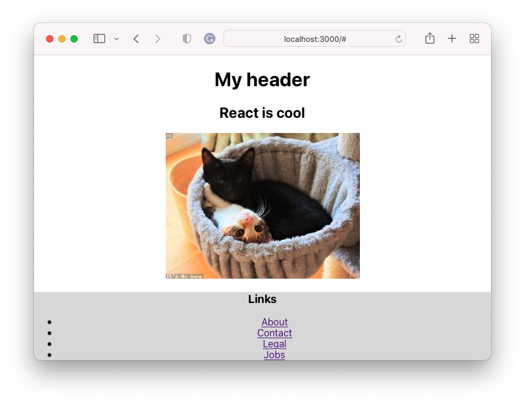

# Introduction To React

## Learning Objectives

- Understand what React is and what problem it solves
- Use Create React App to start a React project
- Understand the role of the files and folders in Create React App starter code
- Create an application that uses React to render its front-end

## Getting Started

This lesson will help you build a simple app demonstrating Create React App's fundamental syntax, organization, and conventions.

The final app will look similar to this:



There are several ways to [create an application with React or add React to a current project](https://reactjs.org/docs/getting-started.html). We'll use `Create-React-App`, which is a feature-rich application that has the following features:

- Automatic browser reloading when you make a change and other pre-configurations that make using it very easy
- Helpful error messages
- File and folder structure that is easy to use and maintain
- Configured for easy deployment

To use Create-React-App to create a new app:

- `npx create-react-app@5.0 my-app`

Inside this project, you will see the following files.

```
.
├── README.md
├── node_modules
├── package-lock.json
├── package.json
├── public
└── src
```

> **Note:** If node modules are missing, use `npm install` to install the needed packages.

> Where will you build your application?

<details><summary>Answer</summary>

You will work inside the `src` folder.

</details>

To start your app:

```
npm start
```

Go to the **src/App.js** file.

What does each line of code do?

We will remove the **boilerplate** code for the rest of this lesson and add our code.

## Creating Components

This app is tiny. Production level apps are massive. One of the benefits of React is that it allows you to create small custom components. Each component is typically stored in its own file.

Inside the **src** folder, add a new file called `Header.js`.

Then, add a function called `Header`:

```js
// Header.js
function Header() {}
```

Add a return statement with parenthesis. Return statements can only return one line of code. The parenthesis allows you to space your HTML/JSX across multiple lines to make it easier to read and edit, but JavaScript will still read it as one line of code.

```js
// Header.js
function Header() {
 return ()
}
```

Add some JSX that will be rendered in the browser.

```js
// Header.js
function Header() {
  return (
    <header>
      <h1>My header</h1>
    </header>
  );
}
```

We want to use this code in `App.js`. To export this code, we must do so explicitly:

```js
// Header.js
function Header() {
  return (
    <header>
      <h1>My header</h1>
    </header>
  );
}

export default Header;
```

The default keyword allows the ability to rename this component in `App.js`.

Return to `App.js` and import this component:

```js
// App.js
import Header from "./Header";
```

Use this new custom component you've created:

```js
function App() {
 return (
 <Header />
 <div className="App">
 <h2>React is cool </h2>
 </div>
 );
}
```

This will cause an error. JSX expressions can have only one parent element. Let's move your custom header inside the `div`.

```js
function App() {
  return (
    <div className="App">
      <Header />
      <h2>React is cool </h2>
    </div>
  );
}
```

Inside of the div is a property `className`. What does it do?

Why can't you use the `class` keyword instead? [Hint](https://www.w3schools.com/js/js_reserved.asp)

## Duplicating Components

What happens when you add three headers?

```js
function App() {
  return (
    <div className="App">
      <Header />
      <Header />
      <Header />
      <h2>React is cool </h2>
    </div>
  );
}
```

## Children Components

Make a new file `Footer.js`:

```js
// Footer.js
function Footer() {
  return (
    <footer>
      <h3>Links</h3>
      <ul></ul>
    </footer>
  );
}

export default Footer;
```

Make a new file `Links.js`

```js
// Links.js
function Links() {
  return (
    <>
      <li>
        <a href="#">About</a>
      </li>
      <li>
        <a href="#">Contact</a>
      </li>
      <li>
        <a href="#">Legal</a>
      </li>
      <li>
        <a href="#">Jobs</a>
      </li>
    </>
  );
}

export default Links;
```

**Try it**: Add the Links component inside the Footer's unordered list.

Add the footer to `App.js`.

## Rendering Values

React renders data.

Currently, we have built a static app where nothing changes.

Let's demonstrate how to _embed_ (insert) data into JSX.

```js
// App.js
const photoOfTheDay = "https://loremflickr.com/320/240";
const currentDate = new Date();
```

Use curly braces for JSX to evaluate the inside value: `{}`.

```js
<Header />
<h2>React is cool</h2>

<Footer />
```

## Using CSS

There are several ways to include CSS in a Create React App.

You will notice some default styles have been placed in **src/index.css**. This is an excellent place to store CSS that should impact the entire app. For example, making sure the whole app has the same base font.

Another way to add CSS is to add it for every component. This will assist in keeping your CSS code organized.

Create a file `Footer.css`.

```css
/* Footer.css */

footer {
  background: Gainsboro;
}
```

Import this code into **Footer.js**

```js
// Footer.js
import "Footer.css";
```

> **Note**: Now, many files are in the `src` folder. To keep projects maintainable and files easily findable, you can add more folders to organize your components.
