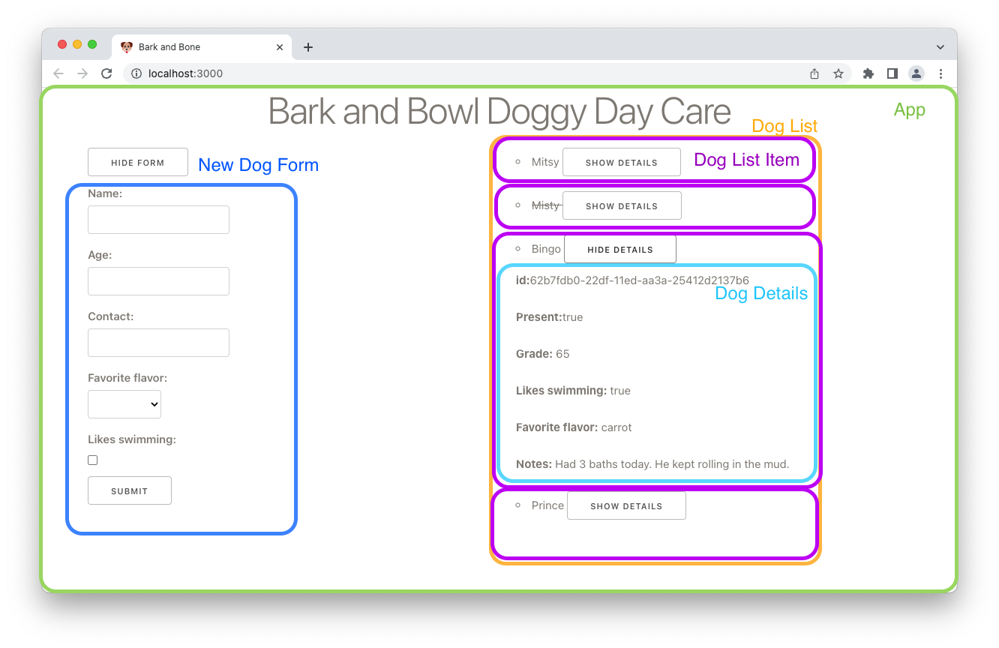

# Lifting State

The flow of data in React is unidirectional. Data flows down. However, sometimes state needs to be shared across components. In this lesson, you will refactor the Doggy Day Care App into more components and manage state to return to the app's full functionality.

## Learning objectives

- Thinking in React
- Understand that data only flows down in React
- Learn where state should go
- Learn how to lift state

## Getting started

Today we'll refactor the Doggy Day Care app to have more components and utilize lifting state to return the same functionality.



Start by forking and cloning the following repository:

- [React Lifting State Class Build](https://github.com/joinpursuit/class-build-lifting-state)

```
npm i
```

## Thinking in React

You may find this lesson quite challenging to code along with, as refactoring as a class is challenging work. Or, if you are looking to be challenged more, you can go back to the last version of this app (completed build from react-forms) and try to refactor the app to have a separate form and list item components.

Refactoring in React is challenging and time-consuming. The best way to avoid it is to plan by [Thinking in React](https://reactjs.org/docs/thinking-in-react.html).

## Data flows down

Props allow you to send data down into child components. However, you cannot send data upwards. If you need to change state in a parent or sibling component, you must use a function.

## Where should state go

Knowing that data flows down in React, use the following wireframe of the Doggy Day Care App to take some time to label where each of these state variables goes:

- `dogs` An array of dogs
- `showNewDogForm` a true/false value to show/hide the new dog form
- `showDetails` is a true/false value to show/hide the details of a single dog
- `newDog` is an object containing data about a new dog that will be added to the `dogs` array
- `checked` a true/false value that handles the checkbox in the form
- `selectOption` is a string that is chosen through the select options form elements


## Lifting state

### Update dog attendance

Right now, when you click on a dog's name, the attendance doesn't change. The dog's attendance is being tracked in the `dogs` array. So the `updateDogAttendance` function must stay in `App.js` because it is calling `setDogs`. However, we can pass this function down.

```js
// App.js

<DogListItem dog={dog} updateDogAttendance={updateDogAttendance} />
```

Pass in `updateDogAttendance` into the object of the functional component:

```js
// Components/DogListItem.js
export default function DogListItem({ dog, updateDogAttendance }) {
```

Then uncomment the `onClick` on or around line 7:

```js
// Components/DogListItem.js
onClick={() => updateDogAttendance(dog.id)}
```

The functionality to update attendance should have returned.

### Remove a dog

We'll follow the same pattern.

- Pass down `removeDog` to the `DogListItem` component.
- Add it as a parameter in the `DogListItem` component.
- Uncomment the `remove` button in the `DogListItem` component.

### Add a dog

- Pass down `handleAddDog` from `App.js` to `NewDogForm`.
- Add it as a parameter in the `NewDogForm` component.
- Uncomment the line that calls this function inside `addDog` at or around line 29.

### Your Turn

Try to get the form to toggle back to hidden after the form submit.

### Completed build

See a complete build [here](https://github.com/joinpursuit/class-build-lifting-state/tree/build)
