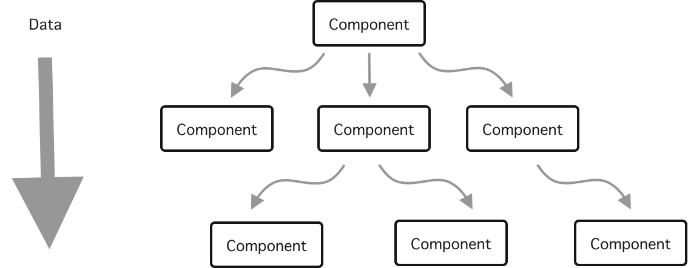
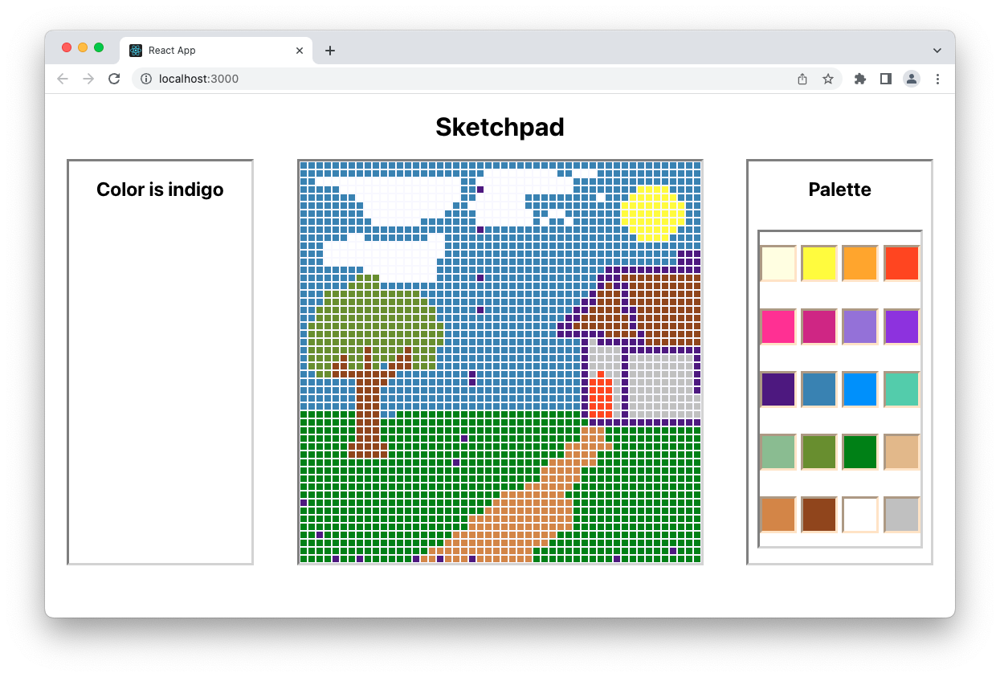
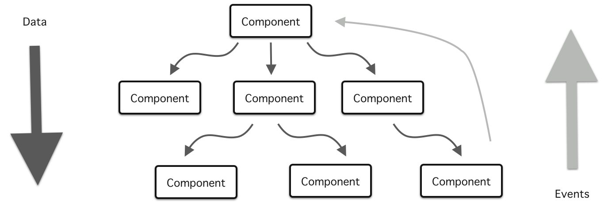
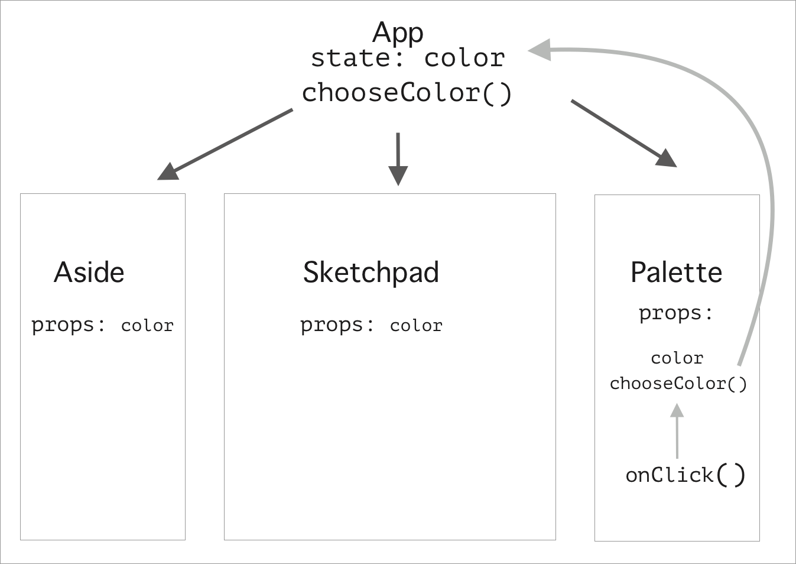

# Data Flow and Lifting State

As you've seen, data flows down in React. When you add a prop, it becomes available inside the child component. But what if you need to pass a value to a parent component (lift state)?

## Objectives

- Thinking in React
- Understand that data only flows down in React
- Learn where state should go
- Learn how to lift state

## Thinking in React

According to the [React documents](https://reactjs.org/docs/thinking-in-react.html), one of the best ways to build an app in React is to build your app in a specific order.

There are several key steps:

1. Start with a mock
   - Take the time to make wireframes and write out other details about your app
   - Refactoring a React app can be very challenging, so when you already start with a great layout, it will be easier to stick with it.
1. Break the UI ito a component hiearchy
   - Clarify within your wireframe which elements are going to be React components and determine which elements go inside other elements.
1. Build a static version first
   - Before adding conditional rendering, forms or other functionality, first create a static view.
1. Identify the minimal complete representation of UI state
   - Determine which data will have state and which data will be passed on as props.
   - Add props to your app, it's ok to use some mock data/mock array of objects.
1. Identify where your state should live
   - State should go down to the lowest (most nested) component possible.
   - If state must be shared across components, put state in the lowest common ancestor.
   - If you can't find a good common ancestor, create one.
   - Add state to start replacing your mock data.
1. Add inverse data flow (lift state)
   - There are times where state must be shared across components, this should be the final piece you work on.

## Data flow and management in React

Data flows down from the parent component to children. The advantages of this are:

- Debugging is easier when the deveoper knows where the data is coming from and where it is going.
- Unidirectional data flow makes the program less prone to errors because there is only one way to do it.



Here is an example situation. In this sketchpad, there are four components:

- Top level `App`
  - Color indicator div
  - Sketchpad
  - Color palette



The color selection happens in the color palette component, but in order for the sketchpad to use that color, the color must be lifted up to the `App` component and then go into the sketchpad and color indicator div.

Even though data flows down, event handlers can send data upwards.



## Lifting State

In the example of the sketchpad:


the color must be set ast state go in `App.js`. App is the most recent common ancestor of the components that share this data. Color is then passed down to the Sketchpad and the Aside components.



```js
function App() {
  let [color, selectColor] = useState("white");

  function chooseColor(color) {
    selectColor(color);
  }

  return (
    <div className="App">
      <header>
        <h1>Sketchpad</h1>
      </header>
      <main>
        <Aside color={color} />
        <Sketchpad color={color} resetBoard={resetBoard} />
        <Palette colors={colors} chooseColor={chooseColor} />
      </main>
    </div>
  );
}
```

The funtion that updates state, `chooseColor`, also goes in App.js and it is passed down to the the color `Palette` component.

This is a color square:

```js
export default function Square({ colors, chooseColor }) {
  return (
    <div
      key={color}
      style={{ backgroundColor: color, height: "40px", width: "40px" }}
      onClick={() => chooseColor(color)}
    />
  );
}
```

`chooseColor` has been passed down to the square. When the click event listner/handler is triggered, it will call `chooseColor` which is a function that is in `App.js`. When this funtion is called in `App.js` it will be able to change the state of `color` and then updated color will be passed down to the Sketchpad and Aside components.

## Resources (optional)

- [Components and Props](https://reactjs.org/docs/components-and-props.html)
- [Thinking In React](https://reactjs.org/docs/thinking-in-react.html)
- [Container Components](https://medium.com/@learnreact/container-components-c0e67432e005)
- [Separation of Concerns](https://en.wikipedia.org/wiki/Separation_of_concerns)
