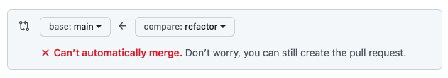
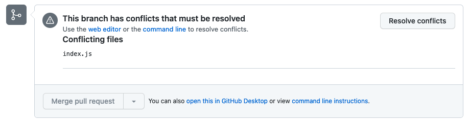
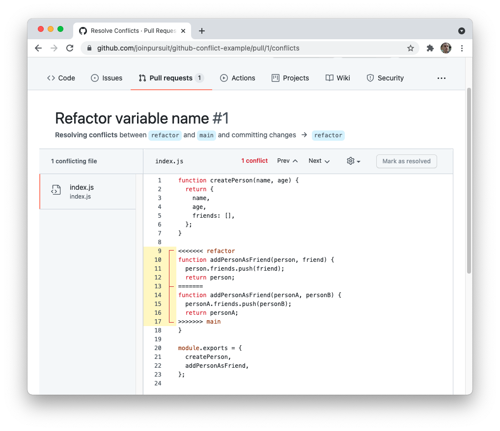
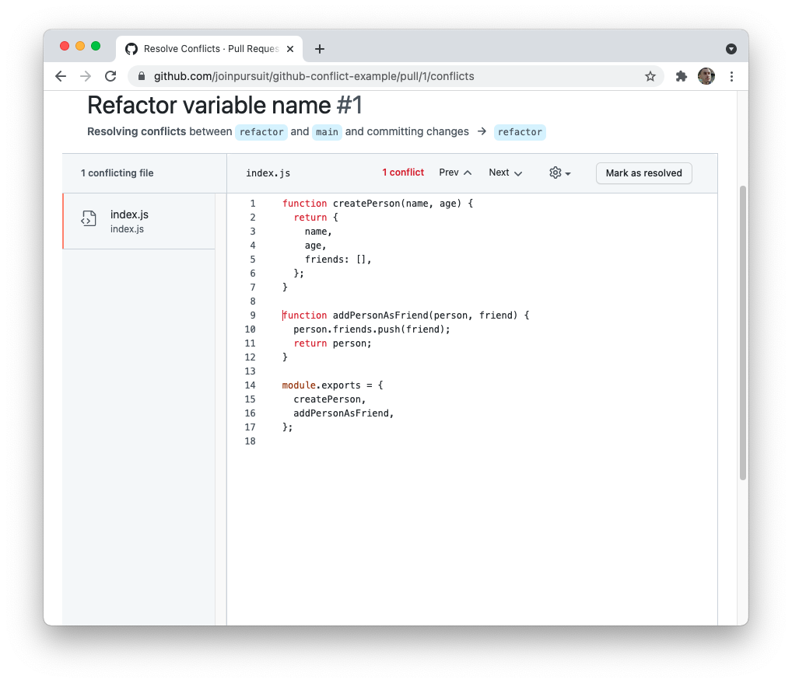
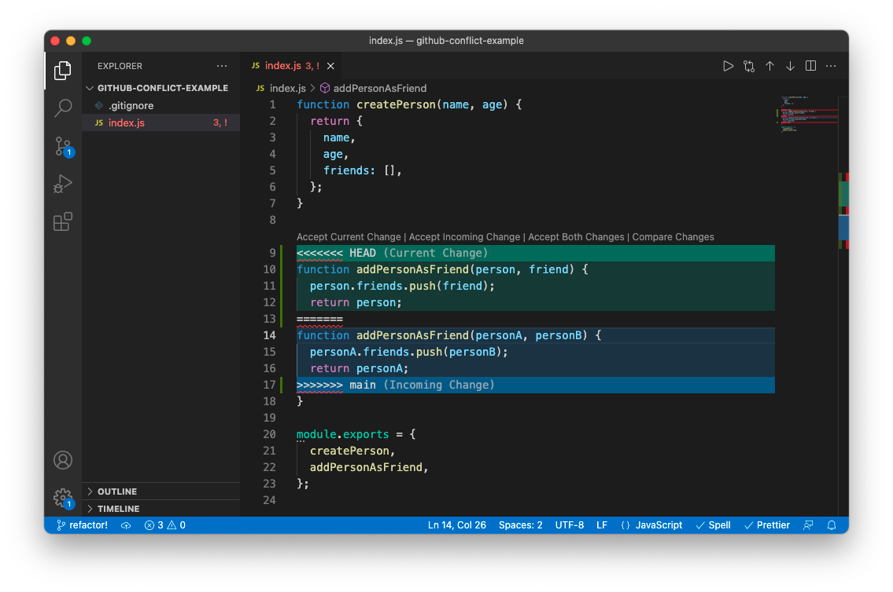
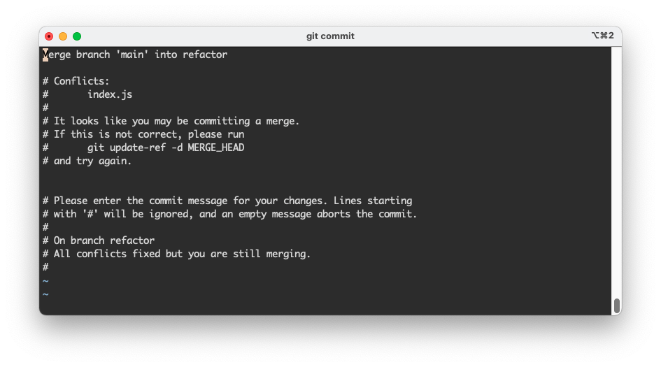

# Merge conflicts

Git and GitHub are incredible tools for keeping track of multiple contributions. However, these tools are not magic. While usually they can manage multiple changes at the same time, when some of these changes overlap a conflict arises. These are called merge conflicts.

In this lesson you'll learn how to manage merge conflicts through the GitHub UI and on your local machine. You'll also learn some best practices for avoiding merge conflicts all together.

## Learning objectives

By the end of this lesson you should be able to:

- Manage merge conflicts through the GitHub GUI.
- Manage merge conflicts locally through the `git` program.
- Describe best practices for working with a team on Git and GitHub.

---

## What is a merge conflict?

A merge conflict occurs when git attempts to merge together two branches which modify the same code. If git cannot determine which code should be kept and which should be removed, a conflict appears.

For example, assume you have the following code in a file called `main.js`.

```js
function sortByAge(elements) {
  return elements.sort((a, b) => {
    if (a.age < b.age) {
      return -1;
    } else if (a.age > b.age) {
      return 1;
    } else {
      return 0;
    }
  });
}
```

This code is fine, but some of the variable names could be better. Now assume that both you and your coworker update the code on your own branches. For example, perhaps one person changes `elements` to `people` and `a` to `personA`, while the other person changes the `if` statements into a `switch` statement. Depending on the type of changes, Git will not know which changes are meant to be kept.

Because Git acts cautiously when this occurs, it asks the user to decide what to do next by surfacing a merge conflict.

### Creating a conflict

To best understand conflicts, it's helpful to see one directly. The steps below will help you reproduce a potential conflict, but keep in mind that typically this will occur when working with multiple members of a team.

1. Create a new `git` repository by running the following lines in your terminal. You should only run the following lines _outside of_ an existing `git` repository.

   ```bash
   take github-conflict-example
   git init
   echo ".DS_Store" > .gitignore
   git commit .
   git commit -m "Initial commit"
   ```

1. Next, you'll want to create a file that can cause a conflict. Create an `index.js` file and copy the following code inside of it.

   ```js
   function createPerson(name, age) {
     return {
       name,
       age,
       friends: [],
     };
   }

   function addPersonAsFriend(person, other) {
     person.friends.push(other);
     return person;
   }

   module.exports = {
     createPerson,
     addPersonAsFriend,
   };
   ```

1. Add and commit the `index.js` file you created. You should be on the `main` branch when this happens.

1. Create a new branch and switch to it by running the following line in your terminal.

   ```bash
   git switch -c refactor
   ```

1. On your new branch, update the `addPersonAsFriend()` function in `index.js` with the following. As you can see, the `other` variable has been renamed as `friend`.

   ```js
   function addPersonAsFriend(person, friend) {
     person.friends.push(friend);
     return person;
   }
   ```

1. Add and commit the changes from above.

1. Switch back to the `main` branch.

   ```bash
   git switch main
   ```

1. The code in `index.js` should have reverted to the code that includes the `other` variable. Update the `addPersonAsFriend()` function with the following.

   ```js
   function addPersonAsFriend(personA, personB) {
     personA.friends.push(personB);
     return personA;
   }
   ```

1. Add and commit the changes from above.

At this point, you have two commits on separate branches that will cause a conflict.

## Managing conflicts through GitHub

One place where you can manage conflicts is through GitHub. There UI (user interface) can allow users to manage conflicts on the website.

To view a conflict on GitHub, first follow the instructions above for creating a conflict. Then, push up both your `main` branch and `refactor` branch to a GitHub repository that you've created.

If you attempt to create pull request with your `refactor` branch, you'll see the following at the top of the screen.



If you continue to create the pull request, you'll then see the box below in place of where it would typically offer the option to merge.



Clicking the "Resolve conflicts" button will lead you to a new screen, where you can resolve the conflict.



This screen shows a lot of information, which can be described as follows:

- On the left, it shows all files where there are conflicts.
- On the right, it shows the currently selected file and highlights where the conflict occurs.
  - The `<<<` and `>>>` characters denote the outer bounds of the conflict. The `===` characters separate one branch's changes from another.
  - The changes from the `refactor` branch are shown above the changes from the `main` branch.

To resolve this conflict, you will need to do the following:

1. Remove the lines of code added by GitHub. (i.e Lines that include `<<<`, `>>>`, and `===`.)

1. Update the code to be in working order.

1. "Mark as resolved."

You'll notice that the "Mark as resolved" button is greyed out until you remove the lines added by GitHub. One example of a solved conflict is below.



In the image above, the changes from the `refactor` branch are kept.

Clicking the "Mark as resolved" button will mark that file as resolved. Once all files have been resolved, you can then make a new commit and at it to your pull request.

## Managing conflicts locally

It's also important to be able to manage conflicts locally. This may occur when you are attempting to reconcile changes from the `main` branch to a local feature branch.

To view a local conflict, first follow the instructions above for creating a conflict. Then, run the following in your local repository.

```bash
git switch refactor
git merge main
```

You will end up with output that looks like the following.

```
Auto-merging index.js
CONFLICT (content): Merge conflict in index.js
Automatic merge failed; fix conflicts and then commit the result.
```

Helpfully, `git` tells you what occurred. Open up the `index.js` file in your code editor and you will see something similar to what you saw on GitHub.



If you're using VSCode, you'll see that the conflict is actually highlighted in your code. At this point, you have a couple of options. You can either edit the text directly that `git` has added to your file (e.g. by deleting lines of code) or you can click the links directly above the highlighted section.

For example, clicking "Accept Current Change" will remove the lines added by `git`, and choose to keep only the code from the `refactor` branch.

Once you updated your file, save it, and then return to the terminal. Running `git status` will prompt you with more options.

```
On branch refactor
You have unmerged paths.
  (fix conflicts and run "git commit")
  (use "git merge --abort" to abort the merge)

Unmerged paths:
  (use "git add <file>..." to mark resolution)
	both modified:   index.js

no changes added to commit (use "git add" and/or "git commit -a")
```

While this doesn't look as neat as the GitHub interface, it is still telling you what to do. To mark a file as resolved, `git add` that file. Then, once everything that needs to be resolved has been, run `git commit`. When you do so, you'll likely be brought to the `vi` editor.



Remember that you can save and quit from this file by typing `:x` and then enter.

If you run `git log`, you'll see you have a new commit, just like you did when resolving your conflict via GitHub.

## Best practices

While this process is not too difficult, it can be frustrating if you find yourself constantly dealing with multiple conflicts each time you try to integrate your code. To avoid conflicts, many teams have adopted the following practices.

### Separating work

Most crucially, it is useful to have different members of your team working on different files. Not only does this help you avoid conflicts, but it's generally a better architecture to have many small files as opposed to a few large files.

When you are working on the same code as someone else, that's a good opportunity to pair together. That way, you can implement features alongside a partner and make sure that they integrate well.

### Branch management

Teams often also discourage direct pushes to the `main` branch. If everyone on the team is constantly pushing to `main`, you'll regularly end up with merge conflicts for every new feature.

Instead, feature branches should be used and reviewed by other members of the team. That way, if a merge conflict occurs, it may just be for a single branch as opposed to everyone's branches.
