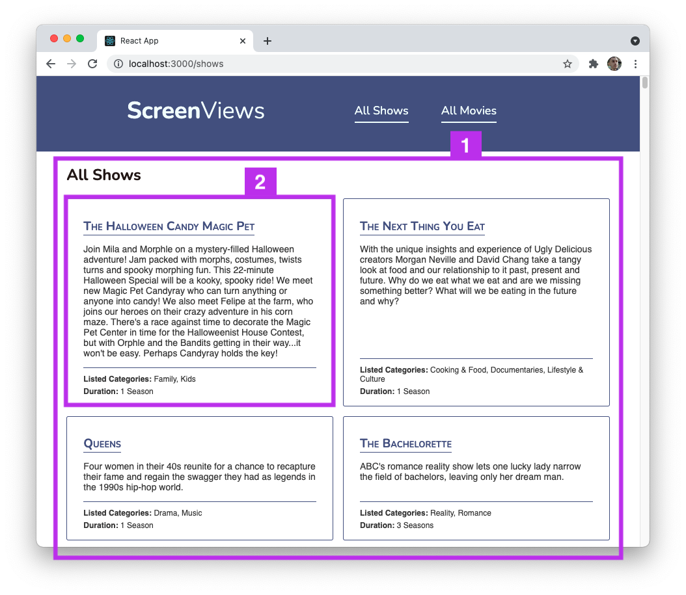
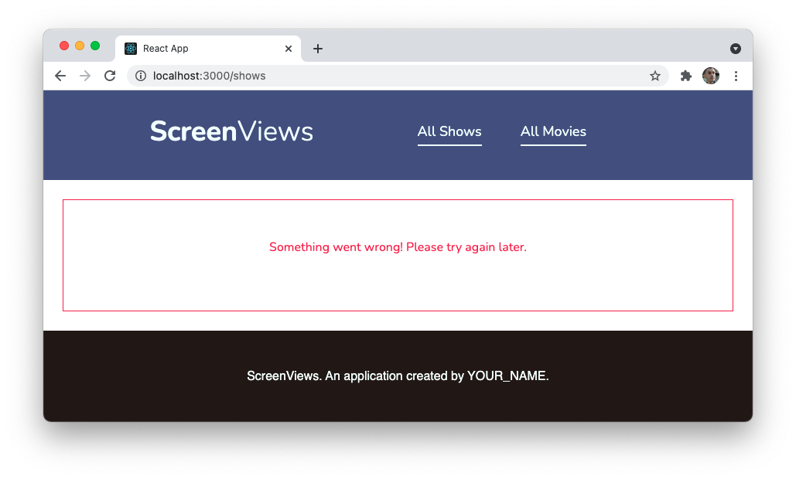

# React CRUD

## Learning objectives

By the end of this lesson, you should be able to:

- Build an Index page that loads all of a particular resource.
- Build an individual Show page that loads a single resource.
- Allow for the destruction of an individual resource through user interaction.

---

## Getting started

Start by forking and cloning the following repository.

- [React CRUD Lab](https://github.com/joinpursuit/8-0-react-crud-lab)

Follow the instructions in that repository to get the application up and working.

- Then fork and clone the API that is linked in the lab. You'll have to open another new tab and keep that application running throughout the build along with the React application.

> **Note:** The second application will be a server on your computer. This server will mimic a third-party API, but instead of the resource being somewhere on the internet, it will be on your machine. You will not need to edit the code in this application to complete the build.

In class you will build out the `shows` resource. During lab, you'll use what you learned in class to build out the `movies` resource.

## Guiding questions and app exploration

First, once your applications are up and running, review the code in the React CRUD Lab repository. Answer the following questions.

- Take a look at the `src/App.js` file. React Router has already been set up for you. How do you know?

- What is the `.env.development` file? You can view [this page](https://create-react-app.dev/docs/adding-custom-environment-variables/) to get some help.

- Take a look at the `src/components/common` directory. What kind of components are in this folder?

- Take a look at both `src/components/common/Nav.js` and `src/App.js`. What routes are available to the user in this application?

- Take a look at both `src/components/shows`.

The app will have the following views and actions once you have completed the build. Some of these views are already available:

|       route       |      view      | action | top-level component |
| :---------------: | :------------: | :----: | :-----------------: |
|        `/`        |   home page    |  none  |   `src/home/Home`   |
|     `/shows`      |  shows index   |  GET   |    `ShowsIndex`     |
|   `/shows/:id`    |   shows show   |  GET   |       `Show`        |
|   `/shows/new`    | shows new form |  none  |    `ShowNewForm`    |
| `/shows/:id/edit` |   shows edit   |  GET   |   `ShowsEditForm`   |
|     `/shows`      |      none      |  POST  |   `ShowsNewForm`    |
|   `/shows/:id`    |      none      | DELETE |   `ShowsNewForm`    |
|    `/shows/:id    |      none      |  PUT   |   `ShowsEditForm`   |

If there is no `GET` action, that page will not load any data. The home page and new form are examples where no data is needed for the view.

When there is a `GET` action, the app must `GET` data from the server and then load it into the view. The index, show, and edit form views are examples of data needed to complete the view.

To complete CRUD, three more actions are needed: `POST` (create), `PUT` (edit), `DELETE` (delete/destroy). These actions will also send requests to the server, but instead of getting data, they will modify data by creating, updating or deleting. These actions are typically represented as buttons and links, they do not have a view. Once the action is complete, the user will typically be rerouted to another view.

In this lesson, the plan is to build out the following pages:

1. An _Index_ page for television shows.
1. A _Show_ page for television shows.
1. The _Delete_ functionality for an individual show.

### Index page

The goal will be to build the page to look like the image below.



There are two components highlighted in the image above:

1. This will be the `ShowsIndex` component.
2. This will be a `ShowsListing` component.

### Show Page

The show page will show data for one TV show. It will also have a button that will allow the user to delete the show. The user will reroute to the index view when the show is successfully deleted.


### Handling an error

Before building the page, handling any potential errors is a good idea. For example, what should the user be shown if the API cannot be reached?

In this case, show them a generic error message, like the image below.



## Begin coding

## ShowsIndex

The `ShowsIndex` view is available at `/shows` in the browser (use the `All Shows` link in the nav bar). The file is located at `/src/components/shows/ShowsIndex.js`.

### ShowsIndex Error Handling

- Add state to the `ShowsIndex` component with `useState`

```js
// src/components/shows/ShowsIndex.js
// Top of file
import { useState } from "react";
```

- Create a state variable called `loadingError` and a function called `setLoadingError` to update the state of the variable.
- Set `loadingError` default to `false`

```js
// Inside functional component
const [loadingError, setLoadingError] = useState(false);
```

- replace the hard-coded `false` (after the opening `div`) inside the return to be the variable `loadingError`

```js
 return (
 <div>
 {loadingError ? (
 <ErrorMessage />
```

To test that this component loads, you can change the initial state for `loadingError` to `true`. However, for a better user experience, the initial value should be `false`.

### ShowsIndex load and render shows data

As your applications grow more extensive and complex, splitting functionality into different files can be helpful.

In this application, fetch requests will go inside the `src/api/fetch.js` file and then be imported into the components as needed.

At the top of this file, add:

```js
const URL = process.env.REACT_APP_API_BASE_URL;
```

This will get the value of the base URL from the `.env` file. Currently, the fetch requests are going to a locally running API version. However, if you want to put this app on the internet, the URL needs to be updated. Using environmental variables lets you manage how applications will run in different environments.

Add this fetch request inside the `getAllShows()` function

```js
// src/api/fetch
// Index/Get all
export function getAllShows() {
  return fetch(`${URL}/shows`).then((response) => response.json());
}
```

Return to `src/components/shows/ShowsIndex`

Create state to hold the shows:

```js
// src/components/show/ShowIndex
const [shows, setShows] = useState([]);
```

Import and call `getAllShows()` on component mount. Then `setShows()`to the incoming data and `setLoadingError()` to `false`. If there is an error, log the error and change the `loadingError` to true.

The code should look like the following:

```js
// Top of file
import { getAllShows } from "../../api/fetch";
```

Import the `useEffect()` function:

```js
import { useEffect, useState } from "react";
```

Call `getAllShows()`. `getAllShows()` is a function that returns a promise. When a promise is returned, you can chain a `.then()` function that will execute when `getAllShows()` has either fulfilled or rejected the promise.

If the promise is fulfilled (the fetch request successfully requested data), it will return a response containing the data. Additionally, there is no loading error, so set that to `false`.

If the promise is rejected, use `.catch()` to run the code that handles the error. Log the error and `setLoadingError` in this case to `true`.

```js
// Inside the functional component
useEffect(() => {
  getAllShows()
    .then((response) => {
      setShows(response);
      setLoadingError(false);
    })
    .catch((error) => {
      console.error(error);
      setLoadingError(true);
    });
}, []);
```

Now that the data is loaded into state, you can add in the component that will display the data:

You want to have a `ShowListing` component for each show.

Import the component

```js
import ShowListing from "./ShowListing";
```

Replace the `section` element and the comment inside it with:

```js
<section className="shows-index">
  {shows.map((show) => {
    return <ShowListing show={show} key={show.id} />;
  })}
</section>
```

Now, you should see a list of all the shows in your browser.

### ShowsIndex Search Bar

There are a lot of shows on this page. They are not organized in any particular way. For a better user experience, you can think about:

- Adding pagination so that only 10-20 shows are listed per page
- Allowing sorting by title, rating, or other fields - in both ascending and descending order
- Creating a simple search bar

In this case, let's create a simple search bar.

Before we begin, let's plan.

- We need to get all of the shows and hold onto this original set of values
- We need to input all the shows into a function
- We need to input whatever the user has typed into the search bar
- We need to return all the shows that have a title that matches the characters the user typed
- We need a way to reset the data back to the original data set

Let's add a variable to always hold on to all the shows.

```js
const [allShows, setAllShows] = useState([]);
```

Let's set it on the component mount, along with `shows`:

```js
getAllShows().then((response) => {
  setAllShows(response);
  setShows(response);
  setLoadingError(false);
});
```

Let's set up the user input.

Add state:

```js
const [searchTitle, setSearchTitle] = useState("");
```

Add a function to handle the text change:

```js
function handleTextChange(event) {
  const title = event.target.value;
  setSearchTitle(title);
}
```

Update the input to match the following:

```js
<label htmlFor="searchTitle">
  Search Shows:
  <input
    type="text"
    value={searchTitle}
    id="searchTitle"
    onChange={handleTextChange}
  />
</label>
```

Outside of the component, let's create a function that will allow us to filter the results to be only the ones that match what the user has entered. Usually, such a function would go in a separate file with other similar functions, but since we only have one, we will keep it in this file.

If you are unfamiliar, `.match()` is a method to look for string matches. If there is a match, it will return true. Else it returns false.

If the value is true with the method `.filter()`, the array item is put in a new array. If the value is false, it is filtered out.

```js
function filterShows(search, shows) {
  return shows.filter((show) => {
    return show.title.match(search);
  });
}
```

Now we want to improve the user experience so that they can type lower or uppercase letters and still get a match:

```js
function filterShows(search, shows) {
  return shows.filter((show) => {
    return show.title.toLowerCase().match(search.toLowerCase());
  });
}
```

Return to the `handleTextChange()` function.

If the input field is empty, it will have the value of empty string. Remember, an empty string is a falsy value. We don't want to filter anything when the input field is empty. Instead, we want to render all the shows. Else, we want to filter the shows against the user input.

We can write this logic with a ternary operator:

```js
const result = title.length ? filterShows(title, allShows) : allShows;
```

Finally, update the view to only show shows that match.

```js
setShows(result);
```

Now let's put all the pieces together:

```js
function handleTextChange(event) {
  const title = event.target.value;
  const result = title.length ? filterShows(title, allShows) : allShows;

  setSearchTitle(title);
  setShows(result);
}
```

Try it! Some example searches:

- lodge (or Lodge)
- School (or SCHOOL)
- trek

## Show View

From `ShowsIndex`, you should be able to click on a show, which will take you to `/shows/:id`. You can click on the link, but the data will not be there. You can also see that the URL matches the pattern of `/shows/:id`, where `:id` is a variable that matches the id of a show.
You will need to make a `GET` request.

Open `src/api/fetch.js`

```js
// src/api/fetch.js
// Show/Get one
export function getOneShow(id) {
  return fetch(`${URL}/shows/${id}`).then((response) => response.json());
}
```

Open the `src/components/shows/Show.js` file.

Import `getOneShow()`

```js
// src/components/shows/Show.js
import { getOneShow } from "../../api/fetch";
```

Import `useEffect()`

```js
import { useEffect, useState } from "react";
```

If the id is invalid (show not found), view the generic error message. Additionally, show the error message if the application cannot reach the server.

The way this API works is that if the show is not found, it will send back an empty object. You can use `Object.keys` to get an array of the object's key values. If the array's length is 0 (no keys), it is an empty object.

```js
useEffect(() => {
  getOneShow(id)
    .then((response) => {
      setShow(response);
      if (Object.keys(response).length === 0) {
        setLoadingError(true);
      } else {
        setLoadingError(false);
      }
    })
    .catch((error) => {
      setLoadingError(true);
    });
}, [id]);
```

Be sure to test that this view works. What is the URL for a single show?

### Show view: delete a show

Currently, there is a `Remove show` button in the show view, but if you click it, it does not work. Let's add the functionality.

Go to `src/api/fetch.js`. So far, all your requests have been `GET` requests. But to delete an item, you will make a `DELETE` request.

When you use `fetch()`, the default is to make a `GET` request. You can pass an option to change the method of the request.

Open `src/api/fetch.js`

```js
// src/api/fetch.js
// Delete
export function destroyShow(id) {
  const options = { method: "DELETE" };
  return fetch(`${URL}/shows/${id}`, options);
}
```

Return to `/src/components/shows/Show.js`

Import the `destroyShow` function.

```js
// src/components/shows/Show.js
import { destroyShow, getOneShow } from "../../api/fetch";
```

When a show is successfully deleted, you want to send the user back to the index view. To do that, you must add the `useNavigate` function from React Router.

First, import it:

```js
import { Link, useParams, useNavigate } from "react-router-dom";
```

Configure it

```js
let navigate = useNavigate();
```

Add the `destroyShow()` function to the `handleDelete()` function. Then upon successful delete, navigate back to the index page. If there is an error deleting the show, show the loading error instead.

```js
function handleDelete() {
  destroyShow(id)
    .then(() => navigate("/shows"))
    .catch((error) => {
      console.error(error);
      setLoadingError(true);
    });
}
```

## Next lesson

In the next lesson, you will build the create and edit functionality.
