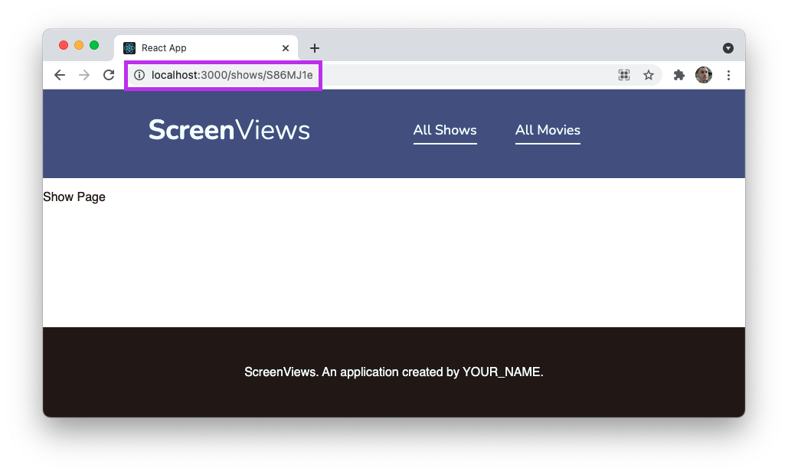

# React CRUD

## Learning objectives

By the end of this lesson you should be able to:

- Build an Index page that loads all of a particular resource.
- Build an individual Show page that loads a single resource.
- Allow for the destruction of an individual resource through user interaction.

---

## Getting started

Start by forking and cloning the following repository.

- [React CRUD Lab](https://github.com/joinpursuit/8-0-react-crud-lab)

Follow the instructions in that repository to get the application up and working.

## Guiding questions and tasks

First, once your application is up and running, review the code that exists in the React CRUD Lab repository. Answer the following questions.

- Take a look at the `src/index.js` file. React Router has already been set up for you. How do you know?

- What is the `.env.development` file? You can view [this page](https://create-react-app.dev/docs/adding-custom-environment-variables/) to get some help.

- Describe the following code which can be found in `src/api/fetch.js`. What is the purpose of it?

  ```js
  const URL = process.env.REACT_APP_API_BASE_URL;
  ```

- Take a look at the `src/api/fetch.js` file. How would you describe the purpose of this file?

- Take a look at the `src/common` directory. What kind of components are in this folder?

- Take a look at both `src/common/Nav.js` and `src/App.js`. What routes are available to the user in this application?

- Take a look at the `ShowsIndex` and `MoviesIndex` components. What is occurring inside of the `componentDidMount()` lifecycle method?

In this lesson, the goal is to build out the following pages:

1. An _Index_ page for television shows.
1. A _Show_ page for television shows.
1. The _Delete_ functionality for an individual show.

### Index page

The goal will be to build out the page so that it looks like the image below.


There are two components highlighted in the image above:

1. This will be the `ShowsIndex` component.
2. This will be a `ShowsListening` component.

#### Handling an error

Before building the page, it's a good idea to handle any potential errors that may arise. For example, what should the user be shown if the API cannot be reached?

In this case, show them a very generic error message, like the image below.


To do this, you will want to do the following:

1. Build an `ErrorMessage` component. Use the HTML below for the component. Where do you think this component should live?

   ```html
   <section className="error">
     <p>Something went wrong! Please try again later.</p>
   </section>
   ```

1. Create a `ErrorMessage.css` file and include the following CSS. Connect this to the `ErrorMessage` component.

   ```css
   .error {
     border: 1px solid var(--error);
     margin: 25px;
     padding: 25px;
   }
   .error p {
     color: var(--error);
     font-family: var(--primary-font);
     margin: 25px;
     text-align: center;
   }
   ```

1. Conditionally render the error message. It should render if `state.loadingError` is `true` _or_ if there are no shows retrieved. When would `state.loadingError` be set to `true`?

#### ShowsIndex

You have experience building pages like this before. Use the HTML structure below to build the `ShowsIndex` page. The comment is where the `ShowsListing` components will go.

```html
<section className="shows-index-wrapper">
  <h2>All Shows</h2>
  <section className="shows-index">
    <!-- ShowListing components -->
  </section>
</section>
```

#### ShowListing

You will now need to create the `ShowListing` component. This component will appear multiple times depending on the number of shows retrieved.

To complete this, you will want to do the following:

1. Create a `ShowListing` component. Use the HTML below for the component and leave the text as is for now. Where do you think this component should live?

   ```html
   <article className="show">
     <h3 class="title">
       <a href="/shows/showId">Title property</a>
     </h3>
     <p className="description">Description property</p>
     <aside className="details">
       <p><span>Listed Categories:</span> ListedIn property</p>
       <p><span>Duration:</span> Duration property</p>
     </aside>
   </article>
   ```

1. Import the `ShowListing` component into the `ShowsIndex` component. Get the `ShowListing` component to display a number of times equal to the number of shows retrieved.

   - This component should only be displayed if there are no errors.
   - Remember to use the `key` property!

1. Pass props into the `ShowListing` component from the `ShowsIndex` component. Replace the dummy text (e.g. "Title property") with the appropriate values. At the end of this step, you should have a long list of unique television shows.

1. Create a `ShowListing.css` file and include the following CSS. Connect this to the `ShowListing` component.

   ```css
   .show {
     border: 1px solid var(--primary);
     border-radius: 3px;
     color: var(--gray);
     display: grid;
     grid-template-rows: auto 1fr auto;
     padding: 10px 25px;
   }

   .show a {
     border-bottom: 1px solid var(--primary);
     color: var(--primary);
     text-decoration: none;
   }

   .show .title {
     text-decoration: none;
     font-variant: small-caps;
     margin-bottom: 0;
   }

   .show .description {
     font-size: 14px;
   }

   .show .details {
     border-top: 1px solid var(--primary);
     padding-top: 10px;
   }

   .show .details p {
     font-size: 12px;
     margin: 0 0 5px;
   }

   .show .details span {
     font-weight: bold;
   }
   ```

### Show page

Next, you will need to build a page that display one television show. The goal will be to build out the page so that it looks like the image below.


This page will just be a single component, called `Show`. This represents the individual television show being viewed, but also shares a name with the common page type!

#### Routing

First, you should set up routing. The goal is to have it so that you are able to go to a page at the following path:

```
/shows/S86MJ1e
```

`S86MJ1e` represents the ID of the show. When a user goes to the above path, they will be shown information about that show.

There are a few different ways to set up this routing.

- Take a moment to consider where you think it makes sense to add more routes. Should you add a new route to the `App.js` file, where all of the other routes are? Should you add new routes to the `ShowsIndex` component, so that all routes related to television shows are in the same place?

  There is not necessarily a right answer here. Describe the pros and cons of doing each.

While there are multiple options here with different impacts, in this case use nested routing. This is what is suggested in the [React Router documentation](https://reactrouter.com/web/guides/quick-start/2nd-example-nested-routing).

1. Import `Switch` and `Route` into the `ShowsIndex` component.

1. Set up two new routes. One should be for `/shows` and the other should be for `/show/:id`. In the future, `:id` will be treated as a variable that you will be able to access.

1. Move your current JSX inside of the `/shows` route. This should allow your Index page to continue working.

1. For now, just add a paragraph tag inside of the new `/shows/:id` route so that you can test and see if it works.

By the end of these steps, you should have something that looks like the following. Take note of the URL.



Finally, you will need to set up links to correctly go to the page. To do so:

1. Return to your `ShowListing` component and update the link so that it uses the `Link` component.

1. For the `to` property, you will need to dynamically build a string that will generate paths like `/shows/S86MJ1e`. How can you do so using string interpolation?

Now, when you click on a show title, you should be brought to your temporary show "page".

#### Dynamically setting the content

First, create a new `Show` functional component with the filename `Show.js`. Replace the paragraph element you currently have in your route with the `Show` component.

```html
<Route path="/shows/:id">
  <Show />
</Route>
```

Then, update your `Show` component to include the following HTML. Leave the hardcoded values as is for the moment.

```html
<section class="shows-show-wrapper">
  <h2>REPLACE_WITH_TITLE</h2>
  <section class="shows-show">
    <aside>
      <p><span>Duration:</span> REPLACE_WITH_DURATION</p>
      <p><span>Listed Categories:</span> REPLACE_WITH_LISTED_CATEGORIES</p>
      <p><span>Country:</span> REPLACE_WITH_COUNTRY</p>
      <p><span>Rating:</span> REPLACE_WITH_RATING</p>
      <p><span>Date Added:</span> REPLACE_WITH_DATE_ADDED</p>
    </aside>
    <article>
      <p>REPLACE_WITH_DESCRIPTION</p>
    </article>
    <aside><button class="delete">Remove show</button></aside>
  </section>
</section>
```

Next, add the following CSS to a `Show.css` file. Connect it to your `Show` component.

```css
.shows-show-wrapper {
  margin: 0 auto;
  width: 70%;
}

.shows-show {
  border: 1px solid var(--primary);
  border-radius: 3px;
  color: var(--gray);
  display: grid;
  grid-template-rows: auto 1fr auto;
}

.shows-show article {
  padding: 10px 25px;
}

.shows-show aside {
  background: var(--primary);
  color: var(--light);
}

.shows-show aside p {
  display: inline-block;
  font-size: 14px;
  margin: 10px 25px;
  padding: 0;
  width: auto;
}

.shows-show aside span {
  font-weight: bold;
}

.shows-show aside button {
  background: none;
  border: none;
  color: var(--light);
  cursor: pointer;
  margin: 10px 25px;
  text-decoration: underline;
}

.shows-show aside button:hover {
  text-decoration: none;
}
```

Next, you'll need to think about how to get the specific television show to appear on the show page. Consider the information available to you at this moment:

- The `ShowsIndex` component contains a `shows` property that contains all shows.
- The URL for this page contains the ID of the television show.

With these two pieces of information, it will be possible to access the specific show by page, and display that information.

Start by updating your route to pass the `shows` prop.

```html
<Route path="/shows/:id">
  <Show shows="{this.state.shows}" />
</Route>
```

Think back to what you read early about the `path="/shows/:id"` key-value pair. The `:id` will act as a variable. To get access to this variable, you will need to import a helpful _higher-order component_ called [`withRouter()`](https://reactrouter.com/web/api/withRouter).

[Higher-order components](https://reactjs.org/docs/higher-order-components.html) in React are similar to higher-order functions in JavaScript. A higher-order component (sometimes abbreviated to HoC) takes in a component and returns a component. In the process, it provides some additional functionality.

To use `withRouter()`, make the following changes:

1. Add the following `import` to the top of your `Show` component.

   ```js
   import { withRouter } from "react-router";
   ```

1. Update the `export default` statement at the bottom of your page to look like the following.

   ```js
   export default withRouter(Show);
   ```

1. Update the first line of your `Show` component with the following:
   ```js
   export const Show = ({ match, shows }) => {
     console.log("Shows:", shows);
     console.log("Match params:", match.params);
     //...
   };
   ```

Head back to your application and take a look at your web console. Then, answer the following questions:

- What is the `shows` variable and where did it come from?

- What is the `match` variable and where did it come from? [This React Router documentation](https://reactrouter.com/web/api/match) may help.

- What kind of data is stored in the `params` key?

- What key inside of the `params` object will allow you to access the ID that is nested in the route?

- Why is that key named what it is?

Use the knowledge you gained from answering the questions above to complete the following:

1. Find the specific show based on the ID in the URL.

1. If no show is found, return `null`. You can test that this works by entering in a nonsense ID into the URL. No content but the navigation and footer should show up.

1. If a show _is found_, dynamically show the data. Replace the dummy text in the `Show` component with data from the real show.

- Additionally, you should only conditionally show one of the paragraph tags if the value for that property is not empty.

Now you should be able to click on any show and all of the data for that show will be displayed.

#### Destroying a show

It is now time to implement your first action, delete. To do so, you will need to do the following:

1. You will need to create a function that sends a request to the API to destroy the show with the selected ID.

1. You will need to create a method in `ShowIndex` that will use the function you just created and, when the request is complete, update the `shows` key of state to no longer have the deleted show.

1. You will need to pass down that method to the `Show` component and use it inside of an event handler.

1. Finally, you will need to use the [`history`](https://reactrouter.com/web/api/history) object to `.push()` the user to a new page, after the request has finished.

##### The DELETE request

Add the following to the `src/api/fetch.js` file. This function will make a `DELETE` request to the API, requesting that the API delete the show with the given ID.

```js
export function destroyShow(id) {
  const options = { method: "DELETE" };
  return fetch(`${URL}/shows/${id}`, options).then((response) =>
    response.json()
  );
}
```

In the `ShowIndex` component, import the above function as well.

##### Handling the DELETE request

In the `ShowIndex` component, you will need to write a method that does the following:

1. Calls the `destroyShow()` function you just created, passing in the ID of the show.

1. If it is successful, remove the deleted show from `this.state.shows`.

1. If it is not successful, show something on the page. For now, you can just set `loadingError` to `true`.

You have the tools to make this function. Complete the function before moving on to the next section.

##### Passing down the handler

You will now need to pass the method you just created down to the `Show` component. Add a key-value pair to the `<Show shows={this.state.shows} />` component inside of your `ShowIndex` component.

In the `Show` component, attach that method to an `onClick` event handler for the delete button that is on the page. Finally, you will need to pass in the ID of the show to your method.

At this point, if all has gone right, clicking on the button should delete the show. You can check this in a few ways:

- Check the API you have running. Did you see a line that looks similar to this?

  ```
  DELETE /shows/I7o4-Q_ 200 27.593 ms - 2
  ```

- Did the television show details disappear from the page, as if you'd used an incorrect ID?

- Go back to the Show Index page. Do you no longer see the television show?

##### Redirecting after a successful deletion

The last step to complete is to redirect the user to a new page once the show has been deleted. Leaving them on the page of the deleted television show doesn't make much sense.

To do so, you can make use of the [`history`](https://reactrouter.com/web/api/history) object. This object allows you to manipulate the history of the page (e.g. the forward and back buttons of your browser) while remaining hooked in to React Router.

To do this, complete the following steps.

1. Import `withRouter()` into the `ShowsIndex` page. Remember to connect it in the `export default` statement as well.

1. Locate the method where the DELETE request is being made. Add the following line at a place where _you know the request was successful._ The code below will "push" the user to the `/shows` route.

   ```js
   this.props.history.push("/shows");
   ```

Once you've done the above, try deleting another show. You should be sent back to the `/shows` route and no longer see the show.

### Recap

You've completed a lot of work in this lesson. To quickly recap, you have:

- Created an Index page for television shows.
- Created dynamic values for the `Link` element's `to` property using string interpolation.
- Created a Show page for television shows.
- Used `withRouter()` and the `match` object to gain access to information in the URL.
- On clicking a button, sent a DELETE request to the API in order to destroy a specific television show.
- Redirected a user through the `history` object.

While there have been a few new tools you've learned (e.g. `withRouter()`), much of what you've done today has been practice of what has already been covered.

### Next steps

To practice what you've learned, complete the same functionality for the `/movies` route. In general, everything should be the same except replacing the word "shows" or "show" with "movies" or "movie".

However, do not simply copy and paste. If you do so it is unlikely you will learn much of anything. Go through the steps above again, frequently thinking of _why_ you need to take certain steps and attempting to reproduce the next steps on your own.
