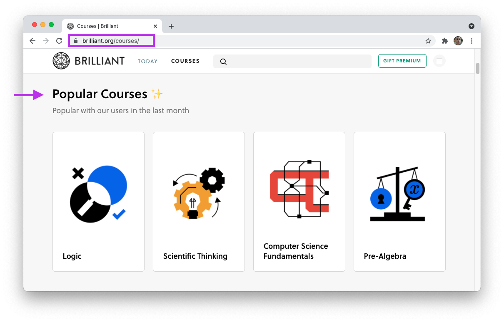
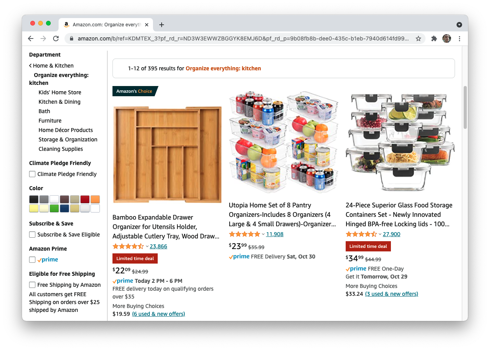
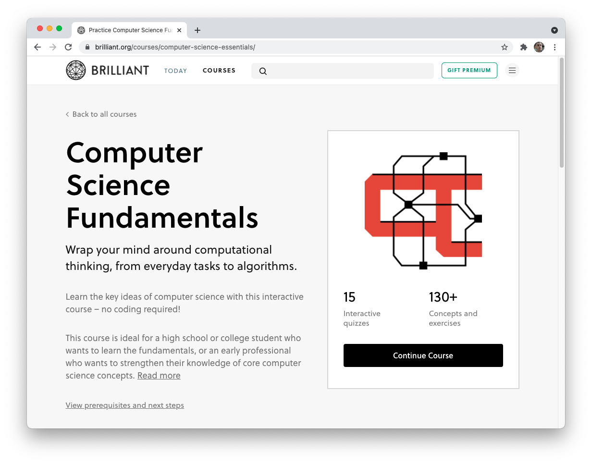
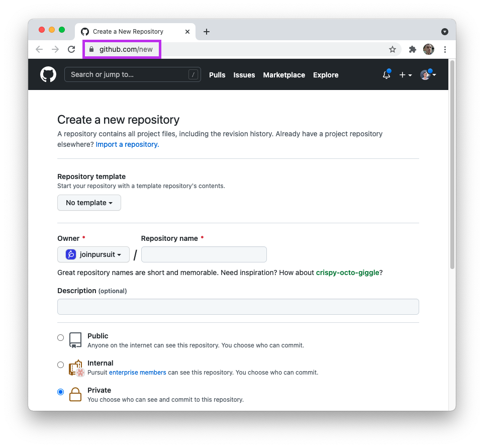
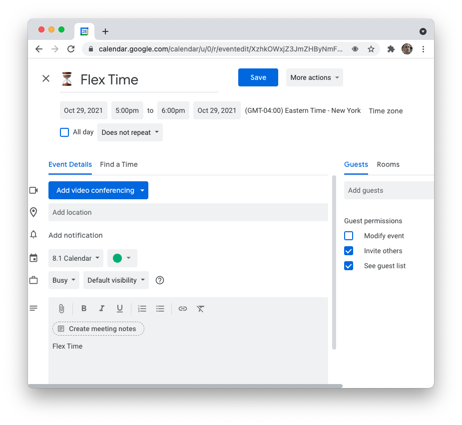

# CRUD in React

Until now, you've learned how to make use of React to conditionally render content using JavaScript. You've seen how React allows you to integrate external APIs into your page and how you can make React applications feel like complex websites through routing.

You may be surprised to learn that there's not much else to React then what you've learned so far. There are many more advanced techniques and tools you could use, but the core aspects of React have already been covered.

With that said, building a typical application you might see on the web is quite complex if you were to just start from scratch. In this lesson, you'll focus on learning about the key actions that take place on just about every single website. Doing so will get you prepared for building all kinds of applications.

## Learning objectives

By the end of this lesson you should be able to:

- Describe the concept of a resource and how it relates to programming.
- Describe the concept of CRUD and how it relates to programming more generally.
- Identify the four most common page types and their purpose.

---

## A quick review

Recall why you're learning React and how it will interact with other parts of a complete application.

- When you go to a URL, you are accessing data from a server. HTML, CSS, and JavaScript (i.e. React) are sent from the server to your Browser, which renders it to you.
- When you interact on a web application, more requests are sent back to the server. Some of these requests to the server are then sent to a database, where information is stored.
- Data stored in the database is requested by the server, which then serves that information up to your browser. For example, when you add a new song to a playlist through an application like Spotify, a request is sent to the server and then to the database which stores that song in your particular playlist.

This concert of requests and promises allows for you to have a unique experience on a website. React allows for you to build a rich and complex frontend experience for your user. However, it also needs to play its part in facilitating this concert of requests.

## Resources

Remember that code is meant to represent real processes and concepts in the real world. For example, when you go to an online store you typically add "products" to your "cart" before placing an "order" to purchase those products. Based on the "address" you've stored in the "account" you've created, a new "delivery" may be created to track your shipment.

Each of these concepts could be a resource. A resource is typically a conceptual representation that has a set of properties with different potential values. Typically, resources are also something you want to "save" or store somehow.

For example, an online store might have dozens of products. Each of these products are different from one another in that they may have different names, colors, weights, costs, images, and more. And yet, they are all similar in that they can all be purchased in the same way. In this example, "Products" are a resource. Each individual "product" shares the same structure (e.g. having a name, color, price property) but each is likely to differ from other products.

### Some examples

The concept of a resource can feel quite abstract. However, whenever you interact with a complex web application, you're likely interacting with many resources.

- Your learning management system has a resource of "assignments." Each individual assignment differs from one another but they all share some qualities, such as having a title and a grade.
- A "post" on a social media site is yet another resource. The content of each post can differ widely, but they share some of the same properties such as having content, a timestamp, and an author.
- If you watch "movies" or "shows" through an online media service, you can think of each movie or show as a resource. Their content is different, but they have similar properties such as titles and lengths.

## Create, Read, Update, and Delete

For many web applications, the entire purpose of the application is to interact with resources. Social media sites are a good example of this. Social media "posts" don't do anything on their own. They are meant to be created, looked at, and occasionally updated or deleted. That is their entire purpose.

This common set of interactions is often called CRUD, representing the actions of create, read, update, and delete.

CRUD actions appear all over the place in programming, as programmers are often working with the concept of resources.

### CRUD in the command line

One place you have already seen CRUD actions is on the command line. For example, consider the resource of a "file". Specific commands allow you to perform the CRUD action via the command line.

| Action | Command         | Effect                             |
| ------ | --------------- | ---------------------------------- |
| Create | `touch`         | Creates a new file.                |
| Read   | `cat` or `less` | Reads the contents of a file.      |
| Update | `mv`            | Allows for the renaming of a file. |
| Delete | `rm`            | Deletes a file.                    |

These same actions can be done with file directories.

| Action | Command        | Effect                                            |
| ------ | -------------- | ------------------------------------------------- |
| Create | `mkdir`        | Creates a new directory.                          |
| Read   | `ls <dirname>` | Lists out the contents of a directory.            |
| Update | `mv`           | Allows for moving file from and to the directory. |
| Delete | `rmdir`        | Deletes a directory.                              |

There are other commands that can have similar actions to the ones above. For example, `>` and `>>` can append text to files, while `rm` can delete a directory as well.

### CRUD in JavaScript

You've also performed CRUD commands on JavaScript objects. Consider how you can manipulate object key-value pairs.

| Action | Syntax                   | Effect                                                         |
| ------ | ------------------------ | -------------------------------------------------------------- |
| Create | `obj[key] = "value"`     | Creates a new key-value pair on an existing object.            |
| Read   | `obj[key]`               | Accesses the value of a particular key in an object.           |
| Update | `obj[key] = "new value"` | Replaces an existing value with a new value for the given key. |
| Delete | `delete obj[key]`        | Removes the key-value pair from the object.                    |

In the example above, you can see that the syntax for creating and updating a key-value pair is the same. The important point to keep in mind is that all of these actions are possible on an object.

### CRUD in APIs

APIs also typically make use of the CRUD actions. So far, you're likely comfortable with building requests that make use of the `GET` method. This method is used to tell the server that you want to read data. Other methods indicate different kinds of actions to perform.

The URL path is also important. For example, take a look at the following path.

```
GET /api/products
```

The above indicates to a server that you want to read (i.e. access) information about the products from the API.

> **Note:** While the above is a _typical_ case, you should always read documentation for an API to best understand how to interact with it.

| Action | HTTP Method/Verb | Effect                               |
| ------ | ---------------- | ------------------------------------ |
| Create | `POST`           | Create a new resource.               |
| Read   | `GET`            | Access information about a resource. |
| Update | `PUT` or `PATCH` | Update information about a resource. |
| Delete | `DELETE`         | Destroy a resource.                  |

Your frontend applications will use the methods above to interact with APIs, allowing you to build robust applications.

## Common page types

In the above section four key "actions" were described that interact with resources. When viewing a webpage as a user, you typically will not see those actions. Instead, you will often see one of the types of pages below. Each of these pages is typically associated with one or more resources and enables different kinds of actions.

### Index

The first, most common type of page is an Index page. The purpose of an Index page is to show many versions of a resource. You can think of it as a list for a resource.

Index pages will always take the read action, to access a number of resources and display them to the user.

For example, take a look at the following page from Brilliant.org.



The image above is an Index page for courses. There are two ways you can tell this:

1. The URL path is `/courses`. While this won't be true for every website, many websites follow a convention where they put the resource name in the URL. This "courses" page shows all courses, therefore the path is `/courses`.

1. Multiple courses are being shown. You can see here that Brilliant organizes the courses by popularity. However, this doesn't change the fact that this is an Index page.

Index pages are the "storefront" for a particular resource. It allows the user to view multiple resources and choose what to do next.

Not all index pages are created equal. The image below is from Amazon and shows multiple products. However, you can see that their URL doesn't indicate what you're looking at and their page is a bit busier.



### Show

A Show page features a single resource. Show pages typically read a single resource, as opposed to the Index page which reads multiple.

That's it! Take a look at the following Show page for a Brilliant.org course.



The page above shows more details on the Computer Science Fundamentals course. The purpose of this page is to highlight display that resource and allow the user to interact with it.

This same concept can be seen on Amazon when looking at a particular product page.


In the image above, a single product is highlighted from Amazon.

### New

A New page refers to any page where you can create a new resource. For example, you're likely familiar with the following New page.



The image above is the page you use to create a new GitHub repository.

New pages will almost always have a `form` element. When clicking the Submit button, the create action is taken. Then, you are often redirected to the newly created resource's Show page or the overall resource's Index page.

### Edit

An Edit page is very similar to a New page, except it modifies an existing resource. For example, the following is Google Calendar's Edit page.



Edit pages also typically use forms. When the Save button is hit in Google Calendar, the update action is used to modify the resource. Then, the user is typically brought back to an Index or Show page.

## Applying this knowledge

You've now seen a number of examples of the four most common actions (i.e. create, read, update, and delete) as well as some of the most common pages (i.e. Index, Show, New, Edit). While interesting, you may be wondering how to apply this new knowledge.

First, it's often helpful to have specific language when getting ready to build complex web applications. It is not very specific to say that you need to build "a dashboard". It's much better to say that you need to build "a product Index page, that allows a user to delete products and click a button to go the product New page." Technical language like this is great for communicate with team members and for future interviews.

Secondly, if you spend some time looking around at your favorite websites you'll begin to notice that these concepts show up often. The majority of pages on many popular applications are just iterations of the concepts you've read about here. And that's helpful to know because you can build all of these kinds of pages!

Take a moment to reflect on the screenshots you've seen above. You're capable of repeating elements on the page, displaying images, and generating forms. You're capable of making requests when a page loads or via button click. And you're capable of reading documentation and asking questions to see how you can interact with an API.

It may not feel like it, but at this point you are ready to build complex frontend applications. You have the knowledge -- now it's time to practice!
