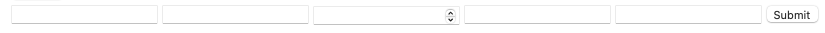
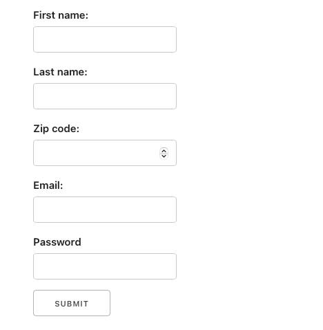

# React Forms

Many interactions on the web are with forms. This lesson will cover using three types of React inputs: checkboxes, options, and text.

## Objectives

- Controlled vs. uncontrolled components
- Use React state to control a checkbox
- Use React state to control an options menu
- Use React state to control a single text input
- Use the form element correctly
- Use React state to control multiple text inputs
- Clearing the inputs after submitting the form

## HTML uncontrolled inputs versus React controlled inputs

HTML form inputs are elements that already have state. When you create a plain HTML input, as you interact with it (type or click), it updates the input's data and the view.

When adding inputs to React, you must give React control of the inputs to ensure the state is being correctly tracked and updated and that there is one source of truth. When an input exists in a React app that React is not explicitly controlling, it is called an "uncontrolled" component.

## A note on demos and best practices

Web accessibility is the inclusive practice of ensuring there are no barriers that prevent people with physical disabilities from using the web. Forms contain a lot of built-in web accessibility when they are set up correctly.

For the sake of brevity and clarity in learning how to handle forms in React, many best practices are often skipped in tutorials teaching other skills.

When developing a professional-level app, be sure to take the time to, at a minimum, include:

- `label` elements with the `for`/`htmlFor` attribute
- Using an `id` with an input that matches the label's `for` attribute
- Wrapping inputs in a form element
- Using the `submit` event to submit form data

See the end of this reading for more information.

## Checkbox

Start by adding state to the app:

```js
const [checked, setChecked] = useState(false);
```

Add a function that will handle the changes:

```js
function handleCheckboxChange() {}
```

Initially, when you add an input element, you can interact with it. This checkbox can be clicked to check and uncheck the value.

```html
<input type="checkbox>
```

React will need two more properties to give React control: one that adds the `checked` key-value pair, which will show the checkbox as checked or unchecked. An event handler `onChange` will be called whenever a change on the element occurs.

```html
<input type="checkbox" checked="{checked}" onChange="{handleCheckboxChange}" />
```

You'll notice that after adding these properties, when you check the checkbox, it stays unchecked because React is now controlling the state, and checked is always set to the initial value of `false`.

Add state and create a function to handle the checkbox change.

```js
function handleCheckboxChange() {
  setChecked(!checked);
}
```

The checkbox should now work.

## Select options

Add state to select an option:

```js
const [selectOption, setSelectOption] = useState("");
```

Add a function to handle the changes:

```js
function handleSelectChange() {}
```

Add the select menu:

```html
<select>
  <option value=""></option>
  <option value="cats">Cats!</option>
  <option value="dogs">Dogs!</option>
</select>
```

Add the event listener/handler to the `select` element.

```js
<select onChange={handleSelectChange}>
```

Use `event.target.value` to get the value of the option

```js
function handleSelectChange(event) {
  console.log(event.target.value);
}
```

> **Note:** What is the value of `event.target.value`? Is it coming from the key-value pair of the `value`property or the value inside the`options` tags?

Add a visual:

```js
<h3>You selected {selectOption}</h3>
```

```js
function handleSelectChange(event) {
  setSelectOption(event.target.value);
}
```

## Text Input

Set up state for a text input that will handle a user's nickname:

```js
const [nickName, setNickName] = useState("");
```

Add a function that will handle the changes:

```js
function handleNickNameChange(event) {
  setNickName(event.target.value);
}
```

Set up the input:

```js

<input type="text" onChange={handleNickNameChange}>

```

Add a visual to confirm:

```js
<h3>
  {nickName} selected {selectOption}
</h3>
```

## Forms

Usually, users fill out forms with multiple fields. The data entered should be 'processed' when the user has completed filling out the fields and has determined the form is ready to be submitted.

```js
function handleSubmit(event) {
  console.log("form submitted");
}
<form onSubmit={handleSubmit}>
  <input type="submit" />
</form>;
```

Press the submit button. What happens? If you look closely, you will notice that the page is reloaded. This is the normal default behavior of a form. To prevent this behavior, you must call `event.preventDefault()`

```js
function handleSubmit(event) {
  event.preventDefault();
  console.log("form submitted");
}
<form onSubmit={handleSubmit}>
  <input type="submit" />
</form>;
```

## Multiple text inputs

In a previous example, you made a function whose sole responsibility is to handle the value of `nickname`. Imagine a form that has 10+ text inputs. You could write a handler for each input. However, it would also make sense to create a handler that handles all of the text inputs.

Create an object for a user:

```js
const [user, setUser] = useState({
  firstName: "",
  lastName: "",
  zip: "",
  email: "",
  password: "",
});
```

Create a function to handle the change

```js
function handleTextChange(event) {
  console.log(event.target.value);
}
```

The inputs will require several properties:

- `type` the type of input. Though `text`, `email`, `number`, and `password` are all text inputs, `email` , `number` and `password` have extra functionality to assist users in filling out the forms. [MDN Input element](https://developer.mozilla.org/en-US/docs/Web/HTML/Element/input)
- `value` this is the value seen in the input field and it is the value tracked and controlled by React. Notice that the keys match the user object created during initial state initialization.
- `onChange` the function for the event listener/handler
- `id` - this will be the `key` name and will match the user object. This value will be used to dynamically set the text in the different text inputs. Additionally, `id` is used in conjunction with `for`/`htmlFor` for [web accessibility ](https://developer.mozilla.org/en-US/docs/Web/HTML/Attributes/for). if you are receiving an unexpected warning along the lines of `A component is changing an uncontrolled input to be controlled`, it is likely being caused by the `key` being missing or having a spelling mismatch between the initial state and the `id` value.

```js
<form onSubmit={handleSubmit}>
  <input
    type="text"
    value={user.firstName}
    onChange={handleTextChange}
    id="firstName"
  />
  <input
    type="text"
    value={user.lastName}
    onChange={handleTextChange}
    id="lastName"
  />
  <input type="number" value={user.zip} onChange={handleTextChange} id="zip" />
  <input
    type="email"
    value={user.email}
    onChange={handleTextChange}
    id="email"
  />
  <input
    type="password"
    value={user.password}
    onChange={handleTextChange}
    id="password"
  />

  <input type="submit" />
</form>
```

You will notice that when you've created these inputs, they are unlabeled, and it is unclear which input is for which field.

Before styling, finish setting up the functionality. This will help clarify which form components are used for input functionality and which assist the user experience.



Add the functionality to update the state of the user object:

```js
function handleTextChange(event) {
  setUser({
    ...user,
    [event.target.id]: event.target.value,
  });
}
```

`user` is an object. In `setUser`, `user` is being destructured to copy it. After that, `[event.target.id]`, which matches the object keys, will be evaluated. Then the value of `event.target.value` is set.

To confirm that this function is updating all the values, log the inputs on submit:

```js
function handleSubmit(event) {
  event.preventDefault();
  console.log(user);
}
```

## Reset the form

To reset the user data, all the values must be returned to their initial state (empty strings in this example). Form resets typically happen after a form has been submitted, so a good place to do this is within the `handleSubmit` function.

```js
function handleSubmit(event) {
  event.preventDefault();
  console.log(user);
  setUser({
    firstName: "",
    lastName: "",
    zip: "",
    email: "",
    password: "",
  });
}
```

## Add labels and style for better user experience and web accessibility

Add labels (and some style), and notice that the `htmlFor` property matches the `id`. This is a best practice for web accessibility:

```js
<form onSubmit={handleSubmit}>
  <label htmlFor="firstName">First name:</label>
  <input
    type="text"
    value={user.firstName}
    onChange={handleTextChange}
    id="firstName"
  />
  <label htmlFor="lastName">Last name:</label>
  <input
    type="text"
    value={user.lastName}
    onChange={handleTextChange}
    id="lastName"
  />
  <label htmlFor="zip">Zip code:</label>
  <input type="number" value={user.zip} onChange={handleTextChange} id="zip" />
  <label htmlFor="email">Email:</label>
  <input
    type="email"
    value={user.email}
    onChange={handleTextChange}
    id="email"
  />
  <label htmlFor="password">Password</label>
  <input
    type="password"
    value={user.password}
    onChange={handleTextChange}
    id="password"
  />
  <input type="submit" />
</form>
```



Resources/Readings:

- [W3 Making the Web Accessible](https://www.w3.org/WAI/)
- [MDN input: The Input (Form Input) element](https://developer.mozilla.org/en-US/docs/Web/HTML/Element/input)
- [MDN label: The Input Label element](https://developer.mozilla.org/en-US/docs/Web/HTML/Element/label)
- [MDN form: The Form element](https://developer.mozilla.org/en-US/docs/Web/HTML/Element/form)
