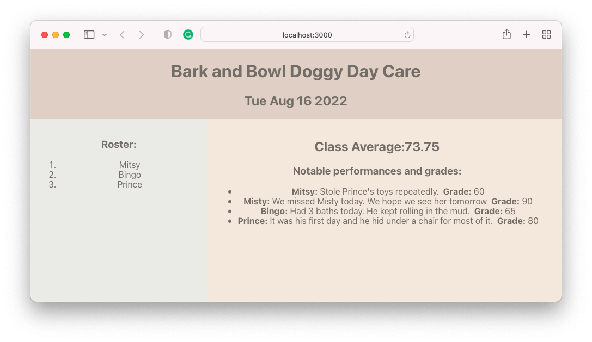

# React Props

React is a framework that helps create interactive user interfaces. One of the most important features is the ability to render data.

## Learning objectives

- Understand what props are and what problem they solve
- Build an application that uses props
- Map over data to render it
- Conditionally render components
- Articulate the distinction between container and display components

## Getting started

Today we'll build a simple doggy daycare app:



Start by forking and cloning the following repository:

- [React Props Class Build](https://github.com/joinpursuit/class-build-react-props)

## Props

Props is short for the word properties. All HTML elements can have properties. This anchor tag has two properties, `id` and `href`.

```html
<a id="best-link" href="www.example.com">My favorite website</a>
```

React extends the function of properties (props) to allow values to be passed down. This may seem strange at first. As you spend more time coding in React, you will realize the importance of this feature.

In `App.js`, there is a variable called `dayCareName`.

You can pass the name to the `Header` component:

You can name the key whatever you want, like `asdf`. But it's a good idea to pick an accurate and descriptive name for the key. The following code will add the key-value pair to an object called `props`.

```js
// App.js
<Header name={dayCareName} />
```

To access this prop (property) in `Header`, add a parameter called `props` to the function:

```js
function Header(props) {
  console.log(props);
  return (
    <header>
      <h1>{props.name}</h1>
    </header>
  );
}
```

You can clean this code up by using object destructuring:

```js
function Header({ name }) {
  return (
    <header>
      <h1>{name}</h1>
    </header>
  );
}
```

You can add more props to Header and pass them down:

```js
<Header name={dayCareName} todaysDate={todaysDate} />
```

```js
function Header({ todaysDate, name }) {
  return (
    <header>
      <h1>{name}</h1>
      <h2>{todaysDate}</h2>
    </header>
  );
}
```

## Dynamic Rendering

There is some dog data in `App.js`. We want to pass the data to the `Aside` and show a list of dogs at Doggy Day Care today.

```js
// App.js
<Aside dogs={dogs} />
```

You can log the value of dogs to be sure it has been passed down.

```js
// Aside.js
function Aside({ dogs }) {
  console.log(dogs);
  return (
    <aside>
      <h3>Roster:</h3>
      <ol></ol>
    </aside>
  );
}
```

How can we get a list of each dog's name as a list item?

We can think of looping over the data and then adding `li` elements around each dog name:

```js
const dogListItems = [];
for (let i = 0; i < dogs.length; dog++) {
  dogListItems.push(`<li>${dogs[i].name}<li>`);
}
```

However, everything inside a `return` statement is JSX and not JavaScript, and JSX does not allow for loops.

You do have another tool that will allow you to loop over values and return a new array: The array method `.map()`. JSX will allow you to use array methods.

First, start with a set of curly braces. `{}`. The braces tell React to evaluate what is inside the curly braces first before rendering it.

```js
// Aside.js
function Aside({ dogs }) {
  console.log(dogs);
  return (
    <aside>
      <h3>Roster:</h3>
      <ol>{}</ol>
    </aside>
  );
}
```

Set up the .map() function to iterate over `dogs`:

```js
// Aside.js

<ol>{dogs.map()}</ol>
```

Write the callback that will return a list item with the name of each dog:

```js
{
  dogs.map((dog) => <li>{dog.name}</li>);
}
```

All the code together:

```js
<aside>
  <h3>Roster:</h3>
  <ol>
    {dogs.map((dog) => (
      <li>{dog.name}</li>
    ))}
  </ol>
</aside>
```

## Conditional Rendering

Not all the dogs were present today. Often, you will want to change what is rendered based on the data.

In the case of the roster, we only want to create list items for dogs that were present. In React, if you don't want to return an element, you must return `null`.

If statements are also not going to work in JSX. Instead, ternary operators are used.

Ternary operators are a different syntax for if statements.

The following if statement can be rewritten:

```js
if (dog.present) {
  return <li>{dog}</li>;
} else {
  return null;
}
```

to

```js
return dog.present ? <li>{dog}</li> : null;
```

When you see a ternary operator, try reading out loud like so:

If `dog.present` is true, then return the first value after the question mark. Else return the value after the colon.

Put it all together:

```js
<ol>{dogs.map((dog) => (dog.present ? <li>{dog.name}</li> : null))}</ol>
```

## Unique key prop

If you open your browser console, you will notice a warning.

```
Warning: Each child in a list should have a unique key prop
```

Your app will still work when there is a warning. However, it would be best if you aimed to solve as many warnings as you can as you are building your app, as warnings may lead to unpredictable app behavior.

Typically, when you work with actual data, the data will have a unique id. In this case, we have a simple data set and don't have an id available. We can use the dog names as a unique key prop for now, but be aware that if a dog with the same name joined, this strategy would not work.

```js
<ol>
  {dogs.map((dog) => (dog.present ? <li key={dog.name}>{dog.name}</li> : null))}
</ol>
```

## Sharing data

Now, to get the class average for the main component. When you pass props, they are unmodified from their original source. How we manipulated the data in the Aside component will not impact what you do in the Main component.

Pass the dogs data to `Main`.

```js
<Main dogs={dogs} />
```

Get the dogs out of the props object and confirm with a console log:

```js
function Main({ dogs }) {
  console.log(dogs);
  return (
    <main>
      <h2>Class Average:</h2>
      <h3>Notable performances and grades:</h3>
      <ul></ul>
    </main>
  );
}
```

Let's add the notes to the Main component.

```js
<ul>
  {dogs.map((dog) => {
    return (
      <li key={dog.name}>
        <span>{dog.name}:</span> {dog.notes}
        <span>&nbsp; Grade:</span> {dog.grade}
      </li>
    );
  })}
</ul>
```

The list item is getting pretty complicated. Would it make sense to separate it and create a new component? Why or why not?

## Adding functionality

You want to get the average of the dog grades. You can write a function inside of Main to do so:

```js
function Main({ dogs }) {
  const getAverage = (dogs) => {
    let sum = 0;
    for (let dog of dogs) {
      sum += parseInt(dog.grade);
    }
    return (sum / dogs.length).toFixed(2);
  };
  const average = getAverage(dogs);
  return (
    <main>
      <h2>Class Average:{average}</h2>
      <h3>Notable performances</h3>
      <ul></ul>
    </main>
  );
}
```

Why can a for loop be used in this case?
