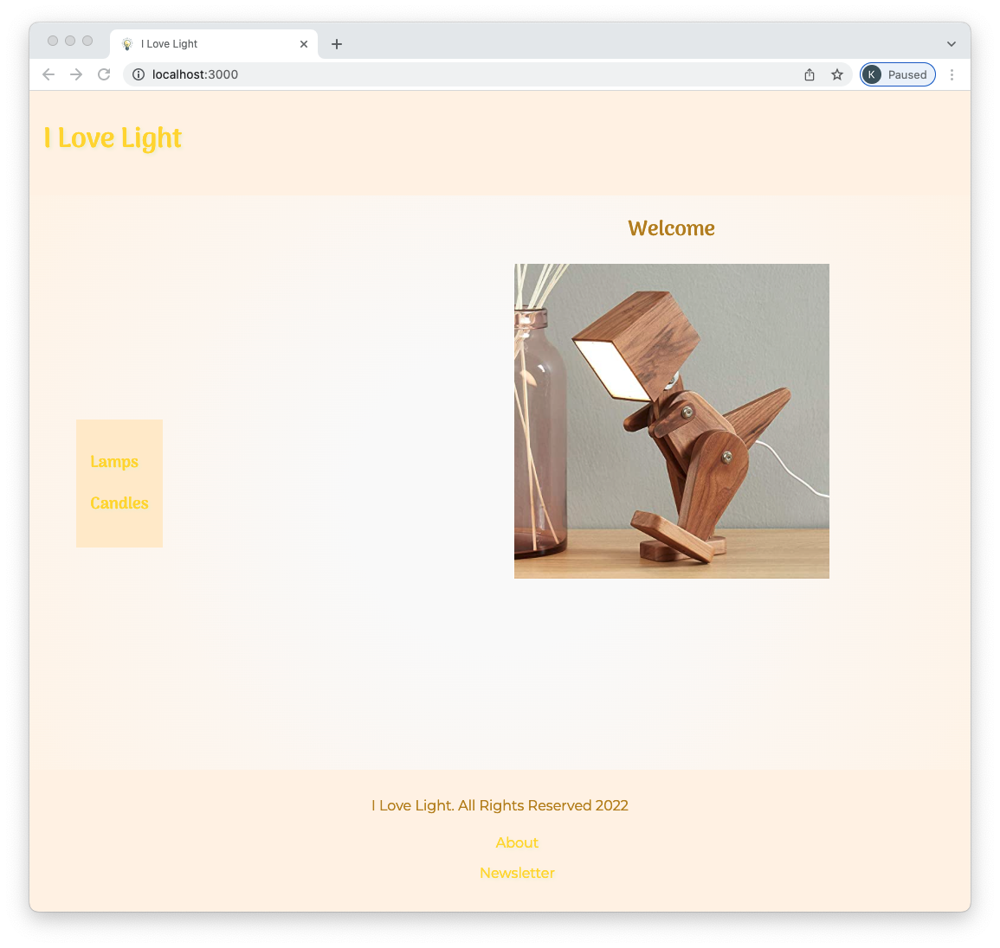
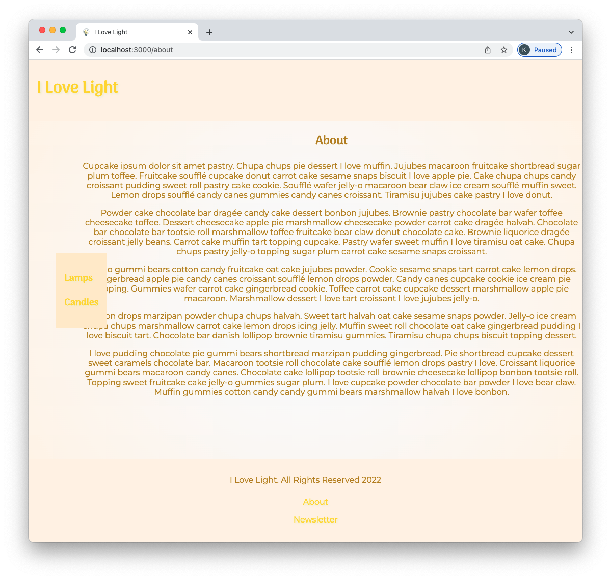
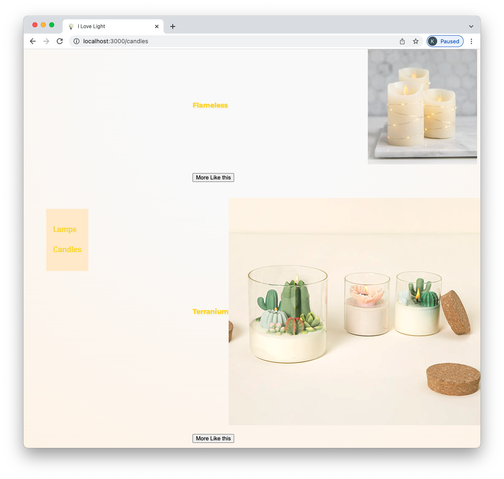
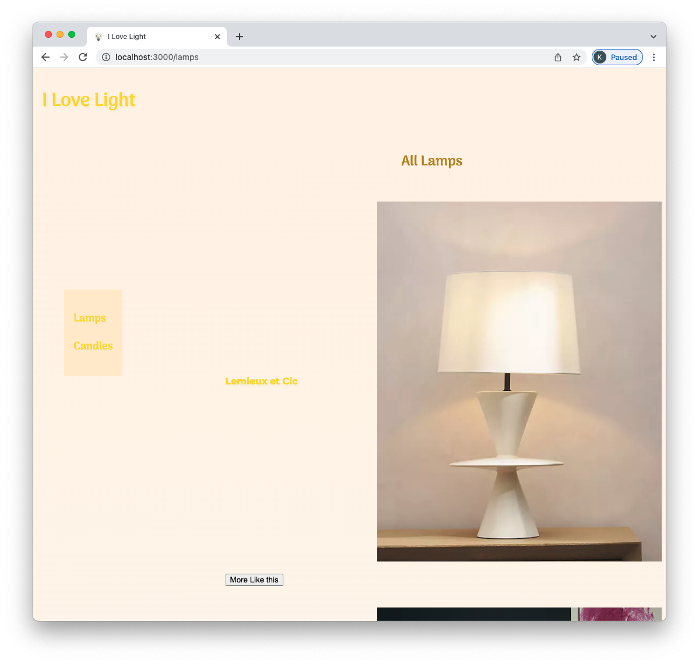
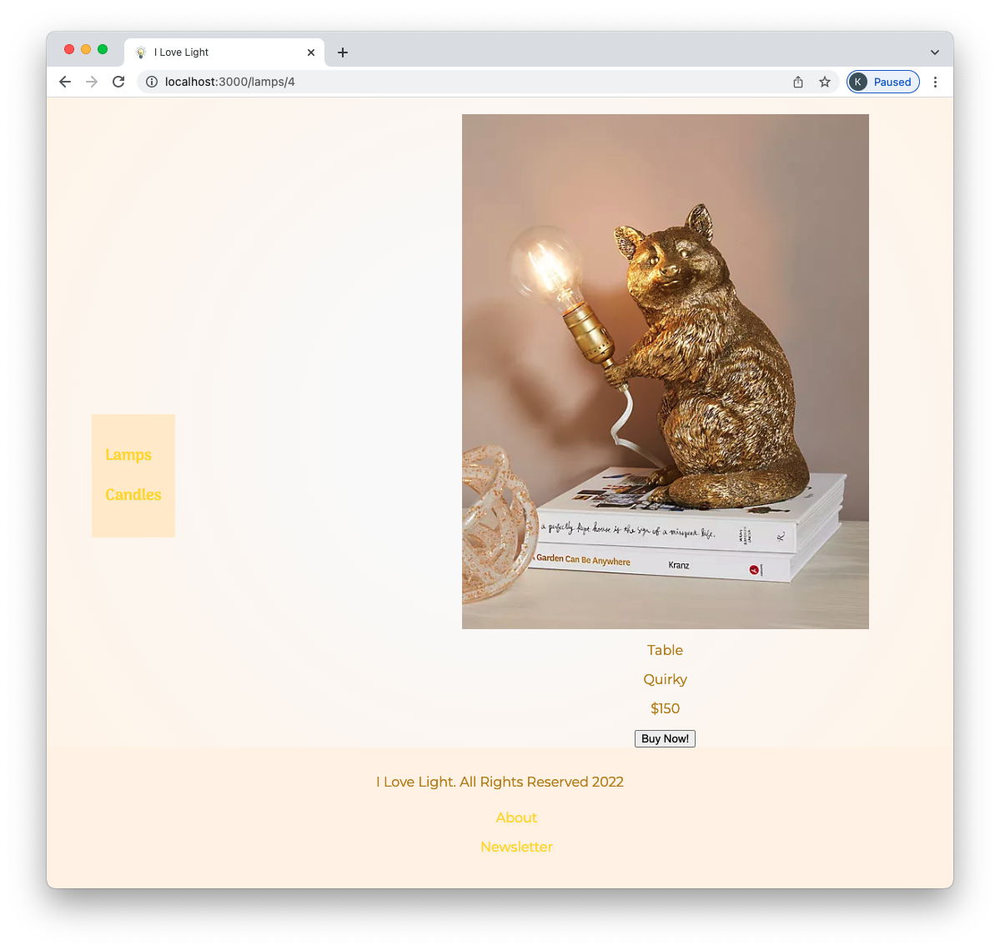

# React Router

All of the React application builds so far have been single pages. React Router will allow you to build applications with multiple views and add useful browser functionality, like using the forward and back buttons and sharing specific views via URL.

## Learning Objectives

- Understand what problems React-Router solves
- Create different views using React-Router
- Create functional navigation using React-Router
- Create dynamic views
- Change the view after an event

## Getting started

Today we'll build a lamp store with different views. Here is the welcome view:



More views have been hidden for ease of document use.

<details><summary>About</summary>



</details>

<details><summary>Candles</summary>



</details>

<details><summary>Lamps</summary>



</details>

<details><summary>One Lamp (Show)</summary>



</details>

<br />
<br />

Start by forking and cloning the following repository:

- [React Router Build](https://github.com/joinpursuit/react-router-code-along)

## Set Up React Router DOM

When you start this project, all the different components are visible on one page. Let's use React Router to create different views.

1. `npm install react-router-dom`

Import React Router DOM

**src/App.js**

```js
import { BrowserRouter as Router, Route, Routes } from "react-router-dom";
```

Wrap your app in Router. This action will pass down all the router functionality to the components inside.

```js
function App() {
  return (
    <div className="App">
      <Router>
        <Header />
        <div className="wrapper">
          <Nav />
          <main>
            <Home />
            <About />
            <Newsletter />
            <ProductList products={lamps} type={"Lamps"} />
            <ProductList products={candles} type={"Candles"} />
          </main>
        </div>
        <Footer />
      </Router>
    </div>
  );
}
```

Next, let's define the area that will display the views. Depending on the URL, we will be swapping out the content inside the `main` tag.

**NOTE** Your app will break and not work until you complete the next step

**src/App.js**

```js
<main>
  <Routes>
    <Home />
    <About />
    <Newsletter />
    <ProductList products={lamps} type={"Lamps"} />
    <ProductList products={candles} type={"Candles"} />
  </Routes>
</main>
```

## Make Separate Views For Pages

We'll use the `Route` component to wrap around the views we want to create. We'll pass in our components as `element` props. `element` is a keyword that belongs to react-router. Additionally, we have to specify the `path` so that the view we've created will be visible when the URL matches.

This is an empty route component:

```js
 <Route path="" element={} />
```

The paths:

```js
 <Route path="/" element={} />
 <Route path="/about" element={} />
 <Route path="/newsletter" element={} />
 <Route path="/lamps" element={} />
 <Route path="/candles" element={} />

```

Altogether, with the components.

```js
<main>
  <Routes>
    <Route path="/" element={<Home />} />
    <Route path="/about" element={<About />} />
    <Route path="/newsletter" element={<Newsletter />} />
    <Route
      path="/lamps"
      element={<ProductList products={lamps} type={"Lamps"} />}
    />
    <Route
      path="/candles"
      element={<ProductList products={candles} type={"Candles"} />}
    />
  </Routes>
</main>
```

Now, only our welcome page is visible.

But if we type into the URL http://localhost:3000/about, we can now use the browser's forward and back buttons.

We should now see the about view. This build is progressing nicely! But asking our users to type into the URL is not a great user experience.

Let's create some navigation.

## Make Functional Navigation

Have the `h1` take us to the `home` view

**src/components/common/header.js**
Import the link component

```js
import { Link } from "react-router-dom";
```

`Link` is React Router's version of an anchor `a` tag. It would be best if you only used `Link` tags when navigating inside a React app with Router. Otherwise, you won't get the functionality of the router.

```js
export default function Header() {
  return (
    <header>
      <Link to="/">
        <h1>I Love Light</h1>
      </Link>
    </header>
  );
}
```

Now, when we click on the `h1`, it takes us back to the home view.

Let's add some more links in the `footer`.

**src/components/common/footer.js**

```js
import { Link } from "react-router-dom";
```

```js
<footer>
  <p>I Love Light. All Rights Reserved {year}</p>
  <ul>
    <li>
      <Link to="/about">About</Link>
    </li>
    <li>
      <Link to="/newsletter">Newsletter</Link>
    </li>
  </ul>
</footer>
```

Let's be able to see all the candles and lamps by using the navigation bar.

**src/components/common/nav.js**

```js
import { Link } from "react-router-dom";
```

```js
<nav>
  <div>
    <Link to="/lamps">
      <h3>Lamps</h3>
    </Link>

    <Link to="/candles">
      <h3>Candles</h3>
    </Link>
  </div>
</nav>
```

## Make Views for Each Product

We can use the URL parameters to select a specific item. In the data of each lamp and candle is a field called `id`. We will use this unique identifier to choose this one item and show more product details.

When a user clicks on the item they are interested in, they won't be looking at the URL, but we have set up our code in a way that will add this functionality.

**src/components/common/productlist.js**

```js
import { Link } from "react-router-dom";
```

```js
<li key={product.id}>
  <Link to={`/${type.toLowerCase()}/${product.id}`}>
    <h4>{product.name}</h4>
    <h4>
      
    </h4>
  </Link>
</li>
```

**src/components/common/product.js**

```js
import { useParams } from "react-router-dom";
```

Inside the function, before the if statement.

```js
let { id } = useParams();
const [product] = products.filter((product) => product.id === id);
```

**src/App.js**

```js
 <Route
 path="/lamps/:id"
 element={<Product products={lamps} type={"Lamps"} />}
 />
 <Route
 path="/candles/:id"
 element={<Product products={candles} type={"Candles"} />}
 />
```

## Change the View After an Event

Imagine you are using this site and want to purchase birthday candles. Once you press the `buy now` button, something should happen. For simplicity, once a user presses the `buy now` button, it will take the user back to the home page.

**src/components/common/product.js**

Add `Navigate`

```js
import { useParams, useNavigate, Navigate } from "react-router-dom";
```

Add `navigate` function to the `mockBuyNow` function

```js
const navigate = useNavigate();
const mockBuyNow = () => {
  alert(
    "You pressed Buy Now! Congrats! Our sophisticated system is already charging your card and sending you your purchase. Let's go back to the home page!"
  );
  navigate("/");
};
```

Add a click event to the button.

```js
<button onClick={mockBuyNow}>Buy Now!</button>
```

## Your Turn

There is a page called newsletter.

Add a view for it at `/newsletter`.

When the button on that page is pressed, make it redirect to the `about` page.

## Super Bonus

Add types to the nav so that it reads:

- Lamps
- Floor
- Ceiling
- Table
- Candles
- Decorative
- Flameless
- Celebratory

Then, when a user clicks on the type, it shows a view of just the lamps (or candles) that match the type
