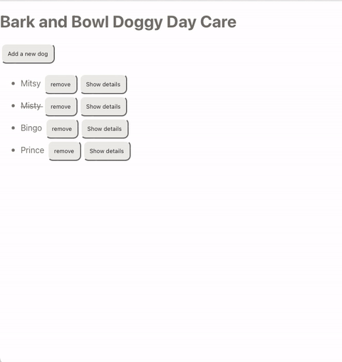

# React State: Arrays & Objects

## Objectives

- Review passed by reference
- Manipulate arrays to update state properly

## Doggy Day Care Roster App

This app will revisit the Doggy Day Care app you built. It will just focus on the roster portion of the application.



There will be a list of dogs, we will build functionality to

- add a dog
- remove a dog
- update dog attendance
- show details about a dog

## Getting started

Start by forking and cloning the following repository:

[React State 2 Class Build](https://github.com/joinpursuit/class-build-react-state-objects)

- `npm i`

## Import data

Typically, you will bring in data from a third-party API or your own data from a server/database. However, to keep the code examples simple and focused on the learning objectives, we will use an array in a file called `data.js` to mimic incoming data.

```js
// App.js

import { dogsData } from "./data";
```

Confirm the data is imported correctly:

```js
console.log(dogsData);
```

> **Note:** console.logs are very useful, however be sure to remove or comment them out when you have finished using them so that your console is not cluttered with information you don't need.

## Build a basic view

## Add state

The dogs array is going to be updated based on user interaction. Therefore we must set up state.

At the top:

```js
// App.js
import { useState } from "react";
```

Inside the App function:

```js
const [dogs, setDogs] = useState(dogsData);
```

## Create an unordered list and make a list of dogs

```js

<ul>
{
  dogs.map((dog) => {
    return (
      <li key={dog.id}>
        <span>{dog.name}</span>
      </li>
    );
  });
}
</ul>

```

- What is the importance of the key prop? What is something important to remember about key props?

## Add a new dog

```js
// App.js
function addDog() {
  console.log("add Rover");
}
```

Create a button and confirm that the button's event listener/handler works:

```js
<button onClick={addDog}>Add a new dog</button>
```

In a later lesson, you'll learn how to use forms in React. For now, we'll just add the same dog.

```js
function addDog() {
  const rover = {
    id: dogs.length + 50,
    name: "Rover",
    present: false,
    grade: "100",
    notes: "The goodest new dog",
  };
}
```

To add Rover, we must create a new array, which we can do with the spread operator. Then we can either add Rover to the start or end of the array. Additionally, since we are using `dog.id` for our app function, we need a way to be sure Rover will have a unique object id. Let's add an npm package [uuid](https://www.npmjs.com/package/uuid) to generate a unique id:

```
npm install uuid
```

```js
// App.js
import { v1 as generateUniqueID } from "uuid";
```

```js
function addDog() {
  // Create a new dog named Rover
  // give the dog a "unique" id
  // normally a database would handle the unique id logic for you
  const rover = {
    id: generateUniqueID(),
    name: "Rover",
    present: false,
    grade: "100",
    notes: "The goodest new dog",
  };

  // make a copy of the dogs array using destructuring
  // add rover, in this case the dog is added to the first array position
  // what would you need to change to add him as the last array item?
  setDogs([rover, ...dogs]);
}
```

## Remove a dog

Create a function to remove a dog:

```js
function removeDog(dogID) {
  console.log("remove dog with id of", dogID);
}
```

Add a button to each dog list item:

```js
<li key={dog.id}>
  <span>{dog.name} </span>
  <button onClick={() => removeDog(dog.id)}>remove</button>
</li>
```

Why does the `removeDog` function need to be wrapped in an anonymous function compared to the `addDog` function which did not need an anonymous function?

Add functionality to remove a dog:

```js
function removeDog(dogID) {
  // use the filter method to remove any dogs that have a matching id
  const filteredDogArray = dogs.filter((dog) => dog.id !== dogID);
  // set the dogs array to the new array that will not have the removed dog
  setDogs(filteredDogArray);
}
```

> **Note:** Some array methods like `.map()` and `.filter()` create a copy of the array. Some other method like `.reverse()` and `.sort()` change the original array. Use the MDN documentation to look up whether an array method makes a copy or changes the original array.

## Update dog attendance

First add some logic so that if a dog is not present a line-through the dog's name appears.

Ternary operators are a different way to write if/else statements. Practice reading the following code: If `dog.present` is true, then set `textDecoration` to none. Else, `textDecoration` is set to `line-through`.

```js
<span
  style={
    dog.present
      ? { textDecoration: "none" }
      : { textDecoration: "line-through" }
  }
>
  {dog.name}{" "}
</span>
```

Write a function to update the dog's attendance property:

```js
function updateDogAttendance(dogId) {
  console.log("update dog attendance, dogId is", dogId);
}
```

Add an event listener/handler to the span element:

```js
<span
  onClick={() => updateDogAttendance(dog.id)}
  style={
    dog.present
      ? { textDecoration: "none" }
      : { textDecoration: "line-through" }
  }
>
  {dog.name}{" "}
</span>
```

Create logic to update the dog attendance.

```js
function updateDogAttendance(dogId) {
  // Copy the dogs array so that the copy can be updated
  const dogArray = [...dogs];
  // Find the dog with the matching id number's array position
  const index = dogArray.findIndex((dog) => dogId === dog.id);
  // Access the dog's present property and update the value
  // By using ! it will toggle the value of present
  dogArray[index].present = !dogArray[index].present;
  // Put the updated array into setDogs to update the dogs array
  setDogs(dogArray);
}
```

## Passing state down as props

There is a component called `DogDetails` included in this project. Import it and add it to the list item.

```js
import DogDetails from "./DogDetails";
```

Add it to the list item and pass `dog` down as a prop:

```js
<DogDetails dog={dog} />
```

You'll notice that the show/hide details functionality already works. As a class work through how this function works.

- Why is there state in `DogDetails` and what does it do. What happens if this state were put in the App.js component instead?
