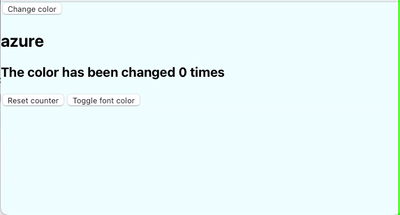

# React State: Primitive Values

## Objectives

- Define state
- Explain the role of state in a React application
- Learn how to use event listeners and handlers in React
- Instantiate state in a React component

- Call set State to update State

## Background-color changing app



## Getting started

- `npx create-react-app@5.0 color-app`
- `cd color-app`
- `npm start`

Change the App component:

```js
// src/App.js

function App() {
  return (
    <div>
      <button>Change color</button>
    </div>
  );
}
```

Add an event handler/listener and confirm that it works.

```js
function App() {
  function changeColor() {
    console.log("I love color!");
  }
  return (
    <div>
      <button onClick={changeColor}>Change color</button>
    </div>
  );
}
```

Add an array of colors:

```js
// App.js
const colors = [
  "papayawhip",
  "thistle",
  "peachpuff",
  "lightgoldenrodyellow",
  "paleturquoise",
];
```

Import state:

```js
import { useState } from "react";
```

Initialize state inside of the App function

```js
const [color, setColor] = useState("azure");
```

Add style to the App component's div:

```js
\div style={{height: "100vh", backgroundColor: color}}>
```

Add some logic to change the color:

```js
function changeColor() {
  const chooseIndex = Math.floor(Math.random() * colors.length);
  setColor(colors[chooseIndex]);
}
```

## Add a counter

If you need more stateful variables, you call `useState` again.

```js
const [counter, setCounter] = useState(0);
```

Update this inside the `changeColor` function

```js
function changeColor() {
  const chooseIndex = Math.floor(Math.random() * colors.length);
  setColor(colors[chooseIndex]);
  setCounter(counter++);
}
```

Add a visual component:

```js
<h2>{color}</h2>
<h3>The color has been changed {counter} times</h3>
```

## Add a counter reset

You can call set state functions for multiple purposes.

Add a new button with a click event:

```js
<button onClick={resetCounter}>Reset counter</button>
```

Add a function called `resetCounter`

```js
function resetCounter() {
  setCounter(0);
}
```

## Working with booleans

Using booleans with state is similar to numbers and strings.

Add more state:

```js
const [defaultFontColor, toggleFontColor] = useState(true);
```

Create a new button:

```js
<button onClick={toggleFontColor}>Toggle font color</button>
```

Create a `toggleFontColor` function:

```js
function toggleFontColor() {
  toggleFontColor(!defaultFontColor);
}
```

Add a visual:

```js
<h3 style={defaultFontColor ? { color: "black" } : { color: "white" }}>
  The color has been changed {counter} times
</h3>
```

## Try it

Sometimes, when choosing a random color, the same color appears twice in a row. Write some logic that checks if the new color is the same as the last color.

If the color is the same, add an `h4` element with a message that says `this colors is the same as the last color`. Else, don't show an `h4` element.

## Reference

Here is a completed App.js

```js
import { useState } from "react";
const colors = [
  "papayawhip",
  "thistle",
  "peachpuff",
  "lightgoldenrodyellow",
  "paleturquoise",
];
function App() {
  const [color, setColor] = useState("azure");
  const [counter, setCounter] = useState(0);
  const [defaultFontColor, setFontColor] = useState(true);
  function changeColor() {
    const chooseIndex = Math.floor(Math.random() * colors.length);
    setColor(colors[chooseIndex]);
    setCounter(counter + 1);
  }
  function resetCounter() {
    setCounter(0);
  }
  function toggleFontColor() {
    setFontColor(!defaultFontColor);
  }
  return (
    <div style={{ height: "100vh", backgroundColor: color }}>
      <button onClick={changeColor}>Change color</button>
      <h2>{color}</h2>
      <h3 style={defaultFontColor ? { color: "black" } : { color: "white" }}>
        The color has been changed {counter} times
      </h3>
      <button onClick={resetCounter}>Reset counter</button>
      <button onClick={toggleFontColor}>Toggle font color</button>
    </div>
  );
}

export default App;
```
